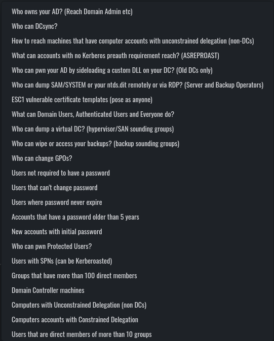

# Visualizing ACLs with Adalanche 

I was always a fan of trying new tools in order to create a personal arsenal for edged cases. Recently, I found a tool called [Adalanche](https://github.com/lkarlslund/Adalanche), which is capable of enumerating and visualizing [ACLs](https://learn.microsoft.com/en-us/windows/win32/secauthz/access-control-lists) between entities in the scope of the [Active Directory](https://en.wikipedia.org/wiki/Active_Directory).

Usually, Active Directory misconfigurations can be found within the ACLs, and they can often lead to obtaining domain administrative privileges by chaining several lateral movement and privilege escalation techniques together. A very simple example for that can be a vulnerable [ADCS](https://learn.microsoft.com/en-us/windows-server/identity/ad-cs/active-directory-certificate-services-overview) server to [ESC1](https://www.blackhillsinfosec.com/abusing-active-directory-certificate-services-part-one/) attack. 
Another example could be finding out that the current owned user is local administrator on some machine and after data exfiltration, you find domain admin credentials.

Mapping such attack vectors can be complicated without such tools, and while you should not be dependant of them, they are here to help, and they certainly do!

While [BloodHound](https://github.com/BloodHoundAD/BloodHound) is my rank #1 tool for enumerating and visualizing the Active Directory, I was also thrilled to try Adalanche, mainly because of curiosity in terms of UI, practical use and evasiveness. Turned out that this tool might be a hidden gem! 

I already deployed a video about this topic on my [channel](https://www.youtube.com/watch?v=PG2J0uILL1Q), so if you prefer watching a video instead of reading, feel welcomed!

Also make sure to join my [Discord](https://discord.gg/bgSpdheEgu) where we share experience, knowledge and doing CTF together.

And if you have further appreciation for my work, don't hesitate to become my [Patreon](https://www.patreon.com/Lsecqt)!

# Why not just use BloodHound?

Now here comes the question, why bother with Adalanche when I have BloodHound?

The answer is very simple, it is always a good idea to have alternatives for specific tools. Also, alternatives creates competition and this is a fundamental process of improving both of the sides, so its a win = win situation.

Additionally, as you might already know, [SharpHound](https://github.com/BloodHoundAD/SharpHound) (The data collector for BloodHound) is extremely signatured by various security mechanisms. I am aware that the signatures and the behavioral detections can be bypassed but sometimes its not a trivial process. For Instance it is possible to land into an environment that is extremely well network segmented, so that you cannot get a C2 implant to run or you should rely on some kind of bind shells on specific ports, which not all C2 framework actually supports. Additionally, if the segmentation is combined with enforced endpoint protection, it can become super challenging to execute SharpHound and collect data.

On the other hand, Adalanche is a tool that can work as both a collector and a visualizer at the same time, while it is extremely evasive. So, let's get an idea of what it actually looks like.

# Adalanche Overview

Adalanche is go-written tool for collecting and analyzing data from Active Directory. It is capable of extracting potential attack vectors such as [unconstrained delegation](https://lsecqt.github.io/Red-Teaming-Army/active-directory/unleashing-the-power-of-unconstrained-delegation/), outdated servers, users with administrative privileges and more. It is extremely fast and compatible with each modern Operating System (OS).

One of the coolest features about Adalanche is that it is self-sufficient, which means, you do not need:
- Database (like Neo4j)
- Specific engine or runtime installed (like dotnet runtime)
- Additional software (like a web server)

All you need is the [compiled binary](https://github.com/lkarlslund/Adalanche/releases) and luck that you are in a vulnerable environment.
Since the Adalanche is go-written, the same code can be compiled for both windows and *nix systems. 

!!!
It is always a good idea to obfuscate the code and compile it yourself. Currently the tool does not get signatured but most likely this will change in the near future!
!!!

Adalanche can be run directly, with no arguments if it is launched from domain joined windows machine. On the other hand it can also mimic [bloodhound.py](https://github.com/dirkjanm/BloodHound.py), scraping the Active Directory from a machine with network access to the Domain Controller. It then stores the gathered data into a folder called ```data```, which can be analyzed in the future. Now let's analyze the different methods on how to get it running!

## Case 1: I am operating from a domain joined Windows computer

Adalanche is capable of detecting the context of the current user. In case you are operating from a domain joined machine, and from the context of a domain user, you do not need to supply any arguments! In this scenario it is enough to just download and execute the binary. This will perform all the scraping automatically, then Adalanche will automatically analyze the collected data and finally, it will host the results on ```127.0.0.1:8080``` while navigating your default browser to the web view.

If everything went smooth, you should see something like this:


## Case 2: I am operating from a host with VPN access and AD credentials

Adalanche is also capable of scanning and extracting data from the Active Directory remotely.
In this scenario, we are required to have network visibility to the LDAP servers as well as a valid pair of credentials for the Active Directory.

The Adalanche binary can now be used in 2 modes:
- collect
- analyze

The first mode will perform the data collection via querying the LDAP service. After completion, again, all of the results will be stored in a folder called ```data``` unless you specify something different. 
All of the needed options can be found on the [docs](https://github.com/lkarlslund/Adalanche) or by running
```
./adalanche help collect activedirectory

11:24:06.425  INFORMA  Adalanche Open Source v2024.1.11 (commit 0161570), (c) 2020-2024 Lars Karlslund, This program comes with ABSOLUTELY NO WARRANTY
Collects information from Active Directory

Usage:
  adalanche collect activedirectory [flags]

Flags:
      --adexplorerboost         Boost ADexplorer performance by using loading the binary file into RAM before decoding it (default true)
      --adexplorerfile string   Import AD objects from SysInternals ADexplorer dump
      --attributes string       Comma seperated list of attributes to get, * = all, or a comma seperated list of attribute names (expert) (default "*")
      --authdomain string       domain for authentication, if using ntlm auth
      --authmode string         Bind mode: unauth/anonymous, basic/simple, digest/md5, kerberoscache, ntlm, ntlmpth (password is hash), negotiate/sspi (default "ntlm")
      --autodetect              Try to autodetect as much as we can, this will use environment variables and DNS to make this easy (default true)
      --configuration string    Collect Active Directory Configuration (default "auto")
      --domain string           domain suffix to analyze (contoso.local, auto-detected if not supplied)
      --gpopath string          Override path to GPOs, useful for non Windows OS'es with mounted drive (/mnt/policies/ or similar), but will break ACL feature
      --gpos string             Collect Group Policy file contents (default "auto")
  -h, --help                    help for activedirectory
      --ignorecert              Disable certificate checks
      --ldapdebug               Enable LDAP debugging
      --nosacl                  Request data with NO SACL flag, allows normal users to dump ntSecurityDescriptor field (default true)
      --objects string          Collect Active Directory Objects (users, groups etc) (default "auto")
      --other string            Collect other Active Directory contexts (typically integrated DNS zones) (default "auto")
      --pagesize int            Number of objects per request to collect (increase for performance, but some DCs have limits) (default 1000)
      --password string         password to connect with ex. --password hunter42 (use ! for blank password)
      --port int                LDAP port to connect to (389 or 636 typical, -1 for auto based on tlsmode) (default -1)
      --purgeolddata            Purge existing data from the datapath if connection to DC is successfull
      --schema string           Collect Active Directory Schema (default "auto")
      --server stringArray      DC to connect to, use IP or full hostname ex. -dc="dc.contoso.local", random DC is auto-detected if not supplied
      --tlsmode string          Transport mode (TLS, StartTLS, NoTLS) (default "NoTLS")
      --username string         username to connect with (someuser@contoso.local)

Global Flags:
      --cpuprofile                Save CPU profile from start to end of processing in datapath
      --cpuprofiletimeout int32   CPU profiling timeout in seconds (0 means no timeout)
      --datapath string           folder to store and read data (default "data")
      --embeddedprofiler          Start embedded Go profiler on localhost:6060
      --fgtrace                   Save CPU trace start to end of processing in datapath
      --logfile string            File to log to
      --logfilelevel string       Log file log level (default "info")
      --loglevel string           Console log level (default "info")
      --logzerotime               Logged timestamps start from zero when program launches
11:24:06.436  INFORMA  Terminating successfully

```

By following the options, this exemplary command can collect the data from the Active Directory:
```
./adalanche collect activedirectory --tlsmode tls --ignorecert --domain domain.local --authdomain DOMAIN --username joe --password joepass
```

After this command finishes, the ```data``` folder will be present in your current working directory.

!!!
Since all of the collected AD information is stored into that ```data``` folder, you can also zip and ship it somewhere else. Keep in mind that the dump can be analyzed offlane as soon as the Adalanche binary is present. 
!!!

When you are ready to analyze the results and generate a web view, you can do so by running:

```
./adalanche analyze
```

If everything is running as expected, you should again see the initial screen of Adalanche:


# Adalanche Usage

Adalanche web UI is divided into 3 parts:
* Object explorer on the left
* Nodes visualization settings on the right
* LDAP querying tool centered on the bottom.

On the Object explorer you can observe various objects, including present users, machines, GPOs and more.

< PHOTO HERE >

On the right you can tweak how the Adalanche should look like, but I personally did not spend much time on it since I was happy with the defaults.

< PHOTO HERE >

It is the LDAP querying tool where it gets interesting.
Compared to BloodHound, Adalanche is not using any database engines for storing and analyzing the results. It is based entirely on LDAP to perform any visualization and analysis over the collected data, which is purely stored on the local file system. This behavior has its pros and cons such as :

| Pros                                             | Cons                                                             |
| ------------------------------------------------ | ---------------------------------------------------------------- |
| Extremely easy to migrate and share              | Extremely easy to lose the data                                  |
| No dependencies other then the Adalanche binary  | Storing files on the local FS can lead to super easy signatures  |
| No collector / db engine version incompatibility | Requires additional efforts for setting up multi-user experience | 

Adalanche comes with the following predefined LDAP queries for visualizing nodes and searching for attack paths:



From these, you may notice that a lot of the queries are actually familiar from BloodHound (such as Kerberoastable users, DC Sync users and so on). One of the coolest parts about Adalanche, is that when you execute one of the sample queries, you get its raw syntax into the LDAP querying section, from where you can modify and update the query to suit your needs.

