# Utilizing Discord as C2 Traffic Broker

## Introduction

In the realm of cybersecurity, the landscape is constantly evolving, with threat actors devising new methods to infiltrate systems and compromise data. One such method I recently decided to test is the use of Discord bots for Command and Control (C2) traffic brokerage. Discord, originally a platform for gamers to communicate, has emerged as an unexpected but powerful tool for covert communications and control.

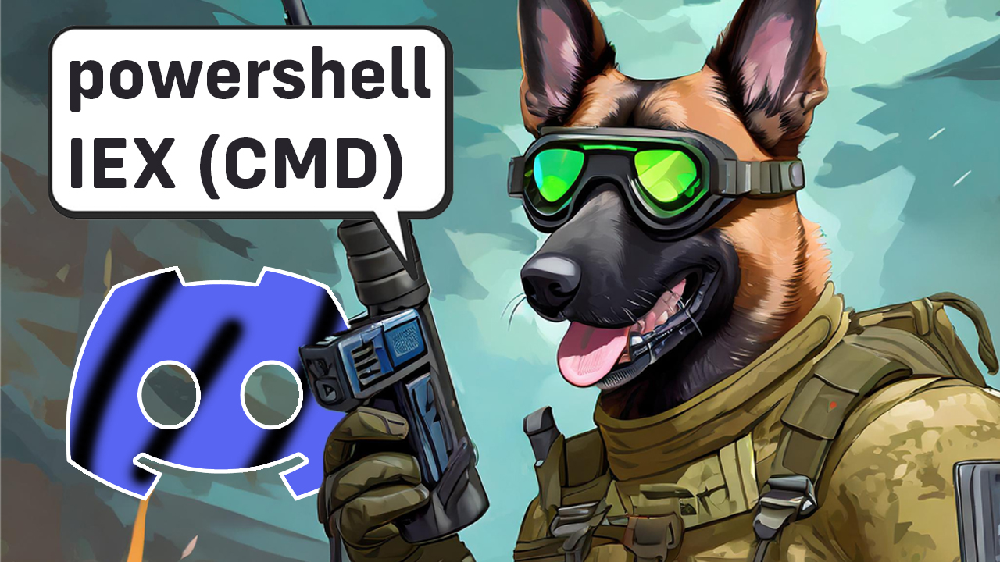

## Understanding Command and Control (C2)

Before delving into the world of Discord bots, it's essential to grasp the concept of Command and Control (C2) in cybersecurity. C2 refers to the communication channels and infrastructure used by threat actors / penetration testers or red team operators to control compromised systems. Traditionally, C2 infrastructures involved complex setups and dedicated servers, making them unique in both UI and functionalities. There are many, and I really mean, MANY C2 frameworks out there, both open sourced and commercialized. 

!!!
For more info, you can take a look at the [C2 Matrix Spreadsheet](https://docs.google.com/spreadsheets/d/1b4mUxa6cDQuTV2BPC6aA-GR4zGZi0ooPYtBe4IgPsSc/edit).
!!!

One of my favorite Open Sourced C2 Framework is [Mythic C2](https://github.com/its-a-feature/Mythic), mainly because of its infrastructure, design, and flexibility. 


Mythic has its own ecosystem, it is heavily dockerized which has its prons and cons, but also, it allows everyone with coding skills to implement their own agents or C2 profiles. Agents are the implants themselves, while the C2 profiles, is how these implant may communicate with the main Mythic C2 server. While there are many [C2 agents](https://github.com/MythicAgents), one of my favorites is the [Athena](https://github.com/MythicAgents/Athena).

This agent is build on .net Core, and I was already fascinated of what it can do. Me and Athena's creator ([@checkymander](https://twitter.com/checkymander)) did a livestream some time ago, so if you want to learn more on how Athena actually works, feel welcomed to my Youtube Channel:

[!embed](https://www.youtube.com/watch?v=44HxphmzTPI)

!!!
If you appreciate my work, you can support me on [Patreon](https://www.patreon.com/Lsecqt) and get access to my private packer - ShadowBurn.
!!!

In the last years, the C2 frameworks are aiming to be as creative as possible, this include everything from initial payload execution, to communication method for better evasion. Most C2 frameworks nowadays are utilizing HTTPS protocol for this case. This is generally a good option because of:

* Outbound HTTPS is allowed in most of the cases.
* Traffic is encrypted.
* Easy to customize the server side to look legit, like a normal web server.

Even though HTTPS is great, it has its down sides when it comes to offensive campaigns. For instance, the outgoing HTTPS traffic is often downgraded and decrypted inside the local company firewall. The decrpted traffic is logged and analyzed, then re-crypted and forwarded. This action allows the blue team to analyze what is going on if specific alerts are risen. The decrypted logs are stored so it is easier to find incident traces. When this is combined with good endpoint protection, it can become extremely frustrating for the attacker. 

!!!
Keep in mind that C2 communication can be caught on many places, such as the network level. While endpoint protection is extremely important, it is not the only problem to bypass!
!!!

In this blog we will NOT pay any attention to the endpoint protections, but on the network side of things. C2 frameworks like Mythic and its Athena agent, has the ability to communicate over HTTPS, but not only! They can be utilized into communicating over various third parties or *trusted* channels, like [Discord](https://github.com/MythicC2Profiles/discord) and [Slack](https://github.com/MythicC2Profiles/slack). This enhances the evasiveness over the network, mainly because of the C2 traffic is now more likely to just blend into the normal traffic of the compromised machine, especially if it has discord running on its system. If there are restrictions about what programs can or cannot be installed, Discord can be also used from any web browser, which makes this C2 profile extremely applicable for many environments.

## Setting up the infrastructure

### Creating Discord Bot

I already created a YouTube video with guide on how to setup the infrastructure, so if you prefer watching a video instead of reading, feel welcomed:

[!embed](https://youtu.be/YluiBE_E4ts?si=qMF-mp-sjKFtZyMp)

The first thing we need to understand is how much development-friendly Discord is. While you cannot read or write to the Discord source code directly, you can create the so called bots. These bots can be created on multiple languages, and there are even dedicated libraries for this case, for example [Discord.py](https://discordpy.readthedocs.io/en/stable/).

The bots can be implemented for multiple different purposes, including:
- Server management
- Chat moderation
- Automatic announcements
- Role management and more

Here, one of the very simplest functionality a bot can have, is to read and send messages. This is all what the C2 profile is about. Keep in mind that the bots are powerful, with proper permissions, they can be utilized for a lot of things.

Obviously the first thing is to create a bot with proper permissions and add it to any demo server.

!!!
Some settings like the bot name, server name and server members does not matter, do not think about them at all. It is even not required for the compromised, nor attacking machine to have discord installed on its system.
!!!

Servers can be created super simple, by following the big + icon on bot left -> Create my Own -> For me and my friends -> Give it a fancy name and click Create.

This will create the dedicated server, now time to add some bots!

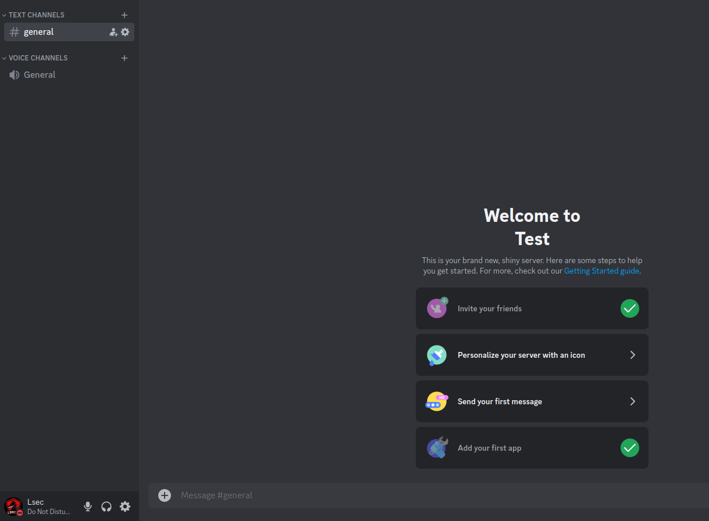

In order to create and add a bot, you need to first navigate to the [Discord Developer Portal](https://discord.com/developers/applications). There, click New Application on the top right corner and give it some random name.

If everything went smooth, after clicking on the newly created application, you should see its settings like this:

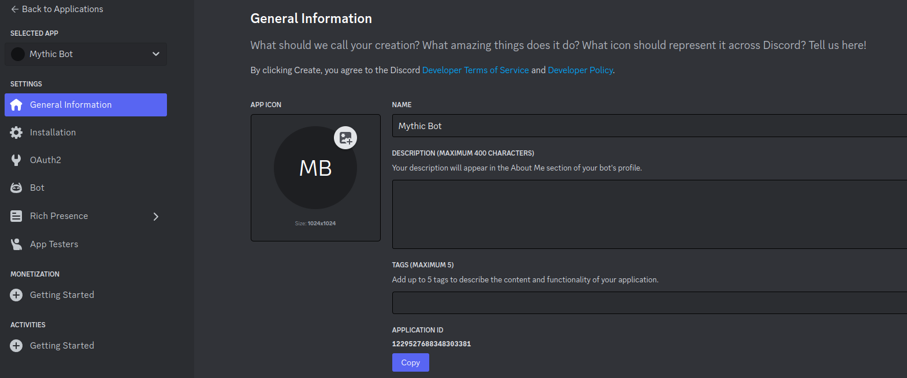

From there, you need to go for the Bot menu -> Reset Token button. This will print the bot token, save it for later! Additionally, as mentioned before, the bot need to be able to read / write messages. In order to allow the application to do so, scroll down and toggle *MESSAGE CONTENT INTENT* intents:

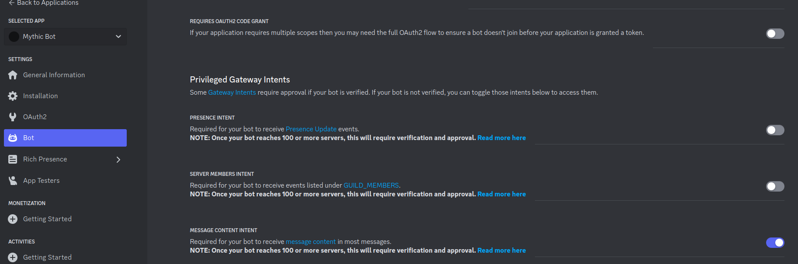

Now that our bot has the intent for sending messages, it is time to invite it to the server. To do so:

1. Go to OAuth2 Menu from the left.
2. On the OAuth2 URL Generator check Bot option
3. Check Send Messages, Send Messages in Threads, Read Message History, Read Messages / View Channels and Manage Messages.

It should look something like that:

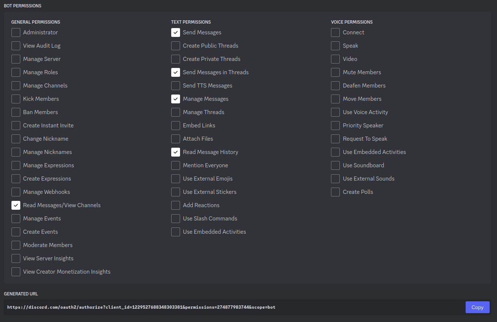

If you pay close attention to the very bottom of the previous screenshot, you will see a URL. By simply copying and pasting it into a browser from where you were already logged into your Discord account, you will be able to invite the bot to your server. When you authorize the request, the bot should be present in your server but offline.

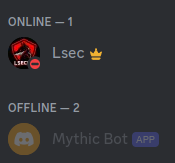

### Setting up the Mythic C2

I have already created a YT video on how to install and operate with Mythic C2, if you are new to this framework, I highly recommend to watch it first, before continuing with this blogpost:

[!embed](https://youtu.be/QmC1zhpTxww)

In a nutshell, after you install the Mythic C2 itself, we would need only 2 things:
* Athena agent
* Discord C2 profile

Luckily, the Mythic C2 has amazing feature installation procedure, all you have to do is just run (as root and from the cloned Mythic C2 directory) `./mythic_cli install github <URL>`, which in that case would be:

```bash
# INSTALLING ATHENA
./mythic_cli install github https://github.com/MythicAgents/Athena

# INSTALLING DISCORD
./mythic_cli install discord https://github.com/MythicC2Profiles/discord
```

After these two are finished, upon logging in to your Mythic C2 instance, you should see something like this:

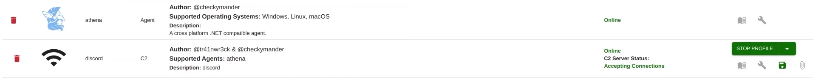

Now it is time to generate a payload, this is done by simply clicking on the payloads tab -> ACTIONS -> Generate New Payload. Here we obviously need to select Windows platform and Athena agent. I will leave all settings to their defaults and skip to the C2 profile tab. There, the only two things that we will need to modify, are the *A Bot Token for sending messages* and *The channel ID for the messages*. 

The bot token is the one you obtained during the bot creation phase, and the channel ID can be obtained after right clicking on any text channel in your newly discord server -> copy channel ID:

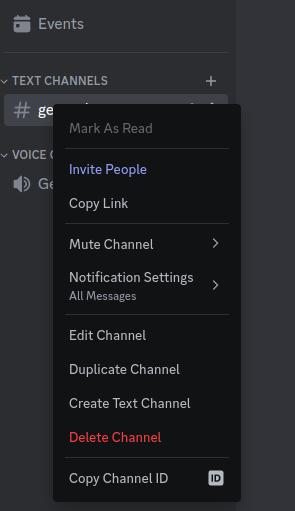

After setting the C2 profile settings, you can click the *NEXT* and the *CREATE PAYLOAD* button to generate and compile your Athena beacon.

!!!
The compilation phase is huge and time consuming based on your hardware. Be patient and ensure that you have more than 4GB of RAM.
!!!

Now after the payload is generated, there is no need for the client or the server to have Discord installed or to operate with it via web browser. The bot is doing that automatically!


## Demo

After we transfer and execute the beacon from a Windows machine, we can observe that the previously offline-sitting bot is now online!

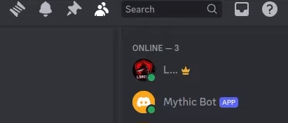

With that, after going back to the Mythic C2 server, we can observe that there is a callback appearing just the same as if we were using HTTP/S.

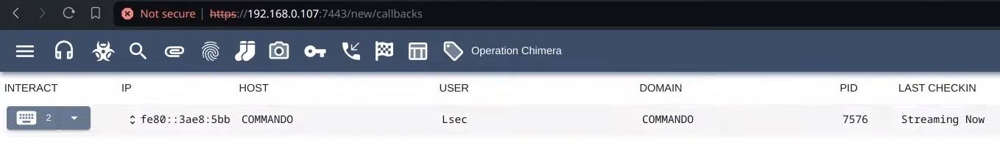

The Discord profile is using a websocket communication, which is intended to be extremely fast. Indeed the commands are issued instantaneously, and are working just the same as they would if HTTP C2 profile was used.

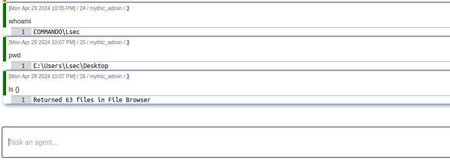

The current Discord profile is automatically deleting all transmitted messages, so there are no traces on the server itself. After running various commands, the server is still empty.

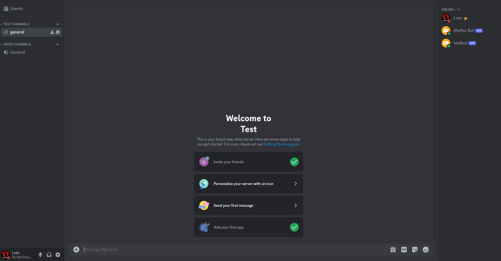
I asked the developer to include verbose options, such as one for saving all the messages into the Discord server itself. He liked the idea so definitely we will get an update on that. Beside that, the C2 profile and the Athena agent were working just great and I am yet to give them a try for longer periods of time.

!!!
Keep in mind that the open sourced world is based on contributions, you do not need to know how to write code, submitting a bug is as helpful.
!!!

During the time of the testing, I had [Portmaster](https://safing.io/) application installed on my compromised Windows machine. Portmaster is software firewall application which lets you observe and control with ease what network connections are going in and out of your PC. Portmaster recognized the Athena.exe process, but the traffic was already allowed by default.

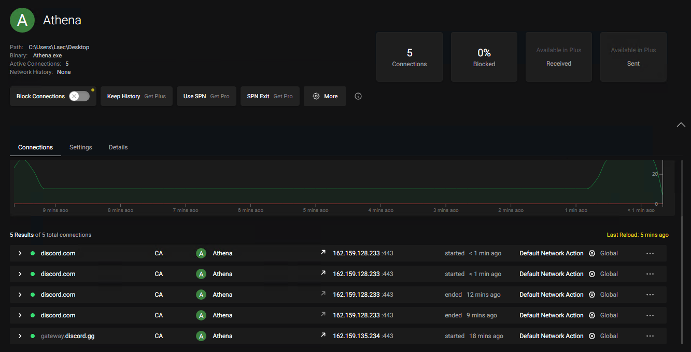

!!!
Of course a process talking to discord can be suspicious by itself, especially if it is not Discord.exe or any web browser. You may consider injecting into these processes first.
!!!

## Conclusion

While Discord bots offer unparalleled convenience and versatility for developers and enthusiasts alike, they also can be utilized for offensive campaigns. Using such trusted channels for communication, I believe it makes the blue teamers job a little harder, since such traffic can more easily just blend into the one from rest of the network. Additionally, Discord has its own valid and trusted certificates, so this condition even saves time and effort into building and configuring local SSL infrastructure.

Of course, do not get me wrong, I am not saying that it is not possible to get detected on the network level, but it is less likely, especially, if the compromised machine is already using Discord before or during the attack. I really enjoy such innovative methods since they indeed bring up a lot of creativity to the table.

Once again, shout out to the creators of the Athena and the Discord profiles, you guys rock! Keep up the good work!

!!!
If you enjoy such content and you want to see more of it, you can support me by becomming my [Patreon](https://www.patreon.com/Lsecqt).
!!!