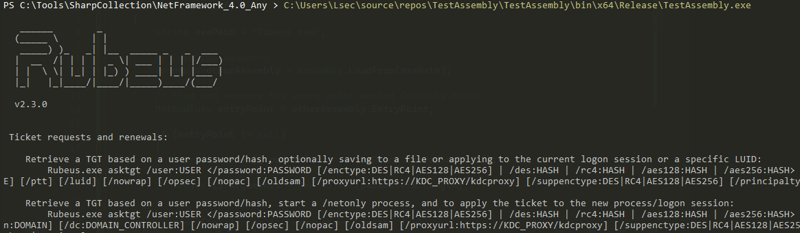
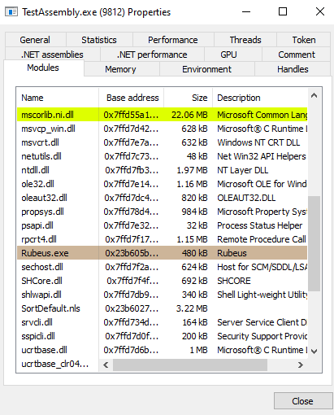

## Introduction
The integration of native C code with managed C# assemblies opens up a realm of possibilities, allowing malware developers to leverage the strengths of both worlds within a single application. Most of the modern C2 frameworks have the option for executing C# assemblies, no matter on which language they are built upon. I know it is a feature we all desire but have you ever wondered, how it works on the bottom level? How it is possible to invoke an assembly from a language like C?

At its core is the Common Language Runtime (CLR), a vital component of the .NET framework.

The magic begins with the compilation process. The native C code is typically compiled into machine code specific to the target architecture, while the C# code is compiled into an intermediate language called Common Intermediate Language (CIL). This intermediate language serves as a bridge between different languages and platforms.

During runtime, when your application is in action, the CLR comes into play. It takes the CIL from the managed C# assemblies and Just-In-Time (JIT) compiles it into machine code that can be executed by the underlying hardware. This JIT compilation ensures that the C# code is optimized for the specific environment it's running on.

Before diving deeper into this topic, make sure to join my [Discord](https://discord.gg/bgSpdheEgu) where we share experience, knowledge and doing CTF together.

!!!
If you have further appreciation for my work, don't hesitate to become my [Patreon](https://www.patreon.com/Lsecqt)!
!!!

## What is CLR?
The Common Language Runtime (CLR) stands as a foundational element within the Microsoft .NET framework, playing a crucial role in the execution of .NET applications. It creates a versatile runtime environment, allowing developers to code in various languages such as C#, VB.NET, and F#. This multilingual support is made possible by compiling code into a common intermediate language (CIL or IL), which CLR then translates into native machine code during runtime.

One of CLR's notable features is its management of memory. It ensures efficient memory allocation and deallocation, mitigating the risk of memory leaks and enhancing overall program reliability.

CLR also incorporates Just-In-Time Compilation (JIT), dynamically compiling IL code into native machine code at runtime. This adaptive process optimizes performance by tailoring the code to the specific characteristics of the underlying hardware.

The Common Language Runtime (CLR) is an integral part of the Windows operating system, making it available by default. This inclusion in the Windows environment streamlines the development process for .NET applications, as developers can leverage CLR's features without the need for additional installations.

!!!
The .net runtime version that comes by default with Windows 10 OS is `v4.0.30319`
!!!

## Loading Assemblies from C#
Loading assemblies from C# is a trivial process mainly because the CLR is already present in the memory of the parent process. The most easy way to load C# assembly from another C# program is by using `Assembly.Load` method.

The `Assembly.Load` method is part of the `System.Reflection` namespace and allows you to load an assembly by providing its name or path. There are a few overloads of this method, but a common one takes a string parameter representing the name of the assembly to load.

```csharp
public static Assembly Load(string assemblyString);
```

The `assemblyString` parameter can be the full name of the assembly, which includes the assembly's simple name, version, culture, and public key token.

Another key component we need to discuss is `AppDomain`. In C#, an `AppDomain` (Application Domain) is a lightweight, isolated, and self-contained environment within a process where .NET applications run. It provides a way to isolate and unload applications independently within a single process. By default, each C# application operates under at least 1 `AppDomain`. In most cases, for simple applications, you don't explicitly interact with the default `AppDomain` because it is automatically created for you. However, in more complex scenarios or when dealing with advanced features like application domain isolation and unloading, you might create additional `AppDomains`.

Let's say you have a scenario where the assembly name is known and it is in the same working directory as the custom loader below. Here is basic example of loading Rubeus, which is in the same directory.


```csharp
using System;
using System.Reflection;

class Program
{
    static void Main()
    {
        string exePath = "Rubeus.exe";

        // Create a new AppDomain
        AppDomain domain = AppDomain.CreateDomain("MyAppDomain");

        // Load the assembly into the new AppDomain
        Assembly otherAssembly = domain.Load(AssemblyName.GetAssemblyName(exePath));

        // Find and execute the entry point method (usually Main)
        MethodInfo entryPoint = otherAssembly.EntryPoint;

        if (entryPoint != null)
        {
            ParameterInfo[] parameters = entryPoint.GetParameters();

            string[] arguments = new string[parameters.Length];

            for (int i = 0; i < parameters.Length; i++)
            {
                arguments[i] = parameters[i].ParameterType.IsValueType
                    ? Activator.CreateInstance(parameters[i].ParameterType).ToString()
                    : null;
            }

            // Execute the entry point method in the new AppDomain
            domain.ExecuteAssembly(exePath, null, arguments);
        }
        else
        {
            Console.WriteLine("No entry point found in the specified assembly.");
        }

        // Unload the AppDomain
        AppDomain.Unload(domain);
    }
}
```
After compilation and execution, we can indeed observe that the Rubeus.exe is executed.



Additionally, if we observe the process with [ProcessHacker2](https://processhacker.sourceforge.io/), the Rubeus.exe will be present in the loaded modules:



## Loading Assemblies with C
### What is the problem?
While loading and executing assemblies is easy in C#, we should not be dependant of the language and its pros and cons.

Executing C# assemblies with C can be a bit tricky due to the differences in how these languages work and the runtime environments they rely on.

Firstly, C# is designed to run on the .NET framework, which provides a managed runtime environment. This means that C# code is compiled into an intermediate language (IL) that is executed by the Common Language Runtime (CLR). On the other hand, C is a low-level language that doesn't have built-in support for the features provided by the .NET framework.

One major challenge is that C doesn't have a built-in understanding of the .NET runtime and its features, such as garbage collection, type safety, and reflection. C# relies heavily on these features for its execution, and trying to replicate them in C can be quite complex and error-prone.

Additionally, C# assemblies are typically packaged with metadata and other information that the CLR uses for execution. Replicating this functionality in C would require a deep understanding of the .NET runtime internals, which is a complex task.

Another issue is that C# code often relies on libraries and dependencies that are part of the .NET framework. These libraries may not have direct equivalents in C, making it challenging to provide the same functionality.

### The Solution?
Executing C# assemblies from C involves a process called `hosting`. The idea is to create a host application in C that loads the CLR and runs the C# assembly.

This involves initializing the CLR using functions such as `CorBindToRuntimeEx` or `CLRCreateInstance`. The CLR becomes the bridge, providing the necessary runtime environment for managed C# code.

Once the CLR is hosted, the next step is loading the C# assembly. Functions like `Assembly.Load` or `Assembly.LoadFrom` facilitate this process, allowing the C program to bring the compiled C# code into the CLR environment. The CLR's just-in-time compilation then translates the Intermediate Language (IL) code into native machine code. Loading the CLR empowers the C program to interact with the C# code flexibly, adapting to the dynamic nature of the managed environment.

However, even though its possible to invoke C# assemblies from C-like languages, there is a specific limitation. As mentioned before, each and every C# application operates under at least 1 `AppDomain` which is created and present by default. In order for our C program to execute an assembly, the `AppDomain` must be explicitly accessed, since its not there by default. After accessing the `AppDomain`, we face another limitation. In order for a method to get called from `ExecuteInDefaultAppDomain`, it must inherit the following signature:

```csharp
static int Method(String args)
```

Having that in mind, if you want to execute a C# assembly like Rubeus, one of the options can be adding such method that will forward the execution flow to the Main method.

```csharp
static int LoadC(string arg)
{
    Main(new string[]{ arg });
    return 1;
}
```

!!!
Just throwing an idea
Another approach would be to implement a loader or a packer that in runtime forwards the execution to the desired assembly / method.
!!!

Additionally, as stated in this nice [reference](https://gist.github.com/xpn/e95a62c6afcf06ede52568fcd8187cc2),

"If you want to be able to bind both languages you should use ICLRRuntimeHost::SetHostControl and create your own implementation of IHostControl that exposes an interface that can be used in managed code, create a managed AppDomainManager that also implements such interface, then obtain the ICLRControl and set the AppDomainManager managed to back your unmanaged interface. Theres a tutorial you can follow here: https://www.mode19.net/posts/clrhostingright/

This may sound a bit complicated but it works. If youre just looking to comunicate between managed and unmanaged code, check out UnamanagedExports nuget package, wich allows you to generate native dll libraries from managed code, wich lowers the complexity of this process by a magnitude."

Keeping the things simple for this demo, the following POC can be used to seamlessly execute C# assemblies, as soon as they have a method with the above signature:

```C
#include <stdio.h>
#include <mscoree.h>
#include <windows.h>
#include <metahost.h>
#include <corerror.h>

#pragma comment(lib, "mscoree.lib")

int main() {
    ICLRMetaHost* pMetaHost = NULL;
    ICLRRuntimeInfo* pRuntimeInfo = NULL;
    ICLRRuntimeHost* pClrHost = NULL;

    // Initialize CLR MetaHost
    HRESULT hr = CLRCreateInstance(CLSID_CLRMetaHost, IID_ICLRMetaHost, (LPVOID*)&pMetaHost);
    if (FAILED(hr)) {
        return -99;
    }

    hr = pMetaHost->GetRuntime(L"v4.0.30319", IID_ICLRRuntimeInfo, (LPVOID*)&pRuntimeInfo);
    if (FAILED(hr)) {
        pMetaHost->Release();
        return -98;
    }

    BOOL loadable;
    hr = pRuntimeInfo->IsLoadable(&loadable);
    if (FAILED(hr) || !loadable) {
        pRuntimeInfo->Release();
        pMetaHost->Release();
        return -97;
    }

    // Load the CLR into the current process
    hr = pRuntimeInfo->GetInterface(CLSID_CLRRuntimeHost, IID_ICLRRuntimeHost, (LPVOID*)&pClrHost);
    if (FAILED(hr)) {
        pRuntimeInfo->Release();
        pMetaHost->Release();
        return -96;
    }

    // Start the CLR
    pClrHost->Start();

    // Load C# assembly and its arguments
    const wchar_t* assemblyPath = L"C:\\Users\\Lsec\\Desktop\\Rubeus\\Rubeus\\bin\\x64\\Release\\Rubeus.exe";
    const wchar_t* typeName = L"Rubeus.Program";
    const wchar_t* methodName = L"LoadC";
    const wchar_t* parameters = L"asktgt";

	// Execution
    DWORD dwRet;
    HRESULT rez = pClrHost->ExecuteInDefaultAppDomain(assemblyPath, typeName, methodName, parameters, &dwRet);
	// Execution check if needed
    if (rez == S_OK)
    {
        printf("OKAY");
    }
    // Cleanup
    pClrHost->Stop();
    pClrHost->Release();
    pRuntimeInfo->Release();
    pMetaHost->Release();


    return 0;
}
```
After executing the code against the modified Rubeus.exe, we can confirm that it is successfully executed.


!!!
The type of the assembly does not matter, if the method signature is present, both .exe and .dll can be executed with the same technique on the POC code.
!!!

Lets analyze the code more in depth:


```C
#include <stdio.h>
#include <mscoree.h>
#include <windows.h>
#include <metahost.h>
#include <corerror.h>

#pragma comment(lib, "mscoree.lib")
```

In the preamble, necessary headers are included. `mscoree.h`, `windows.h`, `metahost.h`, and `corerror.h` provide declarations and definitions required for interacting with the Common Language Runtime (CLR) and handling errors. Additionally, `#pragma comment(lib, "mscoree.lib")` directs the linker to include the `mscoree.lib` library, essential for linking against the CLR.


```C
int main() {
    ICLRMetaHost* pMetaHost = NULL;
    ICLRRuntimeInfo* pRuntimeInfo = NULL;
    ICLRRuntimeHost* pClrHost = NULL;
```

The `main` function serves as the entry point of the program. Here, we declare pointers to the `ICLRMetaHost`, `ICLRRuntimeInfo`, and `ICLRRuntimeHost` interfaces, which are crucial for CLR interaction.


```C
HRESULT hr = CLRCreateInstance(CLSID_CLRMetaHost, IID_ICLRMetaHost, (LPVOID*)&pMetaHost);
    if (FAILED(hr)) {
        return -99;
    }
```

This line initializes the CLR MetaHost by calling `CLRCreateInstance` with the `CLSID_CLRMetaHost` identifier and obtaining the `ICLRMetaHost` interface. If the operation fails, the program exits with an error code.


```C
hr = pMetaHost->GetRuntime(L"v4.0.30319", IID_ICLRRuntimeInfo, (LPVOID*)&pRuntimeInfo);
    if (FAILED(hr)) {
        pMetaHost->Release();
        return -98;
    }
```

The code queries the MetaHost for information about the desired CLR version ("v4.0.30319"). This version is a nice choice since it is shipped by default in each Windows 10. The obtained `ICLRRuntimeInfo` interface is stored in `pRuntimeInfo`. If unsuccessful, the previously acquired resources are released, and the program exits with an error code.

```C
BOOL loadable;
    hr = pRuntimeInfo->IsLoadable(&loadable);
    if (FAILED(hr) || !loadable) {
        pRuntimeInfo->Release();
        pMetaHost->Release();
        return -97;
    }
```

The `IsLoadable` method checks if the specified runtime version is loadable. If not, resources are released, and the program exits with an error code.

```C
hr = pRuntimeInfo->GetInterface(CLSID_CLRRuntimeHost, IID_ICLRRuntimeHost, (LPVOID*)&pClrHost);
if (FAILED(hr)) {
	pRuntimeInfo->Release();
	pMetaHost->Release();
	return -96;
}
```

Having confirmed compatibility and loadability, the code fetches the `ICLRRuntimeHost` interface, enabling direct interaction with the CLR runtime.

```C
pClrHost->Start();
```

The `Start` method initiates the CLR runtime within the current process.

```C
const wchar_t* assemblyPath = L"C:\\Path\\To\\Your\\Assembly.exe";
const wchar_t* typeName = L"Namespace.ClassName";
const wchar_t* methodName = L"MethodName";
const wchar_t* parameters = L"ParameterValues";
```

Here, paths and names are specified for the C# assembly, type, method, and parameters.

```C
DWORD dwRet;
HRESULT rez = pClrHost->ExecuteInDefaultAppDomain(assemblyPath, typeName, methodName, parameters, &dwRet);
if (rez == S_OK)
{
	printf("OKAY");
}
```

The `ExecuteInDefaultAppDomain` method triggers the execution of the specified C# assembly within the default application domain. The result is stored in `dwRet`. If successful (result code is `S_OK`), "OKAY" is printed to the console just for a dummy result check syntax.

```C
pClrHost->Stop();
pClrHost->Release();
pRuntimeInfo->Release();
pMetaHost->Release();
```

The cleanup phase involves stopping the CLR runtime and releasing the acquired resources in the reverse order of acquisition.

## Conclusion
While this code is far from practical and advanced, I believe it can still give you an idea of what is the process of executing assemblies from a low level language like C.

I believe that having the ability to be flexible on the programming languages is a crucial skill for every malware developer. Being able to trigger or execute managed code from any environment can help you with both enumeration and exploitation during engagements.

I am not aware of how other low level languages are treating the CLR, but my bet is that it always has to be explicitly loaded.

Thank you so much for you time, and I hope you learned something new!