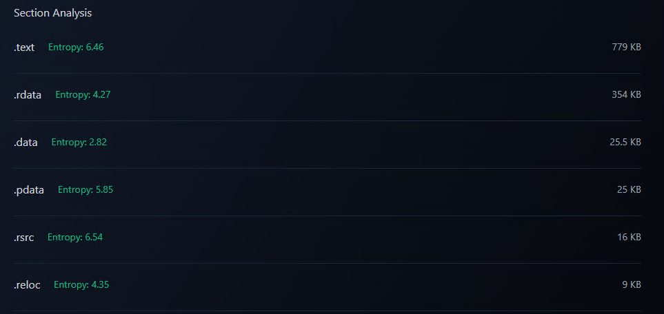
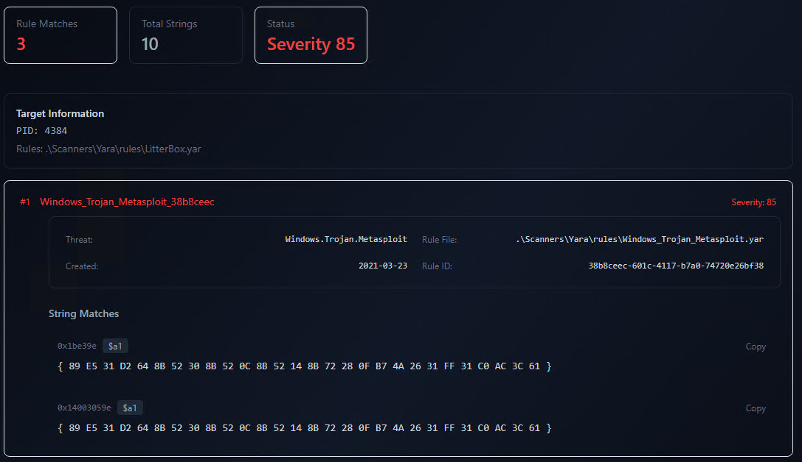

# The Most Powerful Malware Analysis Tool You NEED in 2025


## Introduction

As a penetration tester, I'm always on the lookout for tools that can make malware analysis more efficient, precise, and accessible. Having good malware analysis is beneficial for making your payloads more evasive. Recently, while scrolling through some cybersecurity subreddits, I stumbled upon a gem of a recommendation: [**LitterBox**](https://github.com/BlackSnufkin/LitterBox), an open-source malware analysis tool by [BlackSnufkin](https://github.com/BlackSnufkin). The repository wallpaper alone intrigued me, but what really caught my attention were the good documentation plus the nice Web UI.

People were praising it as an all-in-one solution for both **static** and **dynamic analysis**. LitterBox seamlessly integrates powerful tools like **YARA**, **Moneta**, and **PE-Sieve**, offering a cohesive platform to dissect and understand malicious binaries, and not only. The tool is capable of scanning not only .exe files, but also .dll, .xlsx, .doc and many more. On top of that, the best feature in my opinion is the ability to scan active and running processes on the host system.

This post marks the start of a deeper dive into what makes LitterBox stand out. In the following sections, I'll share my experiences with its installation, key features, and how it can streamline malware analysis workflows.

Before diving deeper into this topic, make sure to join my [Discord](https://discord.gg/bgSpdheEgu) where we share experience, knowledge and doing CTF together.

!!!
If you have further appreciation for my work, don't hesitate to become my [Patreon](https://www.patreon.com/Lsecqt)!
!!!


## Installation

I have already deployed the video version of this blogpost on my [channel](https://www.youtube.com/c/Lsecqt) so
if you enjoy watching a video instead of reading, feel welcomed:

[!embed](https://youtu.be/ExYT3QJL0OU)

The installation process is extremely simple, all you have to do is follow the documentation. However, before proceeding, a few things must be addressed.

1. The tool is designed to run on a Windows host. This will ensure that all built-in tools work as intended and you get the best results.
2. LitterBox requires python to be installed. During this blogpost, the python version on my Windows host was 3.13.1.
3. Do not misunderstand it, LitterBox is **not** an EDR or an AV, it is a sandbox tool that performs memory and signature analysis.

With that cleared, let's install it.

First download the project, this can be either as a .zip file or directly using git.

```
git clone https://github.com/BlackSnufkin/LitterBox.git
cd LitterBox
```

Then let's install all needed dependencies:

```
pip install -r requirements.txt
```

And that's it! Now we can run it via:

```
python litterbox.py
```

This is going to automatically start a web interface on `http://127.0.0.1:1337` which to me looks amazing.

!!!
All of the tools configuration can be found inside the `Config/config.yml`. There, you can alter everything from the yara rules, to the endpoint on which to listen on.
!!!

If everything went fine, now you should be able to access the interface:


## Usage

LitterBox in my opinion is great mainly for 2 reasons:

1. It supports huge variety of file extensions
2. It can perform memory scans over already running process.

These two reasons combined immediately forced me to like LitterBox and to install it in my lab. The huge file extension support allows you to scan payload in most common forms (.exe, .dll or inside a macro). By dropping a file, LitterBox will automatically extract its hash and copy it to the designated folder inside the `config.yml` file. By default this folder is `/Uploads`. 

!!!
Here is extremely important to explain that in order to extract the most out of this tool, it is recommended to shut down your endpoint protection. As mentioned before, LitterBox is not an AV/EDR and its idea is not to protect your PC in runtime but to help you analyze malware. If your endpoint protection is on, it will most likely delete the uploaded malware (if detected of course), which will result into a lot of false positives, so be smart! Optionally, you can exclude just the upload folder.
!!!

### Extracting metadata from file

Here, after file upload, you will see the options for choosing what type of scan to perform - either static or dynamic.


Here, if you scroll, you can see a lot of metadata about the uploaded binary. In this case I uploaded unobfuscated, clean `mimikatz.exe`.


One of the most useful features here is the ability to analyze the file's entropy.

**What is Entropy?**

Entropy, in simple terms, measures the randomness or unpredictability of data within a file. It is quantified on a scale from 0 to 8, where 0 indicates highly structured and predictable data, while values closer to 8 indicate high randomness.

In the context of executables, entropy gives a clear indication of the file's structure. A typical, unaltered binary compiled through standard processes tends to have moderate entropy because it includes organized sections like code, data, and resources. Conversely, a binary with unusually high entropy often contains compressed, encrypted, or obfuscated data, which raises suspicion.

!!!
Generally, embedding your payload inside the binary will drastically increase the entropy. Some EDRs will block a binary just based on that so always pay attention.
!!!

The entropy is even divided into PE sections, which helps predicting where the payload might be (if there is any).



We also have the ability to check for suspicious imports even before performing any dynamic analysis. In this particular example, the tool has identified six suspicious imports. Each of these imports is associated with functionality that is often exploited in malicious binaries, particularly in the context of process injection, memory manipulation, and API resolution evasion techniques.

Analyzing imports allows you to detect potential malicious behavior without executing the binary. Functions like the ones listed here are frequently leveraged in malware to perform evasion techniques, memory injection, or privilege escalation. Static import analysis can serve as an early warning system for binaries with high likelihoods of malicious intent.

!!!
When talking about malware development, be mindful of these imports, as they are heavily scrutinized by EDRs and antivirus software. Consider using indirect or dynamic techniques to obfuscate their usage and reduce detection.
!!!


And also, we can examine all the DLLs imported by the binary. This provides a comprehensive view of the external libraries that the executable relies on.


### Performing Static Analysis

Let’s dive straight into the static analysis feature. According to the [LitterBox documentation](https://github.com/BlackSnufkin/LitterBox), static analysis is performed using two powerful tools:

1. [CheckPlz](https://github.com/BlackSnufkin/CheckPlz)
2. [Yara](https://github.com/elastic/protections-artifacts/tree/main/yara)

I’ll assume you’re already familiar with Yara, the widely used rule-based engine for identifying patterns in binary files. So let me take a moment to explain what **CheckPlz** brings to the table.

**CheckPlz** is a Rust-based adaptation of popular tools like **[ThreatCheck](https://github.com/rasta-mouse/ThreatCheck)** and **[GoCheck](https://github.com/gatariee/gocheck)**. It is designed to scan files for malicious content with the help of **AMSI (Antimalware Scan Interface)** and **Windows Defender**, offering precise isolation of flagged content alongside detailed analysis. What makes it stand out is how it enhances the detection process by pinpointing _exactly_ what part of the file is being flagged and why.

Here's how it works (based on the `README.md`):

1. **AMSI Scanning**:
    
    - Initializes an AMSI context.
    - Scans the file content and buffers for threats.
    - If a threat is detected, performs a binary search to isolate the malicious segment.
2. **Windows Defender Scanning**:
    
    - Invokes `MpCmdRun.exe` to scan the file.
    - Analyzes the output for threat detection.
    - Performs a binary search if a threat is found.
3. **Binary Search**:
    
    - Recursively scans segments of the file to locate malicious content.
    - Produces detailed logs and results.

In short, CheckPlz doesn’t just flag your malware—it tells you _where_ and _why_ it was flagged. This precision is invaluable for improving evasion techniques.

After uploading the file, I selected the first option in the main menu to kick off a static scan. The results were immediate:


Both CheckPlz and Yara identified the binary as malicious. But let’s unpack _how_ they did this.

**Yara** flagged multiple patterns, including suspicious strings and byte sequences. What I found particularly helpful was that LitterBox not only listed these detections but also displayed the Yara rules that were triggered. This is a goldmine for bypassing detection since it allows you to tweak your binary in a targeted manner.


**CheckPlz**, on the other hand, went a step further by showing the exact byte offset where the detection occurred. It identified the binary as `HackTool:Win32/Mimikatz!pz`, displaying both the detection name and the byte content around the flagged region.


I was impressed by how effectively the static analysis identified the nature of the binary and provided actionable insights. But while the static analysis results were great, this only scratches the surface. Static analysis tells us _what_ was detected, but it doesn’t show us _how_ the binary behaves in a real environment. For that, we’ll need to move on to the dynamic scan. Let’s see what happens when we run the binary!

### Performing Dynamic Analysis

From here we have two options of running a dynamic scan. The first option is to run a scan for the uploaded binary, or to run a scan for an already running process. For me the ability to analyze running processes is huge. Here it is important to mention that based on the mechanisms of your malware, scanning it from file and scanning it from a running process might output different results. For example this can be applicable in cases when your malware is designed to attach to a running process and then do all of its things, so if you want your malware to do some form of injection (process or thread) then it will make most sense to first run it, and then scan the attached process.

Now to make things simple let's run dynamic scan for the same `mimikatz.exe`.

!!!
Dynamic analysis will run the binary in order to understand how it works and scan it in runtime.
!!!

During my testing, it was reported that LitterBox executes the malware from the context of the user for the Windows host itself. It does not create a desegnated user for the sandbox testing.

Even though it executed the malware for just a second, I was fast enough to type `whoami` before it was killed.


After running a dynamic scan on the clean, unobfuscated `mimikatz.exe`, I reviewed the report, and the findings were quite interesting. The Yara scanner was the only tool to detect anything suspicious, flagging the binary with two matches. Meanwhile, every other tool in the analysis suite reported the file as clean. This outcome immediately stood out, so I decided to explore why this happened.


First, let’s discuss Yara’s results. The flagged detections make perfect sense because Yara relies on predefined rules to identify known malicious patterns, such as specific strings, byte sequences, or sections of memory. Since this version of `mimikatz.exe` was not obfuscated or modified, it still contained all of its recognizable signatures. In fact, the same rules during the static analysis part  triggered here.


On the other hand, the other tools, including PE-sieve, Moneta, Patriot, and Hunt-Sleeping-Beacons, all reported the binary as clean. This is because they rely heavily on analyzing runtime behavior or changes within the system caused by the file. Tools like PE-sieve focus on detecting runtime tampering, such as injected code or modifications to memory regions. Similarly, Moneta specializes in identifying runtime anomalies, such as unusual file system interactions or network activity. Since `mimikatz.exe` didn’t execute any malicious actions during the scan, these tools found no reason to flag it.

The difference between Yara and these runtime-focused tools boils down to their detection methodologies. Yara operates based on static signatures, while the others depend on monitoring behavior. In this case, `mimikatz.exe` didn’t engage in any runtime behavior that could be classified as suspicious, so the runtime-focused tools didn’t detect anything. However, Yara’s static rule-matching approach allowed it to identify the binary simply by analyzing its contents.

To prove this, let's upload a different binary now -> unobfuscated, clean `meterpreter`.


After uploading an unobfuscated `meterpreter` payload and running a dynamic scan, the results were drastically different compared to the earlier test with `mimikatz.exe`. This time, every tool in the analysis suite flagged the binary as malicious. Unlike before, the detections weren’t limited to Yara’s signature-based analysis—PE-sieve, Moneta, Patriot, Hunt-Sleeping-Beacons, and the rest of the tools all identified suspicious behavior or anomalies in the binary.

This outcome wasn’t surprising, given the nature of the `meterpreter` payload. By design, `meterpreter` is packed with functionality that enables malicious actions, such as process injection, memory manipulation, and command-and-control communication. These capabilities are inherently suspicious and are often detectable even in their dormant state.

Yara once again flagged the payload based on its predefined rules, identifying signature patterns within the binary. 



However, the real difference this time came from the runtime-focused tools. PE-sieve and Moneta, which excel in identifying memory modifications and system anomalies, were able to detect signs of malicious intent. 


This is because `meterpreter`’s structure and embedded functionality often include artifacts, such as shellcode or dynamically linked APIs, that are recognized as red flags by heuristic and behavior-based detection systems.


For instance, tools like Patriot and Hunt-Sleeping-Beacons focus on identifying indicators such as beacon-like activity or suspicious memory allocations, which are common characteristics of tools like `meterpreter`.


The scan summary highlighted these detections across the board, reinforcing the idea that `meterpreter`, especially when unobfuscated, carries many inherent indicators that make it highly detectable.


### Scanning Running Processes

In order to carry a dynamic analysis for a running process, it is enough to know the Process ID (PID).

The steps are simple:
1. Navigate to the `Analyze Process` menu
2. Supply the PID


This time I download and executed simple `windows/x64/shell_reverse_tcp`, and the results surprised me a little:


Which again proves the point: do not think that evading all of LitterBox's arsenal will guarantee that your payload will get through an EDR, but it will definitely help!

## Conclusion

As we've explored, the scan results showcased a wide array of detections from various tools, all seamlessly integrated into LitterBox. This platform excels at combining the power of these tools while maintaining a clean and intuitive interface. The combination of scanners it offers is undoubtedly challenging to evade, but what truly sets it apart is its ability to answer the critical question: **why was something flagged?**. This transparency makes it an invaluable tool for understanding detection mechanisms and improving evasion techniques.

To be honest, I’m thoroughly impressed with LitterBox, and I’ve officially decided to incorporate it into my malware development challenges. While it’s not an active AV or EDR solution, it simulates many of the functions and detection strategies used by such systems. This makes it a fantastic resource for testing payloads and refining bypass techniques in a controlled environment. And most importantly, the samples are not distributed anywhere!

That said, there is one disadvantage worth mentioning—the maximum file size for uploads, which is currently capped at 16 MB. While this is sufficient for most scenarios, there are exceptions. For example, some payloads, such as those generated by [Athena](https://github.com/MythicAgents/Athena), can exceed this limit. This raises an interesting question: does this file size restriction imply that larger payloads are inherently more challenging to scan and detect? I’d love to hear your thoughts on this.

I hope you found this post insightful and learned something new along the way! If you did, consider supporting my work by becoming a [Patreon](https://www.patreon.com/Lsecqt). By doing so, you’ll not only help me continue creating content but also gain access to exclusive private tooling and repositories. Thank you for reading, and happy learning!