# You Don't Need Mimikatz for DCSync Anymore (SharpDCSync)

## Introduction

The end goal of most Active Directory penetration tests is a DCSync attack. If you can pull it off, you can dump the hashes of every user in the domain, which means you effectively own it. Full coverage, full permissions, game over.

The classic way to do this is Mimikatz or Impacket's `secretsdump`. Both work great, but both have a problem in the real world. Mimikatz is loud and heavily signatured, and `secretsdump` assumes you have a Linux box like Kali sitting on the target network, which is not always the case.

In this post I want to show you another way that has been working really well for me. It is a tool called **SharpDCSync**, a DCSync written in pure C#. No Mimikatz on disk, no Mimikatz in memory, and it runs comfortably from a C2 framework. I will also show how I baked the same technique straight into my agent with proper token support.

If you prefer watching over reading, here is the video version. If you enjoy the content, feel free to subscribe:

[!embed](https://youtu.be/nCA7h71dLTk)

The Mythic C2 agent I use later in this post, the one I call Haunt, is not public. It lives on my [Patreon](https://www.patreon.com/Lsecqt) along with internal videos and the rest of my custom tools. If you want the agent shown here, plus the deeper material that never makes it to YouTube, becoming a patron is the way in, and it directly supports the free content on this blog.

## What DCSync actually does

DCSync abuses the way domain controllers replicate data between each other. If you control an object that has the replication rights (a Domain Admin, or any principal granted the "Replicating Directory Changes" permissions), you can ask a domain controller to hand over the password hashes for accounts in the domain, exactly as if you were another DC syncing up.

You point your tool at the DC, you present the rights, and you walk away with the hashes. That is the whole idea.

## The usual way with Impacket

To set the baseline, here is the standard approach from Kali. Since this is my own lab I already know the password of the account that can replicate, so I am skipping how it was compromised. This is only for demonstration.

The account here is `da_scott`, its password is the very strong `Password1`, and the DC lives at `172.16.16.16`:

`impacket-secretsdump 'lsec.local/da_scott:Password1@172.16.16.16'`

`secretsdump` attaches to the DC and starts dumping every hash.

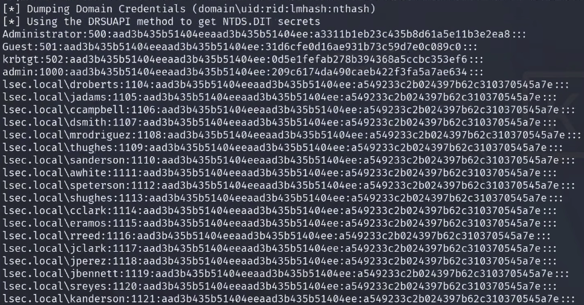

## The problem with the usual way

`secretsdump` is my go to most of the time, but it has one assumption baked in: you need something to run it from. In my lab that is easy because I have my Kali box sitting next to the DC, so reaching the domain controller is trivial.

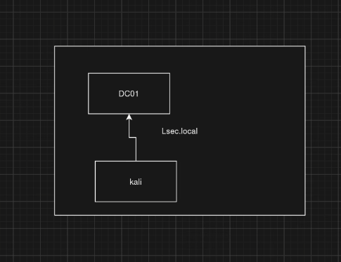

But on a lot of engagements you will not have Kali on the target network. All you have is a Windows box. On Windows your most straightforward option becomes Mimikatz, and Mimikatz is highly detectable. You end up spending real time packing and obfuscating it, and against a decent defensive setup it can be a proper fight to get it running at all.

That is the gap SharpDCSync fills.

## Enter SharpDCSync

[SharpDCSync](https://github.com/3gstudent/Homework-of-C-Sharp/blob/master/SharpDCSync.cs) is DCSync done in pure C#. It does not load Mimikatz, it does not do any reflective loading, side loading or injection. It just uses raw .NET to perform the replication at the lowest level.

Because it is C# and nothing else, you get three nice properties:

1. It is much easier to obfuscate.
2. It is far more open to bypasses if you have a good AMSI bypass and CLR bypass in place.
3. It is flexible, so you can run it in memory from C2 frameworks like Mythic or my Haunt agent.

!!!
The point of a pure .NET implementation is that you can execute it as an assembly straight from your C2. That means no Mimikatz on disk, nothing sitting in the filesystem waiting to be flagged, and none of the reflective tricks that mature EDRs love to catch.
!!!

## How it works under the hood

The clever part of DCSync is that it never tries to steal secrets off a machine. It just asks a domain controller to hand them over using the exact same channel that two real domain controllers use to keep each other in sync. That channel is a Microsoft protocol called the Directory Replication Service, or DRSUAPI. SharpDCSync speaks it directly in C#, and the whole tool is really just six steps.

**1. Connect to the DC over RPC.** The tool opens an authenticated RPC connection to the target domain controller using the Windows `Rpcrt4.dll` functions. It authenticates as whoever you currently are, so your Kerberos or NTLM identity on the box is what gets presented. This is why the account you run it under has to be one that is allowed to replicate.

**2. Bind to the replication interface.** It then binds to the DRSUAPI service on the DC by its well known interface id and calls `DrsBind`. If that succeeds, the DC gives back a handle, which is basically a ticket that says "you are now talking to me as a replication partner".

**3. Ask the DC who it is.** A quick `DrsDomainControllerInfo` call fetches the DC's internal directory identity (its NTDS DSA GUID). The next step needs this value.

**4. List the users.** Over normal LDAP the tool queries the domain for every user account (`objectCategory=User`) and walks the list one by one. Nothing sensitive here, this is just to get the names to target.

**5. Turn each name into an object and pull its secrets.** For every account it does two calls. `CrackNames` converts the account name into its unique object GUID, and then `GetNCChanges` is the real DCSync request. It asks the DC to "replicate" that single object to us, and the DC replies with that object's attributes, including the encrypted password hash. This single object replication request is the exact same trick Mimikatz uses, just written from scratch.

**6. Decrypt the hash.** The hash does not come back in the clear. It is wrapped in two layers, and the tool peels both off using built in Windows crypto functions:

- The outer layer is unwrapped with a key derived from the RPC session key that was negotiated back in step one.
- The inner layer is unwrapped using the account's RID (the last number of its SID) as the key.

Once both layers are off, you are left with the raw NT hash, which the tool prints next to the account's RID and name.

!!!
The takeaway: SharpDCSync never touches LSASS and never injects into anything. It authenticates as you and politely asks the domain controller to replicate secrets, which is a completely normal thing for the protocol to do. That is exactly why it is quiet. The catch is that the detection surface simply moves. A defender is unlikely to catch it on the host, but a replication request coming from a workstation instead of a real domain controller stands out clearly on the DC side.
!!!

## Compiling it

I pulled the project onto a Windows host and opened it in Visual Studio. You can compile with Visual Studio, but you may also do it manually via csc.

Before compiling, make sure `System.DirectoryServices` is available. That is what the tool uses to talk to the DC and do the RPC work over the domain.

The catch: building with the newest C# language version on my system broke because of an `out` parameter in the code. The fix that just worked was compiling with an older `csc.exe` from the command line. My guess is the original author built on that same version, so the older compiler accepts the code as written.

Here is the CLI compile with `csc` version 4.0. I set the output name, reference the directory services library, and point it at the source file:

```
csc.exe /out:SharpDCSync.exe /reference:System.DirectoryServices.dll program.cs
```

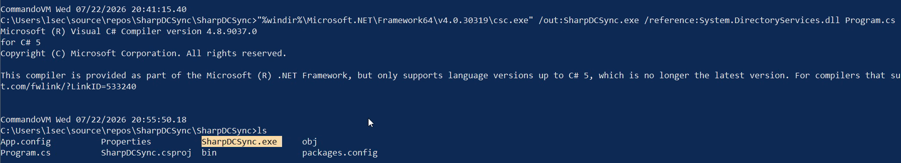

That gives me `SharpDCSync.exe`, ready to move over to the target.

## Running it, option one: on disk

The first way to use it is the simplest. You drop it on disk and run it. It has a lot less detection weight than Mimikatz, so this is more viable than it sounds.

To test that honestly, I dropped it onto a box with Defender fully on. To survive the copy across my own systems I first put it in a password protected zip, using `123456` as the password so my own defences did not eat it in transit:

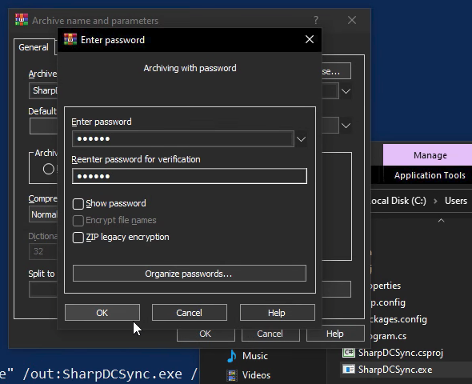

Most AV and EDR will not automatically unzip a password protected archive, so the file rides across fine. On the target I confirmed Defender was still on under Virus and threat protection, then extracted with the same password.

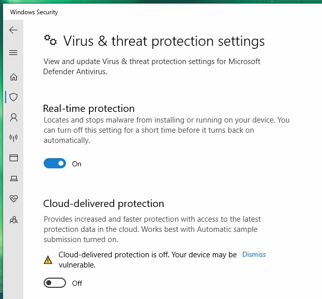

No alert, nothing flagged on extraction. Worth stressing: I did not change a single line of code and I did not rename the file. It is the stock binary and it still landed clean.

Now I open PowerShell, move to the desktop, and run it. The syntax is the DC followed by the domain:

`.\SharpDCSync.exe DC01 lsec.local`

As a normal user this is expected to fail, because my account does not hold the replication rights. To do it properly I open a new session as my Domain Admin account, `DA_Scott`, and run the same binary:

`.\SharpDCSync.exe DC01 lsec.local`

This time it works right off the bat and hands back the user hashes in the domain.

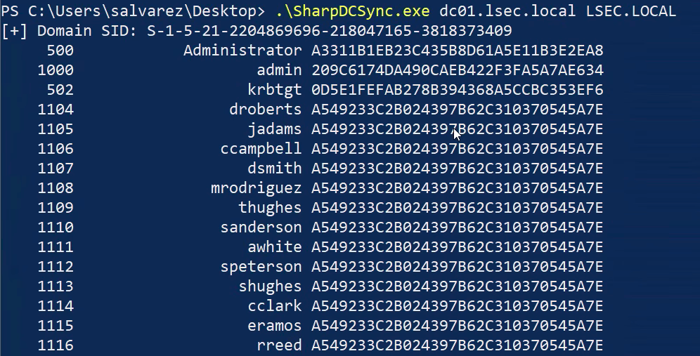

!!!
You will notice a lot of the hashes look identical. That is not a bug. My lab is intentionally vulnerable with heavy password reuse, so many accounts share the same hash.
!!!

## Running it, option two: from your C2

Storing it on disk is fine, but the real value is running it in memory from a C2. Execute assembly is a practical, everyday primitive in every major C2 framework, so this works almost everywhere.

First in Mythic. I already have a beacon, and I can just spin up a fresh callback to show the whole flow.

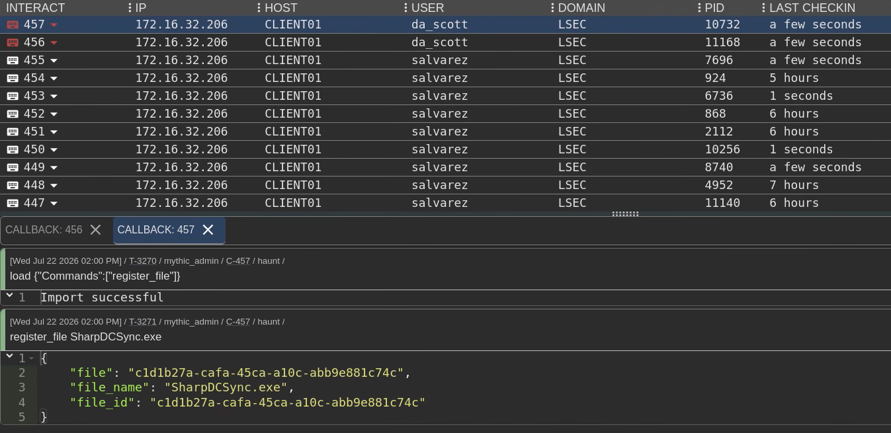

From there it is the standard execute assembly flow. Here I am using my Havoc agent, and I want to say a massive thanks to my patrons whose support makes this content possible. Inside the agent I:

1. Register the file to the server with a register file call, so I do not have to specify it every time.
2. Load the execute assembly function.
3. Run execute assembly with the file, passing `DC01.lsec.local` and the domain `lsec.local` as arguments.

The callback comes back quickly with all the hashes.

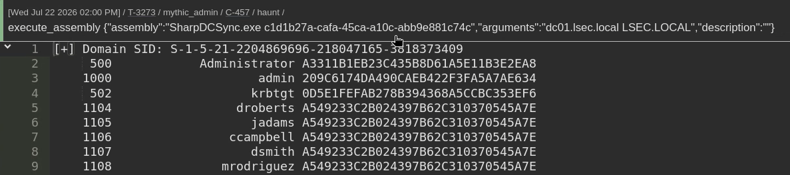

!!!
This is not tied to any one framework. Whether you run Mythic, Sliver, Havoc or anything else, they all support execute assembly, so you can get to the same result with slightly different syntax.
!!!

## Baking DCSync into the agent

Running the external assembly is great, but I took it a step further and embedded DCSync directly into my agent. It is built on the same base I just explained, but it is heavily obfuscated and fills in the gaps the original proof of concept left open, like error checking, proper error handling, and clear error output so you actually know what went wrong.

Using it is as simple as:

`dcsync`

or, to dump everyone:

`dcsync all`

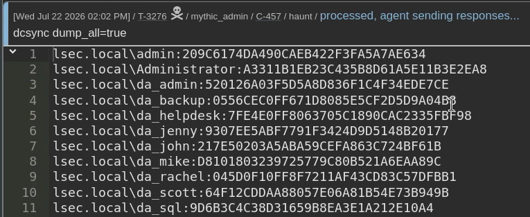

### The token problem, and why the built in wins

There is one real limitation with plain execute assembly: it does not play nicely with `make_token`. Let me show what I mean.

I spawn a new beacon as a normal user, one that cannot perform DCSync. Running the external assembly against `DC01.lsec.local` fails, exactly as expected, because the account has no replication rights.

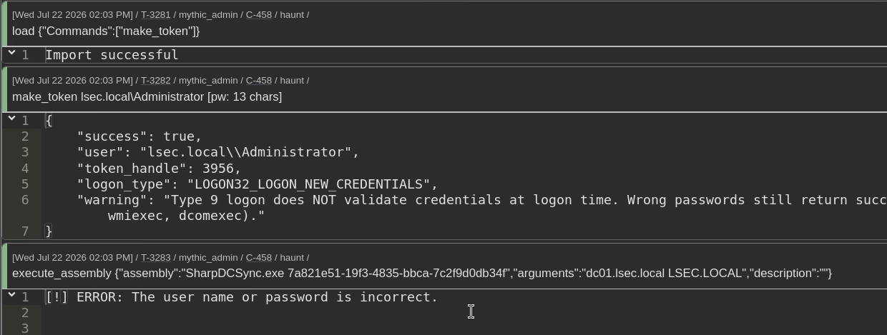

Now I use `make_token` with my Domain Admin credentials to put a privileged token on the beacon. Even after that, running the external assembly still fails, because execute assembly does not carry that forged token through.

This is where the built in command wins. My `dcsync` has token manager support, so it picks up the current token from `make_token`, and performs the attack with it:

`dcsync administrator`

or against everyone:

`dcsync all`

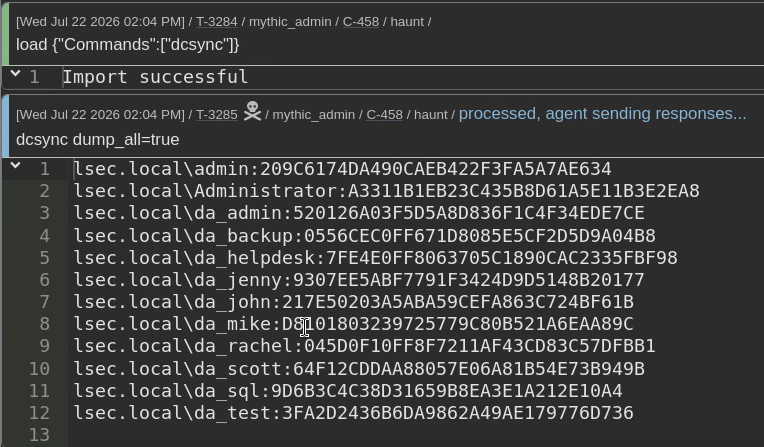

That token awareness is the difference between a proof of concept and something you actually want in an engagement.

## Conclusion

DCSync is the payoff at the end of most Active Directory tests, and for years the answer was Mimikatz or `secretsdump`. Neither is ideal when you are stuck on a Windows box with a watchful EDR. A pure C# implementation like SharpDCSync gives you a quieter, more flexible option that runs straight from your C2, and wrapping it into your agent with token support makes it something you can rely on in real conditions.

From the defensive side, DCSync abuses legitimate replication rights, so the strongest control is limiting who holds "Replicating Directory Changes" on the domain and alerting on replication requests that do not come from a real domain controller. If a workstation or a random user starts asking to replicate the directory, that should light up your monitoring immediately.

Thanks for reading. If this post was useful, you can support my work by becoming my [Patreon](https://www.patreon.com/Lsecqt), and the agent shown here is available to patrons. Go get those hashes, go own those domains, and drop your feedback in the comments.
